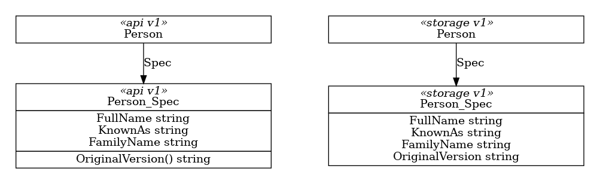

# API Version Recovery

## Context

In addition to structural changes, there may be behaviour changes between ARM API versions. It is therefore important that we use the correct API version - the version requested by the user - when interacting with ARM, to ensure that we get the expected behaviour.

Revisting the CRM example from the [Versioning](../versioning/) specification, consider what happens if we have two available versions of the resource `Person`, lets call them **v1** and **v2**. In **v2** the new properties `PostalAddress` and `ResidentialAddress` are mandatory, requiring that everyone have a both a mailing address and a home. 


If we have a valid **v1** `Person`, trying to submit that through the **v2** ARM API will fail because it's missing these addresses.

We need to be able to pivot from the version Person we have "in hand" (usually the Hub version) back to the original version in order to generate the correct ARM payload.

We also have a performance issue - our current infrastructure for conversions is oriented to convert an entire resource, including both *Spec* and *Status*. 

When submitting a request to ARM we're only interested in the *Spec*; any effort expended on conversion of the current Status is wasted.

Similarly, when retrieving *Status* from ARM, we're only interested in conversion of that; any effort expended on conversion of the *Spec* is also wasted.

## Decision

The original API version used to create the custom resource will as the API version for ARM. From the above example, a v1.Person will result in API version v1 being used, and for a v2.Person we'll use API version v2.

We'll preserve this as another property on the CRD, but one the user does not need to manually provide, allowing us to know which API version to use when interacting with ARM.

The code generator will also inject functions allowing easy access to this information.

Helper methods in the generic reconciler will use these functions implement the required pivot between the current hub version and the specified API version.

### API Preservation

Into the API version of each resource's *Spec*, inject function `OriginalVersion()`, with a hard coded return value:

``` go
// OriginalVersion returns the original API version used to create the resource.
func (storageAccountsSpec *StorageAccounts_Spec) OriginalVersion() string {
	return GroupVersion.Version
}

var GroupVersion = schema.GroupVersion{Group: "storage.azure.com", Version: "v1alpha1api20210401"}
```

Into the Storage version of each resource's *Spec*, inject string property `OriginalVersion` to persist the value returned by `OriginalVersion()`.

``` go
type StorageAccounts_Spec struct {
    // ... elided ...
	OriginalVersion string `json:"originalVersion"`
    // ... elided ...
}
```



The generated `AssignProperties*()` methods will copy OriginalVersion as expected.

### Retrieving the API Version

Into each resource, inject function `OriginalGVK()` to return the required group-version-kind for the original version of the specified resource:

``` go
// OriginalGVK returns a GroupValueKind for the original API version used to create the resource
func (storageAccount *StorageAccount) OriginalGVK() *schema.GroupVersionKind {
	return &schema.GroupVersionKind{
		Group:   GroupVersion.Group,
		Version: storageAccount.Spec.OriginalVersion,
		Kind:    "StorageAccount",
	}
}
```

Implementations will use either the `OriginalVersion` property (as shown above), or the `OriginalVersion()` function, depending on the resource variant.

### Retrieving Spec and Status

Two new interfaces will be added to the `genruntime` package:

``` go
type ConvertibleSpec interface {
	// ConvertSpecTo will populate the passed Spec by copying over all available information from this one
	ConvertSpecTo(destination ConvertibleSpec) error

	// ConvertSpecFrom will populate this spec by copying over all available information from the passed one
	ConvertSpecFrom(source ConvertibleSpec) error
}

type ConvertibleStatus interface {
	// ConvertStatusTo will populate the passed Status by copying over all available information from this one
	ConvertStatusTo(destination ConvertibleStatus) error

	// ConvertStatusFrom will populate this status by copying over all available information from the passed one
	ConvertStatusFrom(source ConvertibleStatus) error
}
```

Implementations of these interfaces will be added to all generated *Spec* and *Status* types, leveraging the `AssignProperties*()` methods already being generated.

The `KubernetesResource` interface and all implementations will be modified by adding four new methods:

``` go
type KubernetesResource interface {
	// GetSpec returns the specification of the resource
	GetSpec() ConvertibleSpec

	// GetStatus returns the current status of the resource
	GetStatus() ConvertibleStatus

	// NewEmptyStatus returns a blank status ready for population
	NewEmptyStatus() ConvertibleStatus

	// SetStatus updates the status of the resource
	SetStatus(status ConvertibleStatus) error
}
```

### Spec Conversion

A helper method for the generic reconciler will be added to return the correct *Spec* from any resource:

``` go
// GetVersionedSpec returns a versioned spec for the provided resource; 
// the original API version used when the resource was first created 
// is used to identify the version to return
func GetVersionedSpec(metaObject MetaObject, scheme *runtime.Scheme) (ConvertibleSpec, error) {
    // ... elided ...
}
```

### Status Conversion

Two similar helper methods will be added for support of Status. 

``` go
// GetVersionedStatus returns a versioned status for the provided resource; 
// the original API version used when the resource was first created 
// is used to identify the version to return
func GetVersionedStatus(metaObject MetaObject, scheme *runtime.Scheme) (ConvertibleStatus, error) {
    // ... elided ...
}

// NewEmptyVersionedStatus returns a blank versioned status for the provided 
// resource; the original API version used when the resource was first created 
// is used to identify the version to return
func NewEmptyVersionedStatus(metaObject MetaObject, scheme *runtime.Scheme) (ConvertibleStatus, error) {
    // ... elided ...
}
```

## Status

Successfully implemented across several PRs:

* [PR #1773](https://github.com/Azure/azure-service-operator/pull/1773) - Add GetStatus() and GetSpec() to all resources
* [PR #1787](https://github.com/Azure/azure-service-operator/pull/1787) - Implement SetStatus() for all Resources
* [PR #1851](https://github.com/Azure/azure-service-operator/pull/1851) - Integrate support for multiple API versions
* [PR #1875](https://github.com/Azure/azure-service-operator/pull/1875) - Eliminate much use of reflection by using generated code
* [PR #1889](https://github.com/Azure/azure-service-operator/pull/1889) - Introduce API Version helper methods
* [PR #1935](https://github.com/Azure/azure-service-operator/pull/1935) - Integrate API versioning
* [PR #1936](https://github.com/Azure/azure-service-operator/pull/1936) - Activate versioning stages in pipeline and update generated files
* [PR #1973](https://github.com/Azure/azure-service-operator/pull/1973) - Generate patches for Kustomize to enable storage versioning
* [PR #1985](https://github.com/Azure/azure-service-operator/pull/1985) - Copy both ObjectMeta and TypeMeta when doing version conversion

## Consequences

TBC

## Experience Report

TBC

## References

TBC
