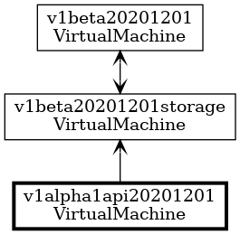
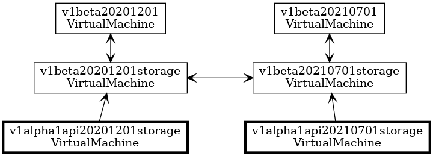

# Context

As we close in on a beta release, we want to modify the version prefix used for code-generated resources.

We don't want to maroon existing users of Azure Service Operator (ASO) by making this a breaking change.

Cross version compatibility between ARM versions of a resource (that is, between `v1alpha1api20180101` and `v1alpha1api20200101`) is already implemented and well tested, so we want to leverage that existing infrastructure.

Version skew policy in the Kubernetes ecosystem is to allow for one or two older minor versions of backward compatibility. This gives us the *option* of temporarily introducing backward compatibility with the `codegen-beta-0` release and then dropping it once we reach `codegen-beta-2` or greater. 
# Decision

Change the prefix used from `v1alpha1api` to simply `v1beta`. (We don't need a minor number as part of the prefix. The original intention was to increment the minor version with each release of the operator, but the overhead of this is very high, so we've instead used the prefix `v1alpha1api` for all our alpha releases.)

Introduce a new pipeline stage to create additional storage versions for backward compatibility, each created by cloning an existing storage version but using a package name based on the old `v1alpha1api` prefix.

For example, the storage version of the `compute` resource `v1beta20201201/VirtualMachine` is `v1beta20201201storage/VirtualMachine`. The new pipeline stage will clone that resource as `v1alpha1api20201201storage/VirtualMachine` and subsequent pipeline stages will create the necessary conversion.

For the trivial case where we only support a single ARM version of a resource, this gives us full compatibility to upgrade an older (alpha) installation of ASO to a new beta release.

When we have multiple ARM versions in flight (as we do with `compute`), supporting all *potential* older resource versions gives us maximum compatibility without any need for configuration or to make any assumptions about which ARM versions were previously supported. 

This approach also gives us backward compatibility when we have a mix of resources across multiple versions (as happens with both `compute` and `network`). We know from prior work (including introduction of the `PropertyBag` field) that conversions between storage versions are lossless.

We'll only drop these backward compatibility types if it is necessary to do so.

Reasons for this include (but are not limited to):

* A breaking change to the structure of our storage resources
* A desire (or need) to reduce the size of our CRD definitions

# Status

Proposed.

# Consequences

With the supported format for old resources being derived from newer resources, we need to be careful about breaking changes (e.g. removing properties or changing property types) that might cause issues for users upgrading to the latest ASO.

Factors reducing the severity of this include:

* Our object shapes are defined by ARM resource versions, which have tight constraints on the types of permitted changes, so we're unlikely to have breaking changes from that source.
* We have exactly the same compatibility issues between adjacent ASO releases, so our changes to the generator already have to consider this.
* We only need to maintain backward compatibility across a small number of versions.

# Experience Report

TBC.

# References

TBC.
