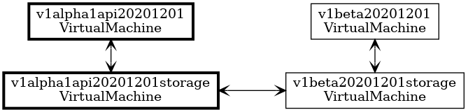
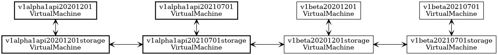

# Context

As we close in on a beta release, we are considering modification of the version prefix used for code-generated resources.

## Option 1: Do nothing

Leave all generated resources using the alpha prefix that is currently in use.

Pros

* Easy to implement (nothing to do) and quick to deliver

Cons

* Introduces an inconsistency between the status of ASO (beta) and the labelling of the resources (alpha).
  
* Might be perceived by some users as indicating these particular resources are still in alpha, and therefore pose significant a barrier to adoption of ASO.

## Option 2: Move all resources to beta

Change the generated prefix for all resources

Pros

* Easy to implement (change the prefix, update affected tests, and regenerate all files), and quick to deliver

Cons

* Existing clusters with custom resources (CRs) reliant on ASO would break because ASO would no longer support the older alpha version.  
  Mitigation: Users would need to manually delete the existing resource and creating a new CR with an updated version.

* Any attempt to apply old alpha YAML will fail, as it no longer exists. This includes attempting to manually apply a YAML using `kubectl apply -f`, and through some other approaches where YAMLs are continuously applied, as in GitOps style workflows.  
  Mitigation: For manual uses, modification of the YAML files being applied to change the version of the resources.  
  Mitigation: For automated uses, modification of the deployment pipelines to change the version of the resources.

## Option 3a: In-place upgrade for existing resources

Change the generated prefix to `v1beta` for all resources, but retain the alpha storage variants of each existing resource. This would allow an upgraded ASO installation to promote any existing resources to the new storage version.

Pros

* Moderate effort to implement (requires a new pipeline stage to create the alpha storage variants for compatibility with older versions).
  
* Existing clusters with custom resources reliant on ASO would continue to run because ASO would support conversion from the old hub version to the new.

Cons

* Any attempt to apply old alpha YAML will fail, as it no longer exists. This includes attempting to manually apply a YAML using `kubectl apply -f`, and through some other approaches where YAMLs are continuously applied, as in GitOps style workflows.  
  Mitigation: For manual uses, modification of the YAML files being applied to change the version of the resources.  
  Mitigation: For automated uses, modification of the deployment pipelines to change the version of the resources.

* CRDs will be 50% bigger than the alpha versions, due to the addition of another storage variant.  
  Observation: We know there is an upper limit to the size of each CRD, though we're not very close to that yet.
  Mitigation: Prune all documentation from the alpha variants to make them (much!) smaller

## Option 3b: Retain the alpha version for existing resources

Use a beta prefix for all resources. Also use our existing alpha prefix for all resources that were included in any alpha release of ASO, but not for new resources.

Pros

* Moderate effort to implement (requires pipeline and configuration changes to generate multiple versions of some resources).  
  Observation: We could implement this in two parts, firstly generating all resources with both prefixes for `codegen-beta-0`, and then introducing configuration for newer resources in `codegen-beta-1`.

* Existing clusters with custom resources reliant on ASO would continue to run because ASO would support conversion from the old hub version to the new.

* Existing use of YAML containing alpha versions will continue to work, as they are still supported. This includes attempting to manually apply a YAML using `kubectl apply -f`, and through some other approaches where YAMLs are continuously applied, as in GitOps style workflows.  

Cons

* CRDs will be twice the size of the alpha versions, due to the addition of both API and storage variants.  
  Observation: We know there is an upper limit to the size of each CRD, though we're not very close to that yet.  
  Mitigation: Prune all documentation from the alpha resource versions

* Possible user confusion from having multiple versions of each resource.  
  Mitigation: Pruning documentation would push users towards the beta versions.

## Other factors

We don't want to maroon existing users of Azure Service Operator (ASO) by making this a breaking change. It's important to us to make upgrades of ASO as straightforward as possible.

Cross version compatibility between ARM versions of a resource (that is, for example, between `v1alpha1api20180101` and `v1alpha1api20200101`) is already implemented and well tested, so we should leverage that existing infrastructure.

Version skew policy in the Kubernetes ecosystem is to allow for one or two older minor versions of backward compatibility. This gives us the *option* of temporarily introducing backward compatibility with the `codegen-beta-0` release and then dropping it once we reach `codegen-beta-2` or greater. 

# Decision

We choose to prioritize a good upgrade experience for our users.

Change the prefix used for our resources from `v1alpha1api` to simply `v1beta`. (We don't need a minor number as part of the prefix. The original intention was to increment the minor version with each release of the operator, but the overhead of this is very high, so we've instead used the prefix `v1alpha1api` for all our alpha releases.)

## Beta 0 Release

All resources will be duplicated, published as both `v1beta` and as `v1alpha1api`. This includes new resources published for the first time in the beta.

Introduce a new pipeline stage to create additional versions for backward compatibility, each created by cloning an existing version but using a package name based on the old `v1alpha1api` prefix.

For example, the API resource `v1beta20201201storage/VirtualMachine` will be cloned as `v1alpha1api20201201/VirtualMachine`. Subsequent pipeline stages will create matching storage versions and the necessary conversions.

For the trivial case where we only support a single ARM version of a resource, this gives us full compatibility to upgrade an older (alpha) installation of ASO to a new beta release.

When we have multiple ARM versions in flight (as we do with `compute`), supporting all *potential* older resource versions gives us maximum compatibility without any need for configuration or to make any assumptions about which ARM versions were previously supported.

This approach also gives us backward compatibility when we have a mix of resources across multiple versions (as happens with both `compute` and `network`). We know from prior work (including introduction of the `PropertyBag` field) that conversions between storage versions are lossless.

## Beta 1 Release

Additional configuration will ensure that resources introduced in that (or later) releases won't include alpha versions. This configuration will require opt-in for backward compatibility, so that the overhead for new resources is as low as possible.

## Beta n Release

At some point, after giving users of ASO alpha releases a reasonable time frame, we will drop the alpha versions. We'll document this plan as a part of the **Beta 0** release.

# Status

Proposed.

# Consequences

With the supported format for old resources being derived from newer resources, we need to be careful about breaking changes (e.g. removing properties or changing property types) that might cause issues for users upgrading to the latest ASO.

Factors reducing the severity of this include:

* Our object shapes are defined by ARM resource versions, which have tight constraints on the types of permitted changes, so we're unlikely to have breaking changes from that source.

* We have exactly the same compatibility issues between adjacent ASO releases, so our changes to the generator already have to consider this.

* We only need to maintain backward compatibility across a small number of versions.
  
# Experience Report

TBC.

# References

TBC.
