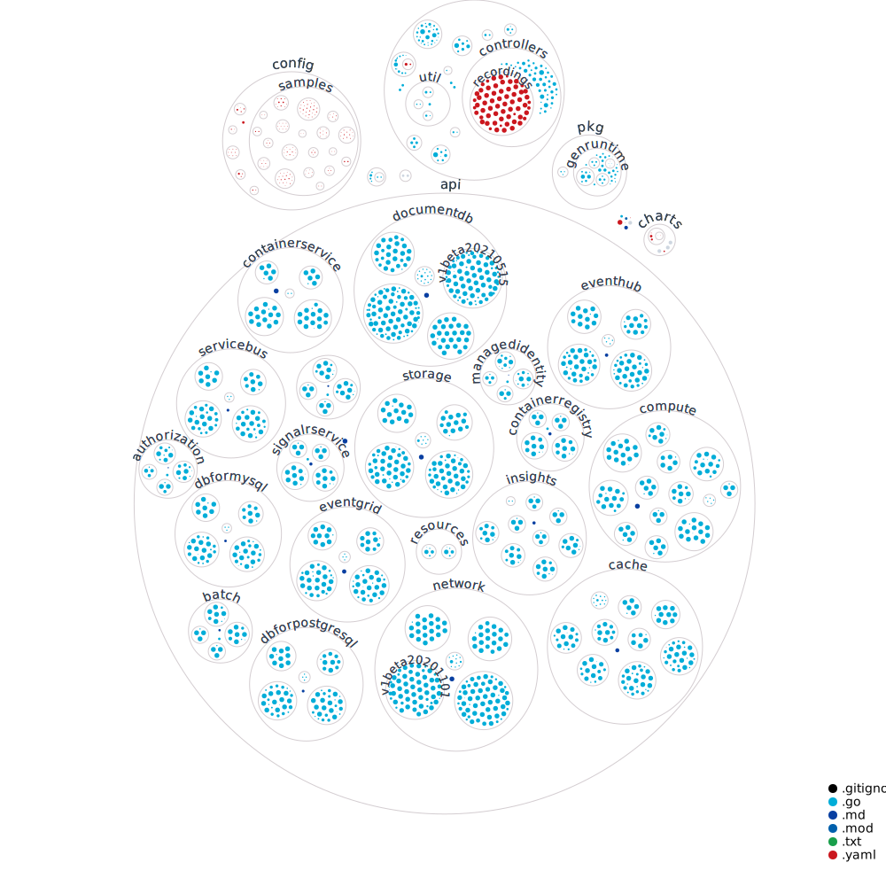

## Related pages

* [Developer Setup](  ).
* [Adding a new code-generator resource](  ).
* [Example walkthrough of adding a new resource version]( ).
* [Generator code overview](  ).
* [Running a development version of ASO](  ).
* [Testing](  ).

## Directory structure of the operator

Key folders of note include:

* [`api`](https://github.com/Azure/azure-service-operator/tree/main/v2/api) contains all of our supported resources. Much (most!) of this code is generated, but handwritten code is added at various extension points for flexibility.
* [`pkg`](https://github.com/Azure/azure-service-operator/tree/main/v2/pkg) contains the package `genruntime` which is provides infrastructure for our generated resources.
* [`internal`](https://github.com/Azure/azure-service-operator/tree/main/v2/internal) contains packages used by our generic controller.

The size of each dot reflects the size of the file; the legend in the corner shows the meaning of colour.

## Submitting a pull request
Pull requests opened from forks of the azure-service-operator repository will initially have a `skipped` `Validate Pull Request / integration-tests` check which
will prevent merging even if all other checks pass. Once a maintainer has looked at your PR and determined it is ready they will comment `/ok-to-test sha=<sha>`
to kick off an integration test pass. If this check passes along with the other checks the PR can be merged.

