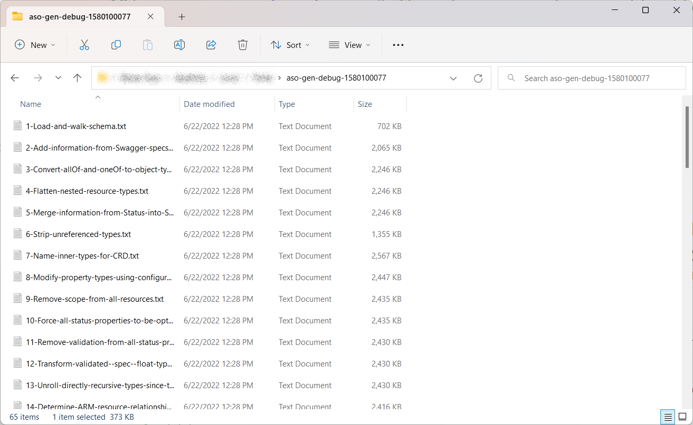
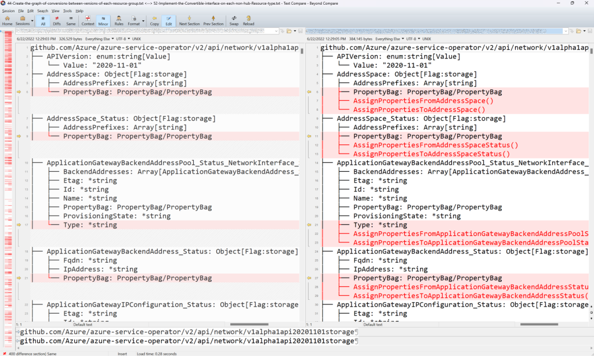

The ASO code generator is our secret sauce - it lowers the amount of effort required to add new Azure resources from several weeks to just a few days (or a few hours if you're lucky and you've done it before).

## What does the code generator do?

The code generator is a Go program that reads the Azure API definitions from the `azure-rest-api-specs` repository and generates most of the code required to support a resource.
The Swagger/OpenAPI definitions in that repo are transformed by the code generator into two forms - once for the `spec`, defining the desired state of the resource, and once for the `status`, defining the observed state of the resource.

Some background: Azure resources are extremely consistent in their structures and behaviours, and the code required to support them is thus also very consistent and repetitive. The code generator is designed to take advantage of this consistency to generate the bulk of the code required for a new resource.

## Adding the resource to the code generation configuration file

The code generator is configured using the [v2/azure-arm.yaml](https://github.com/Azure/azure-service-operator/blob/main/v2/azure-arm.yaml) configuration. This is a _large_ YAML file and it can be daunting to work with.

{}
Please don't apply any prettification tools to the file, as the flurry of changes will make reviewing your new resource much harder. There is wide variety in the preferences of YAML formatting - if you want to tidy up the file, please create an issue and we'll discuss it there.
{}

To add a new resource to this file, find the `objectModelConfiguration` section of the file.

Then, find the configuration for the `group` you want; if it's not there, create a new one, inserting it into the existing list in alphabetical order. Within the group, find the `version` you want; again, create a new one if it's not already there, and keep things in numerical order as you do so.

Add your new resource to the list for that version, including the directive `$exportAs: <name>` nested beneath.
You must also include the `$supportedFrom:` annotation. This should be the _next release_ of ASO, as that's the version what will support your resource. You can determine the name of the next ASO release by looking at our
[milestones](https://github.com/Azure/azure-service-operator/milestones).

The final result should look like this:

``` yaml
<group>:
  <version>:
    <resource name>: # singular, typically just remove the trailing "s"
      $exportAs: <resourceName>
      $supportedFrom: <the upcoming release>
```

For example, taking the _Azure Synapse Workspace_ sample from above:

``` yaml
synapse:
 2021-06-01:
   Workspace:
     $exportAs: Workspace
     $supportedFrom: v2.0.0
```

**Tip:** The `$exportAs` directive allows the name of the resource to be changed. We typically use this to simplify the name, relying on the **group** to disambiguate things. For example, if the original resource name was `SynapseWorkspace` we'd prefer to use `Workspace` to avoid stuttering.

If ASO was already configured to generate resources from this group (or version), be careful when adding your new resource that you don't break any existing configuration.

## Run the code generator

In your development environment, run the code generator:

```bash
task 
```

If you want to run the code generator manually, work from the `v2` folder and first build the generator yourself:

```bash
cd v2
pushd ./tools/generator; go build -o aso-gen; popd
```

Then run the generator:

```bash
./tools/generator/aso-gen gen-types azure-arm.yaml
```

## Fix any errors raised by the code generator

It's very likely your first run of the code generator will fail with some verbose errors.

_**These errors are normal.**_

We have built the code generator to catch most of the common problems that occur when adding a new resource, and the errors are designed to be as comprehensive as possible and to guide you through the process of fixing them.

The most common errors are listed below, but if you need help with a specific error, feel free to contact us either by [creating an issue](https://github.com/Azure/azure-service-operator/issues) or by joining us over on the [Kubernetes Slack](https://kubernetes.slack.com) in the [#azure-service-operator](https://kubernetes.slack.com/archives/C046DEVLAQM) channel

### \<Resource\> looks like a resource reference but was not labelled as one

We have heuristics to identify properties that look like they may be ARM References, but where they aren't explicitly identified as such in the OpenAPI spec.

For each of these errors, you need to add configuration to tell the code generator whether the property is an ARM ID or not.

Example:

```
Replace cross-resource references with genruntime.ResourceReference:  
["github.com/Azure/azure-service-operator/v2/apis/containerservice/v1api20210501/PrivateLinkResource.Id" 
looks like a resource reference but was not labelled as one.
```

To fix this, determine whether the property in question is an ARM ID or not, and then update the `objectModelConfiguration` section in the configuration file, as follows:

* Find the section you added earlier
* Add a new object if it's not already present
* Adding your property with a `$referenceType:` declaration nested below.

(Just above the `objectModelConfiguration` section, there is a large comment that details all the available configuration options.)

If the property is an ARM ID, use `$referenceType: arm` to flag that property as a reference:

```yaml
network:
  2020-11-01:
    NetworkSecurityGroup:
      PrivateLinkResource: 
        $referenceType: arm # the property IS an ARM reference
```

The code generator will swap out the property for a `genruntime.ResourceReference` type, allowing reference within the cluster, as well as into Azure.

If the property is _**not**_ an ARM ID, use `$referenceType: simple` instead:

```yaml
network:
  2020-11-01:
    NetworkSecurityGroup:
      $export: true
      PrivateLinkResource: 
        $referenceType: simple # the property IS NOT an ARM reference
```

The code generator will leave these properties as is.

### $export specified for type <type> but not consumed

This error is produced when you've added configuration for a new resource to the `objectModelConfiguration` section of the configuration file, but that configuration had no effect. (ASO prefers to make configuration errors visible rather than silently continue while doing the wrong thing).

The most likely cause of this error is a typo in the name of the group, version, or kind specified. ASO will try to help by listing the closest match - for example

```
version 2021-05-01-preview not seen (did you mean 2018-05-01-preview?)
```

Double check the names you've used and correct any typos.

If you're importing a _preview_ version of a resource, you may need to modify the `typeFilters` section at the top of the file. Early in the development of ASO we discovered that some preview versions are poorly formed - filtering them out was a straightforward way to avoid problems.

Type filters are applied in order, with the first matching filter being used. This one prunes all preview versions:

``` yaml
  - action: prune
    version: '*preview'
    because: preview SDK versions are excluded by default (they often do very strange things)
```

To allow a specific preview version, add a new filter to the list and make sure it appears before the `prune` filter (so it's applied first).

For example:

``` yaml
  - action: include
    group: keyvault
    version: v*20210401preview
    because: We want to support keyvault which is only available in preview version
```

Be sure to give a good reason for including the preview version so that other maintainers know why it's there.

If you have multiple preview versions for a single group, you can (and should) combine them together into a single filter. All of the filter fields allow using semicolons (;) to separate multiple values.

``` yaml
  - action: include
    group: servicebus
    version: v*20210101preview;v*20221001preview
    because: We want to export these particular preview versions
```

### Type <type> not seen

If you get an error indicating the generator can't find a type, but you're sure it exists:

```
E1214 10:34:15.476761   95884 gen_kustomize.go:111] 
Error during code generation:
failed during pipeline stage 23/67 [filterTypes]: 
Apply export filters to reduce the number of generated types: 
group cdn: version 2021-06-01: 
type DodgyResource not seen (did you mean ResourceReference?): 
type DodgyResource: $exportAs: ReputableResource not consumed
```

It's possible the submodule `v2/specs/azure-rest-api-specs` is out of date. Try running `git submodule update --init --recursive` to update the submodule. If this fixes your issue, please submit a separate PR to update the submodule by itself. (Submodule updates often include documentation updates to existing resources, and it's worth keeping those updates separate from new reources).

## Debugging

Sometimes it is useful to see what each stage of the generator pipeline has produced and/or changed.

Use the `--debug` flag to write detailed debug logs detailing internal state of the code generator (including all available data types) after each stage of the pipeline has run.

To use it, specify which group(s) or version(s) you want included in the debug output. For example, to see debug output including all types in the `network` group, run:

```bash
./tools/generator/aso-gen gen-types azure-arm.yaml --debug network
I0622 12:28:01.913420    5572 gen_types.go:49] Debug output will be written to the folder /tmp/.../aso-gen-debug-1580100077
... elided ...
I0622 12:29:15.836643    5572 gen_types.go:53] Debug output is available in folder /tmp/.../aso-gen-debug-1580100077
```

The volume of output is high - a separate log file is writting into the indicated directory for _each_ pipeline stage. As shown, the name of this directory is included in the output of the generator twice, once at the start and again at the end.



In this screenshot, I'm comparing the output after stage 44 with the output after stage 52, reviewing the results of all the intervening stages.



The debug flag accepts a variety of values:

* A single group: `--debug network`
* Multiple groups: `--debug network;compute`  
  (Use a semicolon to separate groups)
* A specific version of a group: `--debug network/v1api20201101`  
  (Use a slash to separate group and version; versions are specified as package names)
* Multiple groups and versions: `--debug network/v1api20201101;network/v1api20220701`
  (Again, use a semicolon to separate)
* Wildcards to match multiple groups: `--debug db*`  

**TODO: expand on other common errors**

----

With a successful run of the code generator complete, now's a good time to make your first commits. We recommend keeping your manual changes (e.g. to `azure-arm.yaml`) separate from the generated changes (all the "*_gen.go" files under `v2/api`) as it makes your PR easier for us to review. Once that's done, it's time to [review the generated resource]().
