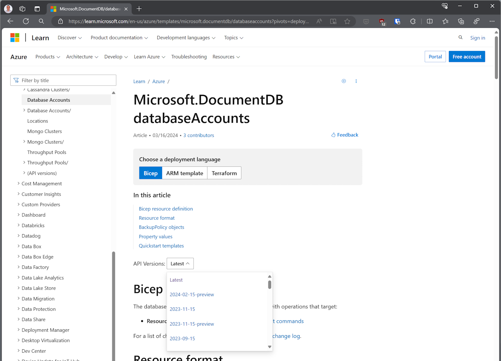
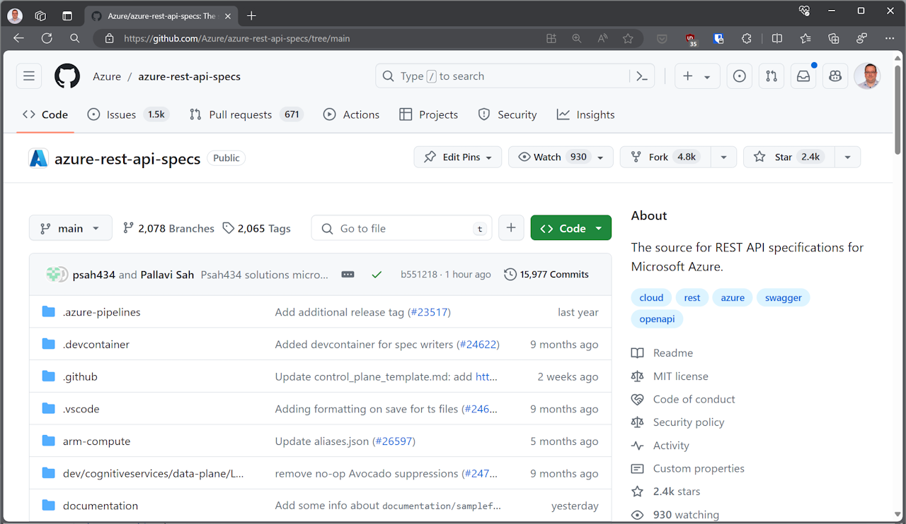
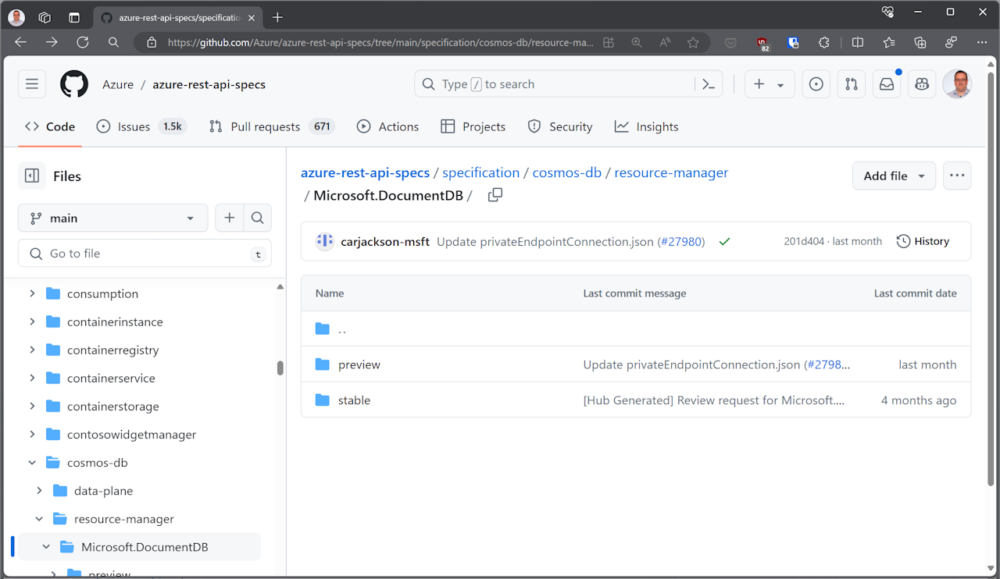
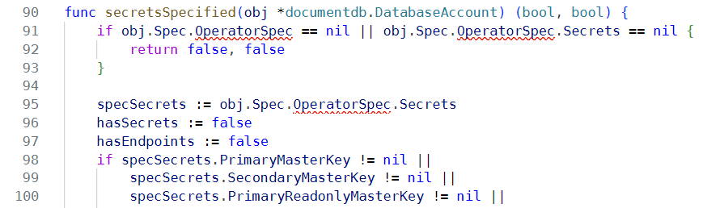
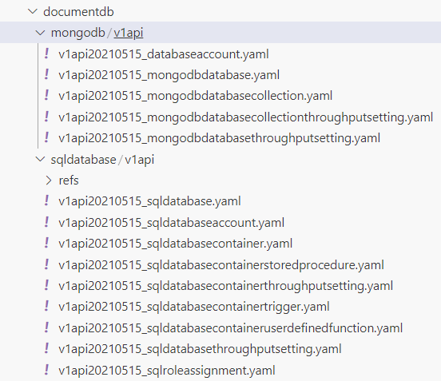

While adding a new version of an existing resource to Azure Service Operator (ASO) is _relatively_ straightforward, it's important to remember that this is relative to hand writing the resource from scratch. 

Our code generator does much of the heavy lifting, but the process isn't trivial and requires a good understanding of the Azure Resource Manager (ARM) API, the ASO code generator, and how the operator works.

This walkthrough will guide you through the process of upgrading a resource version in ASO. We'll be upgrading the `DatabaseAccount` resource for the `Microsoft.DocumentDB` provider, but the process is similar for any resource.

## Identify the version to upgrade

We're going to be importing a specific version of the resource - so we need to work out which version to pick.

### Check the Azure ARM documentation

Find the documentation page for the resource version you want to upgrade and check which versions are available.

Staring with a [web search](https://www.bing.com/search?q=azure+arm+bicep+Microsoft+documentdb), we find the latest stable version is `2023-11-15`. It is usually a good idea to upgrade to the latest **stable** version, unless you have a specific preview feature in mind.



### Check the specs

Another approach is to look at the actual OpenAPI (Swagger) specifications imported by the Azure Service Operator code generator. Navigate to the [Azure REST API specs](https://github.com/Azure/azure-rest-api-specs) repository:



After some searching for `Microsoft.DocumentDB` we find the folder we want is specification/cosmos-db/resource-manager/Microsoft.DocumentDB. 



Below here there are two folders, one for *stable* API versions, the other for *preview*. Looking in the *stable* folder, we discover the latest version is `2023-11-15`.

## Export DatabaseAccount

We start by updating the configuration of [`azure-arm.yaml`](https://github.com/Azure/azure-service-operator/blob/main/v2/azure-arm.yaml) to include the new version of the resource we want to upgrade.

``` yaml
    2023-11-15:
      DatabaseAccount:
        $export: true
        $supportedFrom: v2.7.0
```

The `$export` directive indicates we should export this resource in the generated code. 

The `$supportedFrom` directive indicates the version of the Azure Service Operator that supports this version of the resource - set this to the next upcoming release of ASO.

Now we run `task`. 

Eventually, this will run the code generator that writes most of the code needed for each new resource, but we'll need to iterate on the configuration a few times before we reach that point. 

``` bash
$ task
task: [generator:unit-tests] go test ./... -tags=noexit -run '.*'
... elided
```

For now, task finishes with an error:

``` 
[controller:generate-types] 02:24:22 ERR failed to execute root command 
error="error generating code: failed to execute stage 32: Replace cross-resource references in the config with astmodel.ARMID: 
github.com/Azure/azure-service-operator/v2/api/documentdb/v1api20231115/DatabaseAccountCreateUpdateProperties.NetworkAclBypassResourceIds 
looks like a resource reference but was not labelled as one; 
You may need to add it to the 'objectModelConfiguration' section of the config file"
```

Many ARM resources have references to other ARM resources. When working in Azure, these are always URLs - but we have the capability with ASO to reference resources within the current cluster. If ASO knows about these references, it can be smarter about which resource is created first.

The code generator includes heuristics to detect ARM references between resources, but requires us to make a decision for each one. In the general case, deciding whether a property is an ARM reference or not requires review the documentation for the resource.

In this case, we see something interesting: prior versions of the resource did not mark the property `NetworkAclBypassResourceIds` as an ARM reference, but someone has left a comment indicating that it should be. 

``` yaml
    2021-05-15:
      ...
      DatabaseAccountCreateUpdateProperties:
        NetworkAclBypassResourceIds:
          $armReference: false  # TODO[breaking]: Change this to true
```

As commented, changing the old version to be an ARM reference is a breaking change, but nothing prevents us from doing the right thing in the new version, as long as we ensure conversions between the versions work smoothly. 

Let's configure the new property correctly, but make a note that we'll need to come back to address the change in the property type later.

``` yaml
    2023-11-15:
      ...
      DatabaseAccountCreateUpdateProperties:
        NetworkAclBypassResourceIds:
          $armReference: true
```

## Update the KubernetesExporter extension implementation

Running `task` again, and this time we fail with a compilation error:

``` bash
asoctl:unit-tests] # github.com/Azure/azure-service-operator/v2/api/documentdb/customizations
[asoctl:unit-tests] ../../api/documentdb/customizations/database_account_extensions.go:46:25: 
cannot use typedObj (variable of type *"github.com/Azure/azure-service-operator/v2/api/documentdb/v1api20210515/storage".DatabaseAccount) 
as "sigs.k8s.io/controller-runtime/pkg/conversion".Hub value in variable declaration: 
*"github.com/Azure/azure-service-operator/v2/api/documentdb/v1api20210515/storage".DatabaseAccount 
does not implement "sigs.k8s.io/controller-runtime/pkg/conversion".Hub (missing method Hub)
```

This compilation error is expected - caused by a specific type assertion in an extension for DatabaseAccount. 

``` go
	// Type assert that we are the hub type. This will fail to compile if
	// the hub type has been changed but this extension has not
	var _ conversion.Hub = typedObj
```

For each resource, there's a canonical _hub version_, the version of the resource that's stored (persisted) in Kubernetes. Adding a new (later) version of a resource changes the hub version to a new one. 

As a part of adding a new version of a resource, we need to review any extensions written for that resource to make sure they will still work properly. 
To ensure we do this, our ASO convention is that each extension includes a specific type assertion designed to trigger a compilation error if/when the hub version changes.

Reviewing `database_account_extensions.go` we see the extension implements the `KubernetesExporter` interface to publish secrets and/or configmaps from the resource.

We update the extension by changing the import path to the new version of the resource:

``` go
import (
  ...
  // Add
	documentdb "github.com/Azure/azure-service-operator/v2/api/documentdb/v1api20231115/storage"
  // Remove
	documentdb "github.com/Azure/azure-service-operator/v2/api/documentdb/v1api20210515/storage"
)
```

After doing this, we can see compilation errors in the extension - the property `OperatorSpec` is missing:



To fix up the missing property, we revisit the configuration file and copy the configuration for `$azureGeneratedSecrets` forward to the new version:

``` yaml
    2023-11-15:
      DatabaseAccount:
        ...
        $azureGeneratedSecrets:
          - PrimaryMasterKey
          - SecondaryMasterKey
          - PrimaryReadonlyMasterKey
          - SecondaryReadonlyMasterKey
          - DocumentEndpoint
```
Running `task` again, is fails with this error:

``` bash
task: [controller:verify-samples] /workspaces/azure-service-operator/scripts/v2/check_samples.py v2/
[controller:verify-samples] Found 1 missing samples: {'documentdb/v1api*/v1api20231115_databaseaccount.yaml'}
```

This is good news, as it means the code generator has successfully generated the new resource version, only failing when it checked to see if we had the required samples.

## Creating a Sample

To ease adoption of ASO, we want to have a sample for *every* resource version so that users can see how to use the resource in their own clusters. As we've just seen, we enforce in our CI pipeline.

Looking in the `v2/samples/documentdb` folder, we can see the current samples are all for the earlier version of the resource.



 Before we can copy one of these and use it as a base for a new sample, we need to rename the folders to reflect the version of the resources they contain.

``` bash
$ cd v2/samples/documentdb/
$ cd mongodb
$ mv v1api v1api20210515
$ ls -la
total 12
ldrwxr-xr-x 3 vscode vscode 4096 Apr 17 20:37 .
drwxr-xr-x 4 vscode vscode 4096 Mar  6 22:42 ..
drwxr-xr-x 2 vscode vscode 4096 Mar  6 22:42 v1api20210515
$ cd ../sqldatabase
$ mv v1api v1api20210515
$ ls -la
total 12
drwxr-xr-x 3 vscode vscode 4096 Apr 17 20:38 .
drwxr-xr-x 4 vscode vscode 4096 Mar  6 22:42 ..
drwxr-xr-x 3 vscode vscode 4096 Mar  6 22:42 v1api20210515
```

Now let's make a copy of the old sample for the new version of the resource. Note how we also include the version in the name of the sample itself, not just the folder.

``` bash
$ cd mongodb
$ mkdir v1api20231115
$ cp v1api20210515/v1api20210515_databaseaccount.yaml v1api20231115/v1api20231115_databaseaccount.yaml
```
Next, we modify the new sample to reflect the new version of the resource. 

``` yaml
apiVersion: documentdb.azure.com/v1api20210515
kind: DatabaseAccount
metadata:
  name: sample-mongodb-account
  namespace: default
spec:
  location: eastus
  owner:
    name: aso-sample-rg
  kind: MongoDB
  capabilities:
    - name: EnableMongo
  databaseAccountOfferType: Standard
  locations:
    - locationName: eastus
```

The main thing we change here is the `apiVersion` of the resource. 

If there are any new properties in a new version of a resource, consider adding them to the sample as well. An easy way to find new properties is to compare the `structure.txt` files included alongside the generated code. 

For the new version of DatabaseAccount, we'll add `disableLocalAuth: true` and `minimalTlsVersion: Tls12`.

## Conversion Fixing

Remember the change we noted earlier, flagging `NetworkAclBypassResourceIds` with `$armReference: true` in the new version? Time to revisit that.

In the older version, `NetworkAclBypassResourceIds` property is an array of strings (`[]string`) but the new `NetworkAclBypassResourceReferences` property is an array of references (`[]genruntime.ResourceReference`). We need to implement a conversion between these two properties.

_Why do we need to do this?_ Kubernetes Custom Resources must adhere to a very strong versioning contract - every version of a resource should be convertible to every other version with as little loss of information as possible (ideally none).

Currently, we can't upgrade cleanly because any values in `NetworkAclBypassResourceIds` in the old version will be lost when converting to the new version. If we are wanting to downgrade, there's inevitable loss of information if a `genruntime.ResourceReference` references a cluster resource, but any Azure reference can and should be preserved.

Fortunately, the ASO code generator creates infrastructure to allow us to implement this conversion easily. 

In `v1api20210515/storage/database_account_types_gen.go` the interface `augmentConversionForDatabaseAccount_Spec` is what we want, allowing us to *augment* the existing conversions of `DatabaseAccount_Spec`. We mustn't (can't!) modify the code-generated files, so we write the code in a separate file.

Create a new file `v1api20210515/storage/database_account_types.go` (same base name as the generated file, but without `_gen`), in which we implement the `augmentConversionForDatabaseAccount_Spec` interface by writing two methods: `AssignPropertiesFrom` and `AssignPropertiesTo`. Here's the full code, with commentary.

``` go
// Copyright (c) Microsoft Corporation.
// Licensed under the MIT license.
package storage

import (
	v20231115s "github.com/Azure/azure-service-operator/v2/api/documentdb/v1api20231115/storage"
	"github.com/Azure/azure-service-operator/v2/pkg/genruntime"
)
```

Explicitly declaring that we need to implement the interface gives us safety that we've implemented the methods correctly. It also protects the extension from future changes to the generator - if we ever decided to change the generated `augument*` interfaces, this _type assertion ensures_ the extension will fail to compile and we'll know we need to update it. 

``` go
// Ensure databaseAccount implements augmentConversionForDatabaseAccount
var _ augmentConversionForDatabaseAccount_Spec = &DatabaseAccount_Spec{}
```

To down-convert from the new version to the old version, we need to convert the `NetworkAclBypassResourceReferences` into a list of strings, by selecting the `ARMID` property of each. 

We don't have to worry about any other properties on the Specs, only `NetworkAclBypassResourceReferences` and `NetworkAclBypassResourceIds` - the interface _augments_ the existing conversion methods and is called by the generated code after most of the heavy lifting is complete.

``` go
func (account *DatabaseAccount_Spec) AssignPropertiesFrom(src *v20231115s.DatabaseAccount_Spec) error {
	// Copy any references that point directly to ARM resources into NetworkAclBypassResourceIds
	if len(src.NetworkAclBypassResourceReferences) > 0 {
		ids := make([]string, 0, len(src.NetworkAclBypassResourceReferences))
		for _, ref := range src.NetworkAclBypassResourceReferences {
			ids = append(ids, ref.ARMID)
		}

		account.NetworkAclBypassResourceIds = ids
		account.PropertyBag.Remove("NetworkAclBypassResourceReferences")
	} else {
		account.NetworkAclBypassResourceIds = nil
	}

	return nil
}
```

Note how we're careful not to store an empty slice if there are no references to ARM resources, we store a **nil** instead. This is forced by the way the YAML serialization library works. Since we've handled the property `NetworkAclBypassResourceReferences`, we remove it from the `PropertyBag` to avoid duplicating data.

To up convert from the old version to the new version, we do the reverse. Fortunately, this direction is lossless - we can always convert a list of ARM IDs into a list of references.

``` go
func (account *DatabaseAccount_Spec) AssignPropertiesTo(dst *v20231115s.DatabaseAccount_Spec) error {
	// Copy all ARM IDs into NetworkAclBypassResourceReferences
	if len(account.NetworkAclBypassResourceIds) > 0 {
		references := make([]genruntime.ResourceReference, 0, len(account.NetworkAclBypassResourceIds))
		for _, ref := range account.NetworkAclBypassResourceIds {
			krr := genruntime.ResourceReference{
				ARMID: ref,
			}
			references = append(references, krr)
		}

		dst.NetworkAclBypassResourceReferences = references
	} else {
		dst.NetworkAclBypassResourceReferences = nil
	}
	
	return nil
}
```

The ASO code generator writes unit tests to verify that all conversions between resource versions function correctly. If you make any errors in your implementations, it's extremely likely these tests will fail, and thus catch the problem. For example, I initially stored empty slices instead of **nil** values in the `NetworkAclBypassResourceIds` and `NetworkAclBypassResourceReferences` properties when there were no references to ARM resources, and the tests failed. 

Here's abridged output from the test that failed - it shows exactly which property was the problem, and also flags extra stuff in the `PropertyBag` that I forgot to remove.

``` text
Elapsed time: 17.755865ms
! Round trip from DatabaseAccount to DatabaseAccount 
via AssignProperties_To_DatabaseAccount 
& AssignProperties_From_DatabaseAccount returns original: 
Falsified after 20 passed tests.
> Labels of failing property:  storage.DatabaseAccount{
     TypeMeta:   v1.TypeMeta{},
     ObjectMeta: v1.ObjectMeta{},
     Spec:       storage.DatabaseAccount_Spec{
         ... elided ...
         NetworkAclBypass:            (*string)(nil),
-        NetworkAclBypassResourceIds: {""},
+        NetworkAclBypassResourceIds: {},
         OperatorSpec:                (*storage.DatabaseAccountOperatorSpec)(nil),
         OriginalVersion:             "i",
         Owner:                       (*genruntime.KnownResourceReference)(nil),
-        PropertyBag:                 {},
+        PropertyBag:                 {"NetworkAclBypassResourceReferences":"[{}]"},
         PublicNetworkAccess:         (*string)(nil),
         ... elided ...
     },
 }
```

## Committing Code

This time when we run `task`, we get a clean run. 

Time to commit our changes into a new branch. We recommend separating your changes into a series of commits with useful messages.

Start by creating your new branch and commiting your configuration changes.

``` bash
$ git checkout -b feature/update-documentdb
$ git add v2/azure-arm.yaml 
$ git commit -m "Add new version of DatabaseAccount to config"
[feature/update-documentdb 435b90c83] Add new version of DatabaseAccount to config
 1 file changed, 14 insertions(+)
```

Next we commit the generated code, along with our updated customization.

``` bash
$ git add v2/api/documentdb
$ git add v2/internal/controllers/controller_resources_gen.go
$ git commit -m "Update generated code"
[feature/update-documentdb 054a572dd] Update generated code
 24 files changed, 37235 insertions(+), 849 deletions(-)
```

Now we commit the updated samples

``` bash
$ git add v2/samples/documentdb
$ git commit -m "Update samples"
[feature/update-documentdb bdb87414f] Update samples
 16 files changed, 17 insertions(+)
```

Finally, we commit the updated documentation

``` bash
$ git add docs/hugo/content/reference 
$ git commit -m "Update documentation"
[feature/update-documentdb c55361df0] Update documentation
 2 files changed, 16 insertions(+)
```

## Export Mongodb Resources

Now we repeat the process, exporting the new versions of resources for MongodbDatabase. In the interests of space, I'll only call out the interesting parts of this process. First we copy forward configuration from the previous versions of the resources:

``` yaml
    2023-11-15:
      ...
      DatabaseAccounts_MongodbDatabase:
        $exportAs: MongodbDatabase
        $supportedFrom: v2.7.0
      DatabaseAccounts_MongodbDatabases_Collection:
        $exportAs: MongodbDatabaseCollection
        $supportedFrom: v2.7.0
      DatabaseAccounts_MongodbDatabases_Collections_ThroughputSetting:
        $exportAs: MongodbDatabaseCollectionThroughputSetting
        $supportedFrom: v2.7.0
      DatabaseAccounts_MongodbDatabases_ThroughputSetting:
        $exportAs: MongodbDatabaseThroughputSetting
        $supportedFrom: v2.7.0
```

The default names used by ASO are poor, so we're using the `$exportAs` directive to give them better names. Using `$exportAs` implies `$export: true`, so we don't need to include that as well. Keeping the names consistent across resource versions is also important.

Running `task` again, we get an error about `MongoDBCollectionResource.Id` looking like a resource reference, so we update the config and run again.

``` bash
[controller:generate-types] 23:51:00 ERR failed to execute root command error="error generating code: 
failed to execute stage 32: Replace cross-resource references in the config with astmodel.ARMID: 
github.com/Azure/azure-service-operator/v2/api/documentdb/v1api20231115/MongoDBDatabaseResource.Id 
looks like a resource reference but was not labelled as one; You may need to add it to the 
'objectModelConfiguration' section of the config file"
```

Ditto for `MongoDBDatabaseResource`. Update the config and run again.

This time, we get notified there are four required samples missing:

``` text
[controller:verify-samples] Found 4 missing samples: 
{
  'documentdb/v1api*/v1api20231115_mongodbdatabasecollection.yaml', 
  'documentdb/v1api*/v1api20231115_mongodbdatabasecollectionthroughputsetting.yaml', 
  'documentdb/v1api*/v1api20231115_mongodbdatabase.yaml', 
  'documentdb/v1api*/v1api20231115_mongodbdatabasethroughputsetting.yaml'
}
```

After creating those sample files, we get a clean run of `task`. Time to commit the changes.

## Update SQL Resources

Finally, we repeat the process for the SQL resources. 

## Write MongoDB tests 

For every resource version, we have a coded test in the `internal/controllers` package that verifies the resource can be created and deleted.

The code for these tests can appear intimidating at first, but they all follow the same structure:

* Create a resource group in which to test
* Create a set of in-memory objects representing the resources to be created
* Call CreateResourcesAndWait() to create all those objects
* Optionally run some subtests
* If supported, make changes and check those are updated correctly in Azure
* Delete the resources from Azure and check they are deleted
* Delete the resource group to clean up

We start by creating a new file for the tests, following the new naming convention (not all tests have been migrated): `documentdb_mongodb_crud_v20231115_test.go`. Let's walk through the test and disect how it works.

The test starts with the normal Go testing preamble:

``` go 
func Test_DocumentDB_MongoDatabase_v20231115_CRUD(t *testing.T) {
	t.Parallel()
```

We create a test context, conventionally called `tc`, which provides a infrastructure support for the test.

``` go
	tc := globalTestContext.ForTest(t)
```

First use of the test context is to create a dedicated resource group for this test. The name of this resource group is random, but deterministic, allowing multiple tests to run side-by-side without interfering with each other, and ensuring the test is repeatable.

``` go
	// Create our resource group
	rg := tc.CreateTestResourceGroupAndWait()
```

We declare `acct` as a `DatabaseAccount` object, and set the properties we want to use for testing with a MongoDB database.

``` go
	tc.AzureRegion = to.Ptr("australiaeast")

	// Declare a Cosmos DB account for our MongoDB database
	kind := documentdb.DatabaseAccount_Kind_Spec_MongoDB
	offerType := documentdb.DatabaseAccountOfferType_Standard
	acct := documentdb.DatabaseAccount{
		ObjectMeta: tc.MakeObjectMetaWithName(tc.NoSpaceNamer.GenerateName("db")),
		Spec: documentdb.DatabaseAccount_Spec{
			Location: tc.AzureRegion,
			Owner:    testcommon.AsOwner(rg),
			Kind:     &kind,
			Capabilities: []documentdb.Capability{{
				Name: to.Ptr("EnableMongo"),
			}},
			DatabaseAccountOfferType: &offerType,
			Locations: []documentdb.Location{
				{
					LocationName: to.Ptr("australiaeast"), // Capacity constraints //  tc.AzureRegion,
				},
			},
		},
	}
```
At the time of writing, we couldn't deploy these into the usual ASO test region, so the test is hard coded to use `australiaeast`: by overriding the default value for `tc.AzureRegion`. Applying the override in this way ensures all the resources in the test are co-located in the same region.

Next we declare a MongoDB database called `db` and configure that as well. Key here is the configuration of its `Owner` as the account we just created.

``` go
	// Declare a MongoDB database
	name := tc.Namer.GenerateName("mongo")
	db := documentdb.MongodbDatabase{
		ObjectMeta: tc.MakeObjectMetaWithName(name),
		Spec: documentdb.DatabaseAccounts_MongodbDatabase_Spec{
			Location: to.Ptr("australiaeast"), // Capacity constraints //  tc.AzureRegion,
			Options: &documentdb.CreateUpdateOptions{
				AutoscaleSettings: &documentdb.AutoscaleSettings{
					MaxThroughput: to.Ptr(4000),
				},
			},
			Owner: testcommon.AsOwner(&acct),
			Resource: &documentdb.MongoDBDatabaseResource{
				Id: &name,
			},
		},
	}
```

Now we create both resources in Azure and wait for them to be created. 

ASO is supposed to take care of sequencing the creation of resources, in this case so that the account is created before the database. Creating all resources at once by calling `CreateResourcesAndWait` is a straightforward way to test that this works for the new resource.

``` go
	// Create both resources in Azure
	tc.CreateResourcesAndWait(&acct, &db)
```

A few quick assertions to ensure the resources were created properly.

``` go
	// Perform some assertions on the resources we just created
	expectedKind := documentdb.DatabaseAccount_Kind_STATUS_MongoDB
	tc.Expect(acct.Status.Kind).ToNot(BeNil())
	tc.Expect(*acct.Status.Kind).To(Equal(expectedKind))
	tc.Expect(acct.Status.Id).ToNot(BeNil())
	tc.Expect(db.Status.Id).ToNot(BeNil())
```

Next, we make a change to the account to verify that ASO is able to update the resource in Azure.

``` go
	// Update the account to ensure that works
	tc.LogSectionf("Updating tags on account")
	old := acct.DeepCopy()
	acct.Spec.Tags = map[string]string{"scratchcard": "lanyard"}
	tc.PatchResourceAndWait(old, &acct)
	tc.Expect(acct.Status.Tags).To(HaveKey("scratchcard"))
```

With the MongoDB database created, we've unlocked a couple of additional scenarios that we can test in parallel.

``` go
	// Run sub-tests
	tc.RunParallelSubtests(
		testcommon.Subtest{
			Name: "CosmosDB MongoDB Collection CRUD",
			Test: func(tc *testcommon.KubePerTestContext) {
				DocumentDB_MongoDB_Collection_v20231115_CRUD(tc, &db)
			},
		},
		testcommon.Subtest{
			Name: "CosmosDB MongoDB Database throughput settings CRUD",
			Test: func(tc *testcommon.KubePerTestContext) {
				DocumentDB_MongoDB_Database_ThroughputSettings_v20231115_CRUD(tc, &db)
			},
		})
``` 

Finally, we delete the resources one at a time and make sure the deletions work. First the database:

``` go
	// Delete the database and make sure it goes away
	armId := *db.Status.Id
	tc.DeleteResourceAndWait(&db)

	exists, _, err := tc.AzureClient.CheckExistenceWithGetByID(
		tc.Ctx,
		armId,
		string(documentdb.APIVersion_Value))
	tc.Expect(err).ToNot(HaveOccurred())
	tc.Expect(exists).To(BeFalse())
```

And then the account:

``` go
	// Delete the account and make sure it goes away
	armId = *acct.Status.Id
	tc.DeleteResourceAndWait(&acct)

	exists, _, err = tc.AzureClient.CheckExistenceWithGetByID(
		tc.Ctx,
		armId,
		string(documentdb.APIVersion_Value))
	tc.Expect(err).ToNot(HaveOccurred())
	tc.Expect(exists).To(BeFalse())
}
```

## Run tests

To run our coding test, we use the infrastructure supplied in our `Taskfile.yaml`. After ensuring we have the usual environment variables set for authentication against Azure, we can run the tests with the following command:

``` bash
TEST_FILTER=Test_DocumentDB_MongoDatabase_v20231115_CRUD TIMEOUT=60m task controller:test-integration-envtest
```

This command will spin up a local kubernetes cluster, set up the ASO controller, and then run the test. 

A 60 minute timeout should be enough for most resources, but there are a few that take longer to create, or much longer to delete. If you're running into timeouts, you should increase the timeout value - but before you do, check the test logs to verify that the test is actually making progress. If your test gets stuck waiting for something to happen that's never going to occur, increasing the timeout won't help.

Once the test passes, you'll have a new recording to commit to your branch, recording all the HTML interactions made during execution. This recording allows us to rapidly and reliably re-run the test to check for regressions.

We suggest running your test again, using the recording, to ensure everything works. If it doesn't reach out to the ASO team for help by logging an issue on our GitHUb repository.

``` bash
$  git status
On branch feature/update-documentdb
Untracked files:
  (use "git add <file>..." to include in what will be committed)
        .go-version
        v2/internal/controllers/documentdb_mongodb_crud_v20231115_test.go
        v2/internal/controllers/recordings/Test_DocumentDB_MongoDatabase_v20231115_CRUD.yaml
```

## SQL Tests

We repeat the above process for the SQL resources too.

## Sample Verification

Have you ever tried to use the samples associated with a project and found they simply don't work? We have, and we don't want that to happen with ASO. So every sample is run through a verification process to ensure it's valid. This process is recorded so that we can re-run verification quickly and easily.

First, define the usual environment variables for authentication against your Azure subscription

``` bash
export AZURE_SUBSCRIPTION_ID=<.your.subscription.>
export AZURE_TENANT_ID=<.your.tenant.id.>
export AZURE_CLIENT_ID=<.your.client.id.>
export AZURE_CLIENT_SECRET=<.your.client.secret.>
```

Then we can run each new sample. It's best to record each sample one at a time, so you can see which one failed if there's a problem. There's no technical limitation here, and you _can_ run all the recordings in parallel if needed - but it's easier to debug if you don't.

You can construct the test name as follows:

* Fixed prefix: `Test_Samples_CreationAndDeletion/Test_`
* Group directory name (capitalized): `Mongodb`
* Separator: `_`
* Version directory name: `v1api20231115`
* Fixed suffix: `_CreationAndDeletion`


``` bash
$  TIMEOUT=60m TEST_FILTER=Test_Samples_CreationAndDeletion/Test_Mongodb_v1api20231115_CreationAndDeletion task controller:test-integration-envtest
```

The test will start by creating a resource group into which all the resources will be created. This resource group has a random, but deterministic, name. The randomization allows multiple samples to be run side-by-side without interfering with each other, while the determinizm ensures the recording will be usable. 

When the test terminates, the resource group is deleted to clean up any debris left behind by the test. If you interrupt the test before it naturally terminates, you'll need to manually delete the resource group before re-running the test.

While the test runs, keep an eye out for any fatal errors that indicate the test isn't going to pass. If you see any, you should stop the test, investigate the problem, and make a correction.

Here's an example fatal error:

```
[controller:test-integration-envtest]     logr.go:280: I2024-04-19T04:27:49Z] MongodbDatabaseController "msg"="Owner exists but is not ready. Current condition" 
name="sample-db-mongodb" namespace="aso-test-samples-creationanddeletion-test-mongodb-v1api20-6db11" ready="Condition [Ready], Status = \"False\", 
ObservedGeneration = 1, Severity = \"Error\", Reason = \"BadRequest\", Message = \"DisableLocalAuth is only allowed to be configured for SQL API account.
\\r\\nActivityId: e4906ecd-2644-4f01-90a2-7a1a054ffd88, Microsoft.Azure.Documents.Common/2.14.0: PUT https://management.azure.com/subscriptions/
82acd5bb-4206-47d4-9c12-a65db028483d/resourceGroups/asotest-rg-ceitso/providers/Microsoft.DocumentDB/databaseAccounts/
sample-mongodb-account\\n--------------------------------------------------------------------------------\\nRESPONSE 400: 400 Bad Request\\nERROR CODE: 
BadRequest\\n--------------------------------------------------------------------------------\\n{\\n  \\\"code\\\": \\\"BadRequest\\\",\\n  \\\"message\\\":
\\\"DisableLocalAuth is only allowed to be configured for SQL API account.\\\\r\\\\nActivityId: e4906ecd-2644-4f01-90a2-7a1a054ffd88, 
Microsoft.Azure.Documents.Common/2.14.0\\\"\\n}\\n--------------------------------------------------------------------------------\\n\", 
LastTransitionTime = \"2024-04-19 04:16:49 +0000 UTC\""
```

In this case, I needed to remove the `disableLocalAuth` property from the sample, as it's not supported for MongoDB accounts. So much for adding it proactively earlier!


