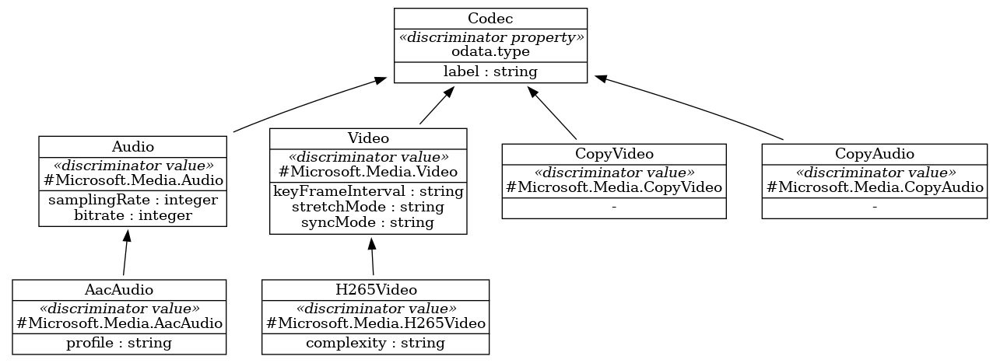
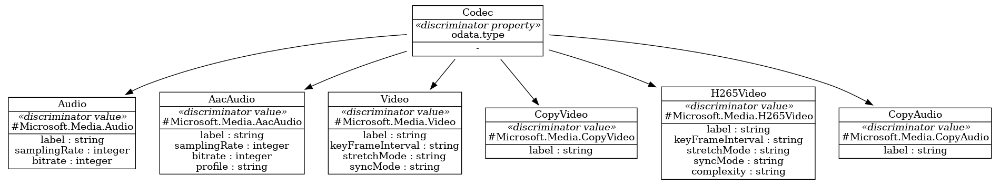

Coined in frustration by the ASO project team, the phrase *evil discriminator* identifies the fundamental differences in the way polymorphic API payloads are defined in Swagger, as compared to the JSON Schema on which ASO was originally based.

## Context

When parsing a JSON Schema and populating our abstract-syntax-model (astmodel), all of the available options for a OneOf are available as children of a single node. This makes processing relatively simple, and greatly influenced our object model during the original development of ASO.

As we move to use Swagger/OpenAPI as our sole source of truth (see Issue [#1758](https://github.com/Azure/azure-service-operator/issues/1758)), we have discovered that not only is the idiom for modelling this via Swagger very different, but there are several variations we need to accomodate as well.

This is best understood by looking at a real example, taken from the Swagger for Azure Media Encoding Services, version [2021-11-01](https://github.com/Azure/azure-rest-api-specs/tree/main/specification/mediaservices/resource-manager/Microsoft.Media/Encoding/stable/2021-11-01).

`Codec` describes how to encode a video or audio stream, and is defined as:

```json
"Codec": {
  "discriminator": "@odata.type",
  "properties": {
    "@odata.type": {
      "type": "string",
      "description": "The discriminator for derived types."
    },
    "label": {
      "type": "string",
      "description": "An optional label for the codec. The label can be used to control muxing behavior."
    }
  },
  "type": "object",
  "required": [
    "@odata.type"
  ],
  "description": "Describes the basic properties of all codecs."
},
```

This definition defines the descriminator to use to identiy different codecs (`odata.type`), and also defines a property (`label`) that is common to all codecs.

Actual codecs are defined elsewhere in the file, each with a different discriminator value. For example, the `Audio` codec definition is:

```json
"Audio": {
  "x-ms-discriminator-value": "#Microsoft.Media.Audio",
  "allOf": [
    {
      "$ref": "#/definitions/Codec"
    }
  ],
  "properties": {
    "channels": {
      "type": "integer",
      "format": "int32",
      "description": "The number of channels in the audio."
    },
    "samplingRate": {
      "type": "integer",
      "format": "int32",
      "description": "The sampling rate to use for encoding in hertz."
    },
    "bitrate": {
      "type": "integer",
      "format": "int32",
      "description": "The bitrate, in bits per second, of the output encoded audio."
    }
  },
  "type": "object",
  "description": "Defines the common properties for all audio codecs."
},
```

The discriminator value to use is defined by the `x-ms-discriminator-value` option of `#Microsoft.Media.Audio`.

The reference to the base `Codec` definition is found within the `allOf` property, which is a list of references to other definitions. This is a common pattern in Swagger, and is used to define inheritance.

New properties 'channels', 'samplingRate' and 'bitrate' are defined.

The definition for `Video` follows a similar pattern, referencing the original `Codec` definition and define new properties.

```json
"Video": {
  "x-ms-discriminator-value": "#Microsoft.Media.Video",
  "allOf": [
    {
      "$ref": "#/definitions/Codec"
    }
  ],
  "properties": {
    "keyFrameInterval": {
      "type": "string",
      "format": "duration",
    },
    "stretchMode": {
      "type": "string",
      "enum": [
        "None",
        "AutoSize",
        "AutoFit"
      ],
      "description": "The resizing mode - how the input video will be resized to fit the desired output resolution(s). Default is AutoSize"
    },
    "syncMode": {
      "type": "string",
      "enum": [
        "Auto",
        "Passthrough",
        "Cfr",
        "Vfr"
      ],
      "description": "The Video Sync Mode"
    }
  },
  "type": "object",
  "description": "Describes the basic properties for encoding the input video."
},
```

The discriminator value used is `#Microsoft.Media.Video`, and new properties `keyFrameInterval`, `stretchMode` and `syncMode` are defined.

Note that some details not relevant to the current discussion have been elided.

Complicating the situation, definitions can form a hierarchy, with multiple levels of inheritance. For example, the `AaacAudio` definition is based on `Audio`, which in turn is based on `Codec`:

```json
"AacAudio": {
  "x-ms-discriminator-value": "#Microsoft.Media.AacAudio",
  "allOf": [
    {
      "$ref": "#/definitions/Audio"
    }
  ],
  "properties": {
    "profile": {
      "type": "string",
      "enum": [
        "AacLc",
        "HeAacV1",
        "HeAacV2"
      ],
      "description": "The encoding profile to be used when encoding audio with AAC."
    }
  },
  "type": "object",
  "description": "Describes Advanced Audio Codec (AAC) audio encoding settings."
},
```

We can depict these relationships visually:



In order for the rest of the ASO code generator to operate normally, we need to transform this structure into one that matches the form available in the original JSON Schema:



The changes here are:

* All references are reversed, so that `Codec` references each potential derivation.
* References are direct, even to *more-derived* types.
* The `label` property from `Codec` has been pushed down to all of the derived types.
* Properties from `Video` have been copied to `H265Video`, eliminating the need for hierarchy.
* Similarly, properties from `Audio` have been copied to `AacAudio`.

### Challenges

Derived types may not be co-resident in the same JSON file, requiring an approach that's driven by processing of each leaf as encountered, instead of being driven by the root.

Many (but not all) leaf types will explicitly declare a property with the name required by the roots discriminator property, but as an enumeration with a single value. If such a property is not found, we need to synthesize one.

## Decision
## Status
## Consequences
## Experience Report
## References
