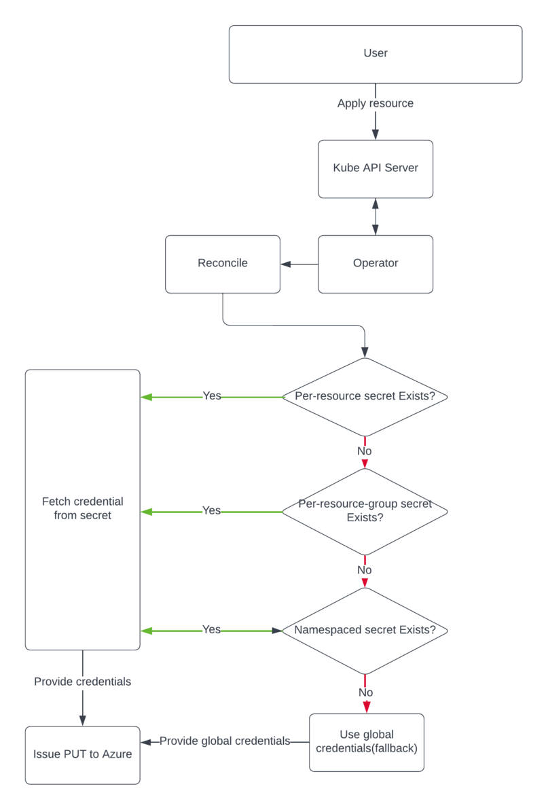

## Context

Some users of Azure Service Operator want to have a single instance that manages Azure resources across multiple subscriptions. This is useful, for example, if the organisation has a large cluster used by multiple teams, each team having their own Azure subscription.
To support this, ASO will introduce support for multiple credentials, each associated with a specific scope:

**Global Secret(aso-controller-settings)** is a currently existing one and is used as default for all Azure Resources

**Namespaced Secrets** will be used for all Azure Resources within a specific cluster namespace

**Per-resource-group Secrets** will be used for all Azure Resources within a specific Resource Group

**Per-resource Secrets** will be used for specific resources

## Credential selection hierarchy

We'll be using a pattern to determine which of the above secrets we use for operation on a resource. As in the below flow chart, if a resource is applied to the operator and the resource exists, operator would fetch and apply credentials in a following manner. If it's a new resource, operator would have to go through the secret selection hierarchy. Where, operator would first check if Per-resource or per-resource-group secret exists, if not, then will check for the namespaced secret. If any of the above is provided, operator would perform actions according to the **options** below. If none is provided, we'll fallback to use the global credential for that resource, which is the default cluster scoped secret(aso-controller-settings) in ASO namespace used today. 

 

## Options

In all the proposed solutions: 
1. Operator would cache (in-memory) the credentials to be used for resources when we reconcile and a mechanism to identify the credentials used for a resource. 
2. Operator would add `serviceoperator.azure.com/subscription: <SUBSCRIPTION_ID>` annotation on each resource, which would be checked with the current credentials on each reconcile. This would prevent users from updating a credential and causing their resource to be created in another subscription without deleting it from the first subscription.

### Option 1: Fixed secret names

In secrets lookup option, fixed naming patterns would be used to look up a secret each time a new resource is created. Operator would first use the naming pattern for the resource group, then for the cluster namespace. If a secret is found with the expected name, the credentials for the resource would be cached for use the next time. If no secret was found matching any patter, the default global secret would be used.

NOTE: Annotation/condition will be added on the resource while creation which will have information about the secret name used for creation/reconcile.

**Fixed secret name pattern:**

| Secret Type        | Pattern                        |
|--------------------|--------------------------------|
| Namespaced         | aso-credential                 |
| Per-resource-group | aso-credential-{rg-name}       | 
| Per-resource       | aso-credential-{resource-name} |


**Pros:**
1. Users don't have to specify the configuration for each resource explicitly

**Cons:**
1. Not very flexible, as users don't have much control for which resource they want to use which credential
2. Can not re-use a secret across Resource Groups. Will have to specify secrets individually for each Resource Group, even if they are same
3. Not friendly to apply-at-once code, as there could be a race while applying secret and resource at the same time

### Option 2: Configuration using annotations

In Configuration using annotations option, we'll use annotations like below on the resource to fetch credentials from a secret and cache it. If secret is not found, operator would block the creation and set the condition to be `Ready condition == false` with `severity == Warning`, so that operator would keepo retrying to fetch the credentials until created. 

```
annotations: 
  serviceoperator.azure.com/credential-from: any-secret
```

**Pros:**
1. Flexible, as users have the control for which resource they want to use which credential

**Cons:**
1. Will have to specify annotation on every resource explicitly, involving lots of repetition

### Option 3: Fixed secret name for namespace + configuration using annotations

Here, we would use a fixed pattern for namespaces secrets + annotations for per-resource-group and per-resource secrets. Operator would look up for the annotation(`serviceoperator.azure.com/credential-from`) on resource created, if annotation found, then use credentials from secret in annotation. If not, then look for the namespaced secret and use the namespaced credential.If none provided, operator shall continue with the global credential.

**NOTE:** Annotations should be watched for changes by the operator and trigger reconcile.

**Fixed namespaced secret name pattern:**

| Secret Type        | Pattern                                                  | Notes                                                                |
|--------------------|----------------------------------------------------------|----------------------------------------------------------------------|
| Namespaced         | aso-credential                                           | Created in the Cluster namespace                                     |
| Per-resource-group | serviceoperator.azure.com/credential-from: `SECRET_NAME` | Annotation on resource mentioning the secret to use for the resource |
| Per-resource       | serviceoperator.azure.com/credential-from: `SECRET_NAME` | Annotation on resource mentioning the secret to use for the resource | 

**Pros:**
1. Users don't have to specify the configuration for each resource explicitly if using a namespaced secret
2. Users get the flexibility of overriding the credential they want to use as per resource and as per resource group

**Cons:**
1. Could be complicated/confusing for users to understand the usage and credentials being used. This can be mitigated to an extent by having `serviceoperator.azure.com/credential-from` annotation on each resource using credential other than global.  

### Option 4: Fixed secret name for namespace + configuration using global secret

We'd use Fixed secret name for namespace + configuration using global secret for per-resource-group and per-resource secret. We can add another list(CREDENTIAL_FROM) in the global secret where admin users can specify the secrets they want to load on the startup.
Then only these loaded secrets would be used further for per-resource and per-resource-group. This option would restrict the other non-admin users(who don't have access to the global secret) to add their credential. 

**Pros:**
1. Users don't have to specify the configuration for each resource explicitly if using a namespaced secret
2. Security conscious, not anyone in the cluster can add to use their credentials.

**Cons:**
1. Could be complicated/confusing for users to understand the usage and credentials being used
2. Not very flexible, as pod will have to startup again if a new secret needs to be loaded and not anyone can add secrets rather than the admin

## Decision

After the analysis of the above options, we've decided to go forward with Option 3(Fixed secret name for namespace + configuration using annotations). Which would be a flexible option for the users to add and move existing resources to use different credentials. 

As part of this, we decided to publish `Last Credential Used` events for each resource on reconcile. Which would be helpful for the users to know which credential was last used to reconcile a resource.

## Example Secret 

```yaml
   apiVersion: v1
   kind: Secret
   metadata:
     name: aso-credential 
     namespace: any-namespace
   stringData:
     AZURE_SUBSCRIPTION_ID: "$AZURE_SUBSCRIPTION_ID"
     AZURE_TENANT_ID: "$AZURE_TENANT_ID"
     AZURE_CLIENT_ID: "$AZURE_CLIENT_ID"
     AZURE_CLIENT_SECRET: "$AZURE_CLIENT_SECRET"
```

## Steps to support workload identity
1. ASO must be installed with workload identity. This is because we need access to the Service Account Token, which will only be injected and used if they configure that for the global credential.
2. Users create a UserManagedIdentity which they want to use as the identity in a particular namespace. They assign permissions to this identity. This can be done either using ASO itself, or
3. Users register a FederatedIdentityCredential for that ManagedIdentity. The FederatedIdentityCredential must be registered for the ASO system service account `("subject": "system:serviceaccount:azureserviceoperator-system:azureserviceoperator-default")`. Note that the users don't need access to our namespace to do this, that subject is basically just a magic string they need to use.
4. User would then create the namespace-scoped aso-credential Secret, containing the clientId of the User Managed Identity. ASO will read and use that clientId when authenticating with Azure.

## Handling for the failure cases and logging

- Failure on loading a secret would result in failure on resource creation
- Failure on authenticating the credentials would result in failure on resource creation
- Logging should be clear about which credential is being used for a resource
- Logging should be clear about the credential load/authentication failure
- Errors can be reported through the standard `Condition` mechanism

## Milestones

1. Namespaced secrets: TBD
2. Per-ResourceGroup secrets: TBD
4. Support for workload identity: TBD
3. Caching secrets: TBD
5. Per-Resource secrets: Will not be implemented unless there is strong user demand. We believe that per-ResourceGroup secrets should be sufficiently granular.

## Consequences

TBC

## Experience Report

TBC

## References

TBC
