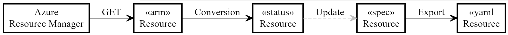

## Context

We have a significant number of customers successfully using ASO v1 whom we want to migrate to ASO v2. This requires both feature parity (so that users don't lose functionality when they switch) and a straightforward migration path (if it's too hard to migrate, they won't).

Discussions so far have identified three possible solutions - *version integration*, *resource import job* and *resource import tool*.
### Version Integration

We would add new hand-written resources into ASO v2 with the same names and shapes as the resources supported by ASO v1. Users would be able to migrate to ASO v2 simply by removing ASO v1 from their cluster and installing ASO v2 in its place.

Since many of these resources are already supported by ASO v2, albeit with shapes much more closely aligned with the ARM originals, we would need to implement forward and backward conversions between the two shapes, preserving the Kubernetes version compatibility guarantees we have today.

* Pro: Very simple migration for our customers.
* Con: Some of the resources are in a different *group*, which makes automatic update impossible.
* Con: Would require a lot of work to implement and test the conversions.
* Con: Any resource features that don't map exactly to a property in the ARM shape would be difficult to retain.
* Con: The investment would benefit only a small number of customers.
* Con: The conversions would need to be maintained, potentially indefinitely.
* Con: It's unlikely we'd achieve 100% fidelity, requiring customers to change their YAML files anyway.

### Resource Import Job

Hand craft a new _job_ CRD that allows specification of an existing Azure Resource that requires import. ASO would reconcile that CRD by downloading the resource from Azure and creating the corresponding Kubernetes resource directly in the cluster.

* Pro: ASO already has the credentials necessary to download the resource from Azure.
* Pro: You don't need to use a separate tool like `asoctl`, which means you can import/export using just `kubectl`.
* Con: Awkward to model a run-once action as a CRD as there is no reconcile to be done after the first pass, though there are examples of such resources in core k8s API such as `Job` and a pattern we could follow.
* Con: Reconciliation of this job would be entirely unlike any existing ASO resource.
* Con: It's highly unlikely that the resource would be ready for use, as it wouldn't have any ASO specific configuration, requiring users to awkwardly download the YAML, make any required changes, and then reapply it to the cluster.
* Con: Unless we immediately annotated the resource as `skip-reconcile` for safety, ASO would immediately pick up the resource and start reconciling it. In most cases this would be benign, but there is potential for _bad things_ to happen. This is the opposite of the usually desired *pit of success*.
* Con: If we do mark the resource as `skip-reconcile`, users will need to manually remove the annotation before things work.
* Con: The job would need to be cleaned up manually afterwards

#### See also
* AWS uses this technique, with an [`AdoptedResource`](https://aws-controllers-k8s.github.io/community/docs/user-docs/adopted-resource/) CRD. 


### Resource Import Tool

Create a tool that allows any supported Azure resource to be to be exported as a YAML file in the shape expected by ASO v2. Users would then be able to modify the YAML file as necessary and apply it to their cluster.

The most likely form of this tool would be as a command-line utility for users to run locally. Idiomatically for the Kubernetes ecosystem, we'd call this `asoctl`.

* Pro: Straightforward migration for ASO v1 customers (though, not zero touch).
* Pro: Would benefit all customers wanting to migrate existing Azure resources, not just those using ASO v1.
* Pro: Could also be used to snapshot existing resources (e.g. to capture a hand configured resource set up by a developer as YAML for reuse in a staging environment).
* Pro: The resource can be customized before being applied to the cluster (e.g. specifying links to secrets for credentials, to config maps for configuration, and so on).
* Pro: The user can choose to apply the resource to the cluster immediately, save it for later, or apply it to a different cluster.
* Pro: Users have an opportunity to review the YAML for correctness (or to assess security considerations) before applying it to the cluster. 
* Con: We'd need to extend the code generator to provide the required support (but much of what we need already exists).

#### See Also

* Google Cloud uses a commandline tool [`config-connector`](https://cloud.google.com/config-connector/docs/how-to/import-export/export).

## Decision

Create the new command line tool `asoctl` to house multiple functions, starting with resource import. The tool will follow the usual convention of supporting a variety of verbs, each activating a different mode (similar to the way `kubectl`, `git` and other modern command-line tools behave).

To export a existing resource, we'd use `export resource` as the verb. 

This would accept a single resource ID (a fully qualified URL) as a parameter and output a YAML file to stdout containing the specified resource and all related child resources. In typical use, the user would redirect the output to a file and modify it as necessary, though we may want to support a `--output` parameter to allow the user to specify the output file directly.

For example, to export the YAML for an existing Virtual Network, the user would run:

``` bash
$ asoctl export resource http://management.azure.com/subscriptions/00000000-0000-0000-0000-000000000000/resourceGroups/rg1/providers/Microsoft.Network/virtualNetworks/vnet1
```

The output would be a YAML file containing the Virtual Network and all child resources (e.g. subnets, route tables, etc).

As an extension, in a later release we could also support pointing at an entire resource group, generating a single YAML file containing all the resources in the specified resource group. This would be useful for users who want to snapshot an existing resource group as YAML for reuse.

``` bash
$ asoctl export resource http://management.azure.com/subscriptions/00000000-0000-0000-0000-000000000000/resourceGroups/rg1
```

### Data Flow

The process of generating the YAML for a given resource can be simplified to the following flow:



1. The user specified URL is used to ***GET*** the resource from Azure in its native ARM format.
2. We apply a ***conversion*** to obtain a Status object for the relevant custom resource.
3. We then ***populate*** a blank Spec to give us a custom resource ready for export (this has the shape we want).
4. The spec is ***exported*** as YAML.

Only the ***populate*** step, converting from *Status* to *Spec* is missing from our existing code generation pipeline, and we believe the existing property assignment code can be largely reused.

That said, we're aware of some challenges. 

**Defaulting**: Some services will fill in missing values, so the YAML we emit will be more explicit than a handwritten resource. Sometimes defaults are documented in Swagger but more often they're not, and sometimes they're dynamic (like in AKS)

**Ordering**: When a resource contains a list of items, we may in some cases need to do an ordinal comparision (based on index) and in other cases a nominal comparison (based on name). We may be to be able to detect which is required, but it's likely we'll need configuration too.

## Status

Proposed.

## Consequences

TBC.

## Experience Report

TBC.

## References

TBC.
