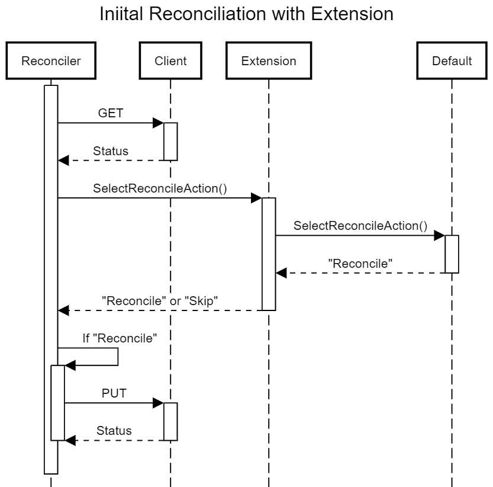
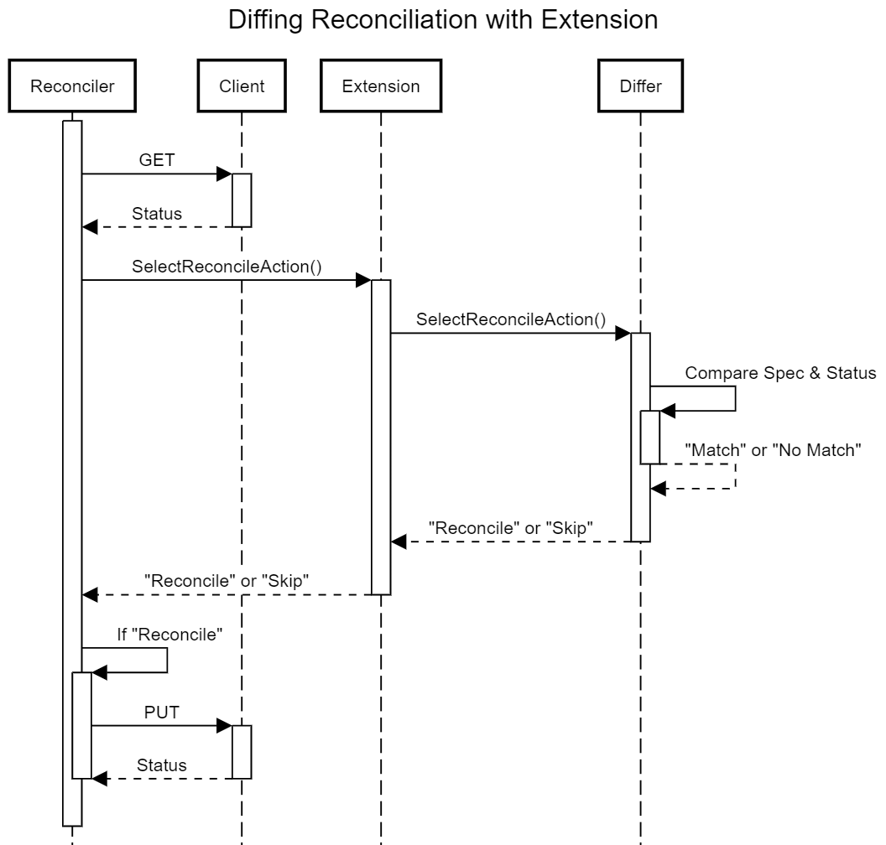

## Context

The current behaviour of Azure Service Operator (ASO) is to unilaterally issue a PUT to Azure each time reconciliation of a resource is triggered. 

For some resources this doesn't work particularly well because the resources can be in a transient state that precludes the PUT from succeeding. The resulting error message pushes ASO into retrying the operation over and over again when it can't possibly succeed. Not only does this cause needless load on both the cluster and Azure, it can trigger rate limiting and other throttling mechanisms.

Examples of this include:

* An [AKS Managed Cluster](https://learn.microsoft.com/en-us/rest/api/aks/managed-clusters/get?tabs=HTTP) with `provisioningState` of `Updating`.
* An [AKS Agent Pool](https://learn.microsoft.com/en-us/rest/api/aks/agent-pools/get?tabs=HTTP) with `provisioningState` of `Updating`.
* A [PostgreSQL Flexible Server](https://learn.microsoft.com/en-us/rest/api/postgresql/flexibleserver/servers/get?tabs=HTTP) with a `state` of `Starting`, `Stopping` or `Updating`.

This list not exhaustive.

We need a way to allow the operator to handle these cases gracefully, by introducing an extension point where we can tweak the reconciliation flow and skip the PUT if the resource is in a state that we know will cause the PUT to fail.

Complicating matters, we are also looking switch from using a unilateral PUT to a more discerning workflow where we do a GET first and only issue a PUT if the resource has changed (See [#2600](https://github.com/Azure/azure-service-operator/pull/2600) for the design). Ideally, our design for this extension point will be compatible with both the current PUT-only reconciliation flow and the new GET-PUT reconciliation flow. 

In the most common scenario, this extension point will be used to skip reconciliation based on the current status of the resource. However, we also want to allow implementers to use this extension point to perform other actions, such as issuing a GET to check on the status of other Azure resources. 

As with other extension points, we want to give implementers the option of acting either before or after the standard action.

## Decision

We'll define a new extension point called `PreReconciliationChecker` in a style similar to our already existing extension points.

The extension point will receive the following parameters:

* The current resource, with a status freshly updated from Azure.
* A Kubernetes client allowing for Cluster operations.
* An ARM client allowing for ARM operations.
* A logger to allow for tracing of what the extension did.
* A context to allow cancellation of long running operations.
* A function that represents the next action to take. 

The return will be one of three possibilities:

* `Proceed` if the resource should be reconciled
* `Skip` and a human readable reason if reconciliation should be skipped
* `error` if something went wrong.

For the initial implementation, we'll only do the GET if the extension exists, and the default `next` action will be hard coded to request a reconciliation.

Down the track when we switch to a GET/PUT workflow, we'll always do the GET, and the default 'next` action will do the comparison to see if the resource has changed.

## Status

Accepted.

* Extension point created in [PR #2683](https://github.com/Azure/azure-service-operator/pull/2683).
* Implementation for Managed Cluster and Agent Pool added in [PR #2686](https://github.com/Azure/azure-service-operator/pull/2686).
* Implementation for PostgreSQL Flexible Server added in [PR #2688](https://github.com/Azure/azure-service-operator/pull/2688).

## Consequences

TBC.

## Experience Report

TBC.

## References

* [#2600 - High Level design for using GET+PUT to reconcile](https://github.com/Azure/azure-service-operator/pull/2600)

