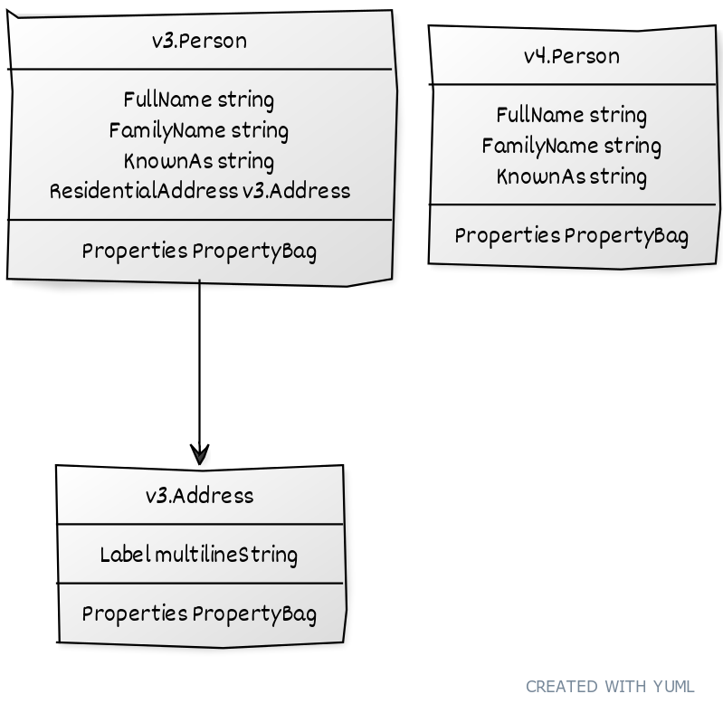
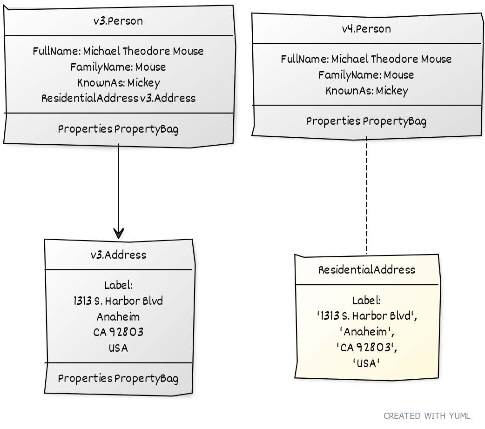
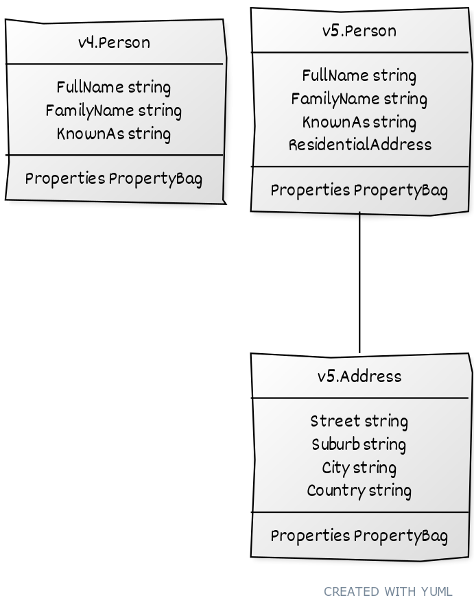
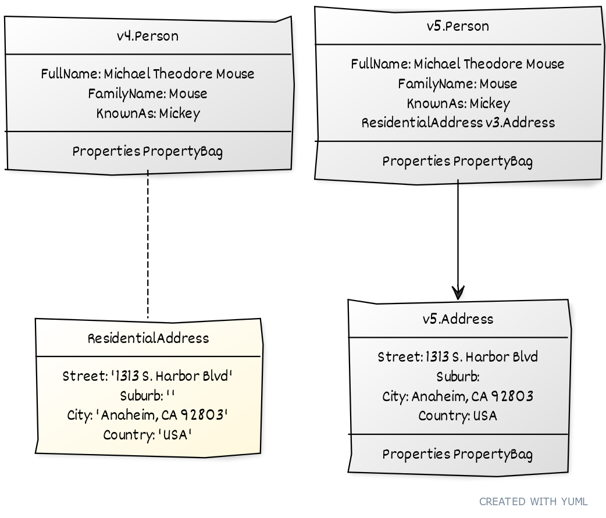
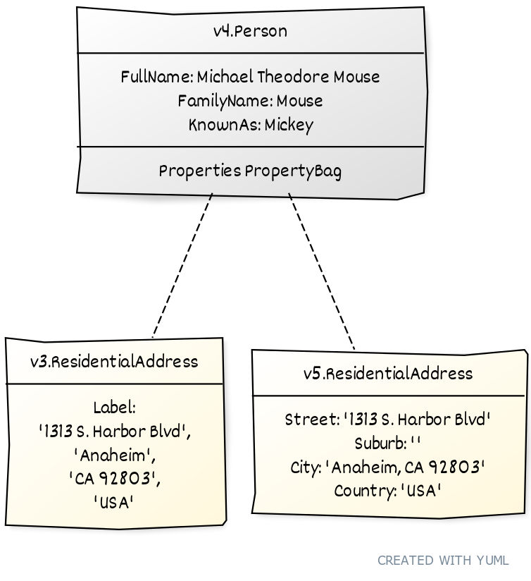
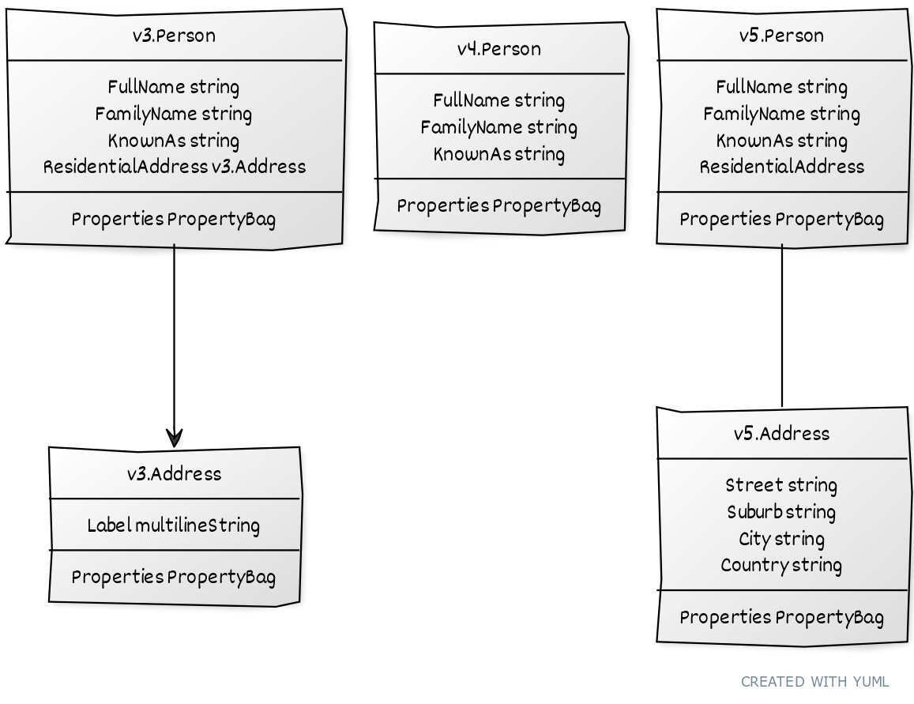
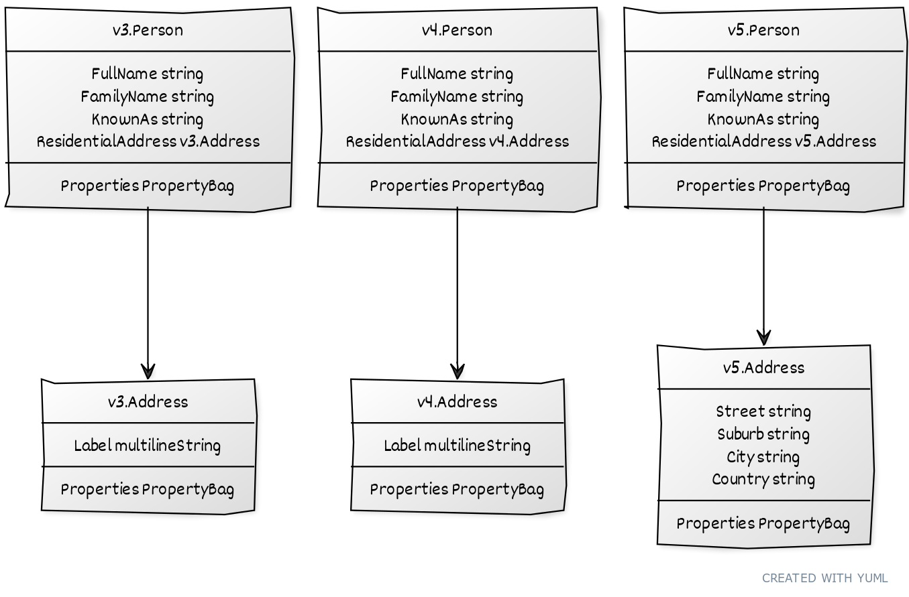
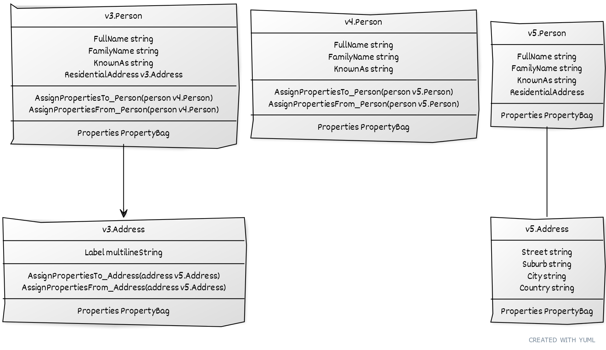
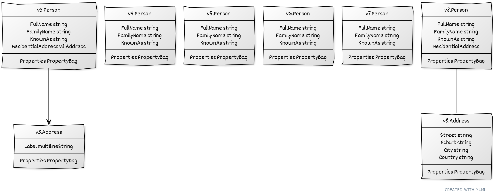
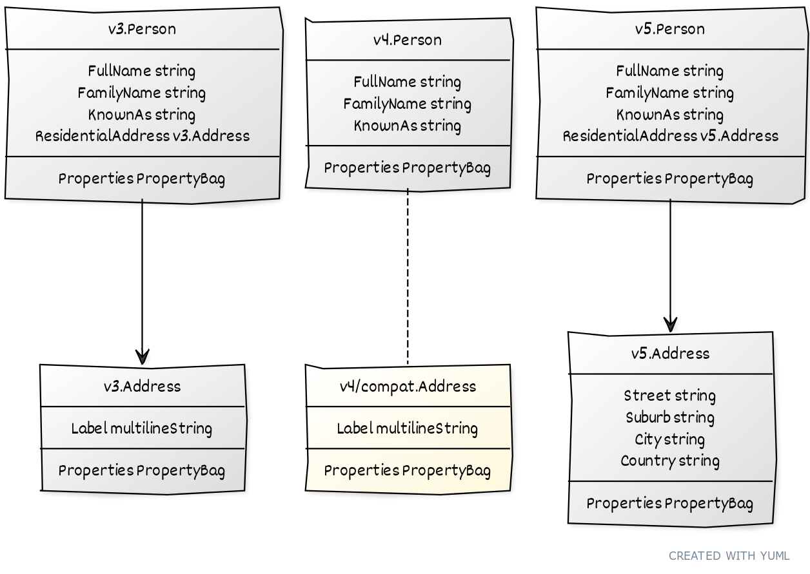

## Context

We have a long standing issue (originally documented in [#1776](https://github.com/Azure/azure-service-operator/issues/1776)) where our conversions between versions will break if a complex (object valued) property is reintroduced with a different shape in a later version after being removed in an earlier one.

**TL;DR:** The crux of the problem is that we can currently end up with two different versions (shapes) of the same property serialized in a property bag on the same intermediate version.

To clarify, consider the following examples, demonstrating the current behaviour, and then how that causes a problem. Following that, we'll discuss some constraints on possible solutions, and some approaches we might take.

### Conversion between v3 and v4

Consider a CRM system containing details of people. In v3 of the system, we capture each person's residential address, but in v4 we have dropped that property:

<!-- yuml.me

[v3.Person|FullName string;FamilyName string; KnownAs string; ResidentialAddress v3.Address|Properties PropertyBag]
[v3.Person]->[v3.Address|Label multilineString|Properties PropertyBag]
[v4.Person|FullName string;FamilyName string; KnownAs string|Properties PropertyBag]

-->




When we convert from v3 to v4 (v3 -> v4) the `ResidentialAddress` property gets serialized into the `PropertyBag` on the v4 Person. Note that the bag contains a v3 `Address` in a serialized form.

To illustrate, consider this concrete example:

<!-- yuml.me

[v3.Person|FullName: Michael Theodore Mouse;FamilyName: Mouse; KnownAs: Mickey; ResidentialAddress v3.Address|Properties PropertyBag]
[v3.Person]->[v3.Address|Label:\n1313 S. Harbor Blvd\nAnaheim\nCA 92803\nUSA|Properties PropertyBag]
[v4.Person|FullName: Michael Theodore Mouse;FamilyName: Mouse; KnownAs: Mickey|Properties PropertyBag]
[v4.Person]-.-[ResidentialAddress {bg:cornsilk}|Label:\n'1313 S. Harbor Blvd',\n'Anaheim',\n'CA 92803',\n'USA']

-->



As YAML, the v3 version of Mickey would be:

```yaml
fullName: Michael Theodore Mouse
familyName: Mouse
knownAs: Mickey
residentialAddress:
    label: |
        1313 S. Harbor Blvd
        Anaheim
        CA 92803
        USA
```

There is no `ResidentialAddress` property on the v4 `Person` to store Mickey's residential address, so it gets safely stashed away in the `PropertyBag`:

```yaml
fullName: Michael Theodore Mouse
familyName: Mouse
knownAs: Mickey
propertyBag:
    residentialAddress: "label:\n1313 S. Harbor Blvd\nAnaheim\nCA 92803\nUSA"
```

In the other direction, from v4 to v3, conversion works fine, as we can take the `ResidentialAddress` value from the property bag, deserialize the v3 `Address`, and set things up as they were before.

Conversion back and forward between versions v3 and v4 works fine.

### Conversion between v4 and v5

In v5, the `ResidentialAddress` is reintroduced, but with a different shape. Instead of being the single field `Label`, it now has multiple fields:

<!-- yuml.me 

[v4.Person|FullName string;FamilyName string; KnownAs string|Properties PropertyBag]
[v5.Person|FullName string;FamilyName string; KnownAs string;ResidentialAddress|Properties PropertyBag]
[v5.Person]--[v5.Address|Street string; Suburb string; City string; Country string|Properties PropertyBag]

-->



When we convert from v5 to v4, again the `ResidentialAddress` property gets serialized into the `PropertyBag` on the v4 Person. 

Again, it's useful to see a concrete example:

<!-- yuml.me

[v4.Person|FullName: Michael Theodore Mouse;FamilyName: Mouse; KnownAs: Mickey|Properties PropertyBag]
[v4.Person]-.-[ResidentialAddress {bg:cornsilk}|Street: '1313 S. Harbor Blvd'\nSuburb: ''\nCity: 'Anaheim, CA 92803'\nCountry: 'USA']
[v5.Person|FullName: Michael Theodore Mouse;FamilyName: Mouse; KnownAs: Mickey; ResidentialAddress v3.Address|Properties PropertyBag]
[v5.Person]->[v5.Address|Street: 1313 S. Harbor Blvd\nSuburb:\nCity: Anaheim, CA 92803\nCountry: USA|Properties PropertyBag]

-->



As before, there is no `ResidentialAddress` property on the v4 `Person` to store Mickey's residential address, so it gets safely stashed away in the `PropertyBag`.

```yaml
fullName: Michael Theodore Mouse
familyName: Mouse
knownAs: Mickey
propertyBag:
    residentialAddress: "street:1313 S. Harbor Blvd;suburb:;city:Anaheim, CA 92803;country:USA"
```

However, note that this time the bag contains a v5 `Address` in a serialized form, **not** a v3 `Address`.

In the other direction, conversion from v4 to v5, works fine, as we can deserialize the v5 `Address` from the property bag.

Conversion back and forward between versions v4 and v5 works fine.

### The Problem

Observe how we can end up with two different variants of v4 `Person`. 

In one case, we have a v4 `Person` where the property bag contains a v3 `Address`.
In the other case, we have a v4 `Person` the property bag contains a v5 `Address`:

<!-- yuml.me 

[v4.Person|FullName: Michael Theodore Mouse;FamilyName: Mouse; KnownAs: Mickey|Properties PropertyBag]
[v4.Person]-.-[v3.ResidentialAddress {bg:cornsilk}|Label:\n'1313 S. Harbor Blvd',\n'Anaheim',\n'CA 92803',\n'USA']
[v4.Person]-.-[v5.ResidentialAddress {bg:cornsilk}|Street: '1313 S. Harbor Blvd'\nSuburb: ''\nCity: 'Anaheim, CA 92803'\nCountry: 'USA']

-->



While round trips between _adjacent_ versions work fine, we run into problems when we attempt longer conversion chains. We end up stuck part-way through with a fatal problem.

<!-- yuml.me 

[v3.Person|FullName string;FamilyName string; KnownAs string; ResidentialAddress v3.Address|Properties PropertyBag]
[v3.Person]->[v3.Address|Label multilineString|Properties PropertyBag]

[v4.Person|FullName string;FamilyName string; KnownAs string|Properties PropertyBag]

[v5.Person|FullName string;FamilyName string; KnownAs string;ResidentialAddress|Properties PropertyBag]
[v5.Person]--[v5.Address|Street string; Suburb string; City string; Country string|Properties PropertyBag]

-->




Compare the two different kinds of v4 Person we end up with for Mickey. 

First when we start from v3:

```yaml
fullName: Michael Theodore Mouse
familyName: Mouse
knownAs: Mickey
propertyBag:
    residentialAddress: "label:\n1313 S. Harbor Blvd\nAnaheim\nCA 92803\nUSA"
```

And now when we start from v5:

```yaml
fullName: Michael Theodore Mouse
familyName: Mouse
knownAs: Mickey
propertyBag:
    residentialAddress: "street:1313 S. Harbor Blvd;suburb:;city:Anaheim, CA 92803;country:USA"
```

If we have a v4 `Person` that contains a v3 `Address` in the property bag, conversion to the v5 `Person` will fail when we try to deserialize a v5 `Address` from the v3 item. 

This will cause the operator to fail at runtime. 

Similarly f we end up with a v4 `Person` that contains a v5 `Address` in the property bag, we can't deserialize a v3 `Address` and again the operator will fail at runtime.

### Constraint: Serialization format

For each resource type, there's a specific hub version that's used for serialization - this is the version that's persisted within a cluster. All other versions are created on-the-fly by conversion from the hub version. By convention in ASO, this hub version is based on the the latest stable version of the resource, or the latest preview version if no stable version is available. 

In most cases, the hub version will be the version affected by changes to solve the skipping-property problem, so we have to assume that there are extant resources of that version.

We have three possible choices:

**Preservation** - we preserve the existing serialization format exactly. Existing ASO users with affected resources will be able to seamlessly update to the new release.

**Compatibility** - we make changes to the serialization format, but in a way that's backward compatible with existing resources, either by restricting our changes to new properties only, or by code-generation of custom marshaling code to read the old structure. If we make no mistakes, existing ASO users with affected resources will be able to seamlessly update to the new release.

**Breaking** - the serialization format is changed, and existing resources are broken. Either users are forced to recreate the affected resources, or we add a migration tool to `asoctl` to assist. We document this as a breaking change in our release notes.

**Decision: Preservation**

As discussed above, the problem is that we can end up with different object shapes embedded in the PropertyBag, depending on the direction of conversion (v3 -> v4 -> v5 vs v5 -> v4 -> v3). Standardising on a consistent object shape shouldn't require making any other changes.

### Rejected Solution: Add a synthetic property

Modify the resource version immediately prior to the reintroduction of the property to restore the property one version earlier, using the same shape as the version where it was removed. Avoid the circular dependency problems by cloning the earlier object into the appropriate package.

In our example here, we would add a new `ResidentialAddress` property to the v4 `Person` that contains an address in a new v4 `Address`, created by cloning the v3 `Address`.

<!-- yuml.me

[v3.Person|FullName string;FamilyName string; KnownAs string; ResidentialAddress v3.Address|Properties PropertyBag]
[v3.Person]->[v3.Address|Label multilineString|Properties PropertyBag]

[v4.Person|FullName string;FamilyName string; KnownAs string;ResidentialAddress v4.Address|Properties PropertyBag]
[v4.Person]->[v4.Address|Label multilineString|Properties PropertyBag]

[v5.Person|FullName string;FamilyName string; KnownAs string;ResidentialAddress v5.Address|Properties PropertyBag]
[v5.Person]->[v5.Address|Street string; Suburb string; City string; Country string|Properties PropertyBag]
-->



The shape of `Address` when reintroduced will always match the shape of `Address` when removed, so we can always serialize the same shape in-to or out-of the property bag, ensuring any `Address` has the a consistent shape.

Pros:
* Works the way existing conversions do.
* We have an existing contract for augmenting conversions with custom code, allowing us to handcode the conversion between v4 and v5 to handle the mismatch in the shapes of `Address`.
* Addresses the central inconsistency problem, ensuring we always serialize the same shape into intermediate property bags

Cons:
* Changes the serialization format for existing v4 resources. This is a breaking change for existing resources.
* Changes the object model of released resources, a breaking change for code consumers of ASO `api` packages.
* When there are multi-generational skips, other questions arise: Do we introduce the new type into every intermediate version, only the last, or both first and last? Each approach has advantages and drawbacks.

Reason for rejection: This solution requires breaking changes and is therefore too disruptive to existing resources and code consumers.

### Constraint: Direction of Conversion

All of the conversion functionality we currently generate for ASO resources is hosted by the earlier version of the resource. For example, the conversion from v3 to v4 is hosted by the v3 package, and the conversion from v4 to v5 is hosted by the v4 package. We can see this by looking for the generated property assignment methods on the v3 and v4 types:

<!-- yuml.me

[v3.Person|FullName string;FamilyName string; KnownAs string; ResidentialAddress v3.Address|AssignPropertiesTo_Person(person v4.Person);AssignPropertiesFrom_Person(person v4.Person)|Properties PropertyBag]
[v3.Person]->[v3.Address|Label multilineString|AssignPropertiesTo_Address(address v5.Address);AssignPropertiesFrom_Address(address v5.Address)|Properties PropertyBag]

[v4.Person|FullName string;FamilyName string; KnownAs string|AssignPropertiesTo_Person(person v5.Person);AssignPropertiesFrom_Person(person v5.Person)|Properties PropertyBag]

[v5.Person|FullName string;FamilyName string; KnownAs string;ResidentialAddress|Properties PropertyBag]
[v5.Person]--[v5.Address|Street string; Suburb string; City string; Country string|Properties PropertyBag]

-->



These conversions are enabled by having each package **import** the next version of the resource, forming a directed acyclic graph leading from the earliest version to the latest.

**Observation**: Not only _should_ we implement our change in a way that's consistent with the direction of conversion already present, we _must_ do so, as the Go compiler will not allow us to introduce a circular dependency between packages.

### Constraint: Multi-generational skips

The examples shown so far have the new property returning after just one version; we need to handle the case where the property returns after a hiatis of several versions.

<!-- yuml.me 

[v3.Person|FullName string;FamilyName string; KnownAs string; ResidentialAddress v3.Address|Properties PropertyBag]
[v3.Person]->[v3.Address|Label multilineString|Properties PropertyBag]

[v4.Person|FullName string;FamilyName string; KnownAs string|Properties PropertyBag]

[v5.Person|FullName string;FamilyName string; KnownAs string|Properties PropertyBag]

[v6.Person|FullName string;FamilyName string; KnownAs string|Properties PropertyBag]

[v7.Person|FullName string;FamilyName string; KnownAs string|Properties PropertyBag]

[v8.Person|FullName string;FamilyName string; KnownAs string;ResidentialAddress|Properties PropertyBag]
[v8.Person]--[v8.Address|Street string; Suburb string; City string; Country string|Properties PropertyBag]

-->



### Constraint: Augmentation of conversions

We're already generating support to allow augmentation of the generated conversions by hand-written code. This is used to handle cases where the generated conversions are insufficient, or where we need to handle special cases.

It's highly desirable that we leverage this existing functionality for skipping properties, rather than building something new.


### Proposed Solution

Given that any existing resources will have property bags containing instances in the earlier shape, standardize on using that shape - and only that shape - when storing the instance in the property bag.

Instead of writing the later shape into the property bag using code like this:

``` go
// ResidentialAddress
if source.ResidentialAddress != nil {
    propertyBag.Add("ResidentialAddress", *source.ResidentialAddress)
} else {
    propertyBag.Remove("ResidentialAddress")
}
```

We will write the earlier shape into the property bag using code like this:

``` go
// ResidentialAddress
if source.ResidentialAddress != nil {
    var address v4.Address
    address.AssignProperties_From(source.ResidentialAddress)
    propertyBag.Add("ResidentialAddress", address)
} else {
    propertyBag.Remove("ResidentialAddress")
}
``` 

Reading the value from the property bag will also need to change. Instead of:

```go
// ResidentialAddress
if propertyBag.Contains("ResidentialAddress") {
    var residentialAddress v5.Address
    err := propertyBag.Pull("ResidentialAddress", &residentialAddress)
    if err != nil {
        return errors.Wrap(err, "pulling 'ResidentialAddress' from propertyBag")
    }

    destination.ResidentialAddress = &residentialAddress
} else {
    destination.ResidentialAddress = nil
}
```
We will read the earlier shape and convert it as required.

```go
// ResidentialAddress
if propertyBag.Contains("ResidentialAddress") {
    var staging v4compat.Address
    err := propertyBag.Pull("ResidentialAddress", &staging)
    if err != nil {
        return errors.Wrap(err, "pulling 'ResidentialAddress' from propertyBag")
    }

    var residentialAddress v5.Address
    err = staging.AssignProperties_To_Address(&residentialAddress)
    if err != nil {
        return errors.Wrap(err, "converting 'Address' from v4compat to v5")
    }

    destination.ResidentialAddress = &residentialAddress
} else {
    destination.ResidentialAddress = nil
}
```

The updated object model will look like this:

<!-- yuml.me

[v3.Person|FullName string;FamilyName string; KnownAs string; ResidentialAddress v3.Address|Properties PropertyBag]
[v3.Person]->[v3.Address|Label multilineString|Properties PropertyBag]

[v4.Person|FullName string;FamilyName string; KnownAs string|Properties PropertyBag]
[v4.Person]-.-[v4/compat.Address{bg:cornsilk}|Label multilineString|Properties PropertyBag]

[v5.Person|FullName string;FamilyName string; KnownAs string;ResidentialAddress v5.Address|Properties PropertyBag]
[v5.Person]->[v5.Address|Street string; Suburb string; City string; Country string|Properties PropertyBag]

-->



Observe that we haven't introduced a `ResidentialAddress` property to the v4 `Person`, the instance still lives in the property bag.

To avoid problems with circular dependencies (as noted above), we will clone the old (e.g. v3) shape and any related types forward. In the diagram above, we've isolated these into a `compat` subpackage, but we could also clone them into the v4 package itself. Doing a clone will maintain the required invariant that the contents of the property bag will always match the shape of the earlier version of the property.

Our existing conversion framework supports writing hand-crafted conversions between shapes, migrating data between the two shapes. By introducing a new type and leveraging the existing framework for the conversion, we gain support for writing these hand-crafted conversions between shapes.


Pros:
* Addresses the central inconsistency problem, ensuring we always serialize the same shape into intermediate property bags
* Conversions are still driven by the earlier version, avoiding any issues with circular dependencies or needing to move conversion code elsewhere (e.g. to the later version).
* Isolates the compatibility type in a dedicated subpackage, where it won't inadvertently be picked up by documentation tools or other code consumers. (If this is not important, we can instead target the main v4 package.)
* Allows a hand driven conversion to be written to convert between v4 and v5 using the augmentation mechanism already in place for conversions between adjacent versions.
* Conversions between v3 and v4 remain unchanged
* Serialization format of v4 remains unchanged, ensuring compatibility with existing releases of ASO.

Cons:
* Requires modification of the conversion-graph, which to this point has been immutable once constructed (we can't delay construction until after we inject the compatibility package as we need it to identify skipping properties).
* When code generating for property conversions using a property bag, we'll need to detect and use the `compat` subpackage. 


## Decision

Recommended.

## Status

TBC

## Consequences

TBC

## Experience Report

TBC

## References

TBC
``