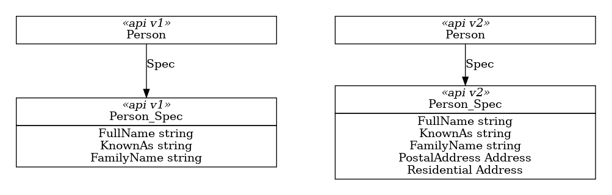
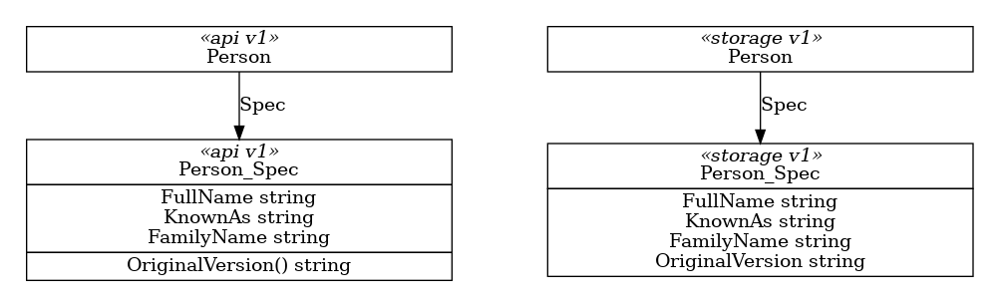

# API Versions

Specification for how we will ensure the ARM API version we use for interaction with ARM matches the version originally requested by a user when they created the resource in their Kubernetes cluster.

## Why do we need this?

Sometimes, in addition to structural changes, there are behaviour changes between ARM API versions. It's therefore important that we use the requested API version when interacting with ARM to ensure that we get the behaviour requested.

### Example

Revisting the CRM example from the [Versioning](../versioning/) specification, consider what happens if we have two available versions of the resource `Person`, lets call them **v1** and **v2**. In **v2** the new properties `PostalAddress` and `ResidentialAddress` are mandatory, requiring that everyone have a both a mailing address and a home. 



If we have a valid **v1** `Person`, trying to submit that through the **v2** ARM API will fail because it's missing these addresses.

## Proposed Solution

At a high level, the proposed solution contains the following elements. These are described in greater detail in following sections.

**Preserve the API Version**: the original API version used to create the custom resource (CR) will be preserved so that we know which API version to use when interacting with ARM.

**New conversion interfaces**: to avoid having to version-convert an entire resource when we are interested in only its `Spec` or `Status`, we'll define and implement new interfaces to allow direct conversion.

**Reconciler integration**: to cleanly plug into the existing reconciler, we'll introduce a new interface and hide the complexity of version-conversion.

## Preserve the API Version

We need to preserve the original API Version of each resource, and use that to create an appropriate resource for ARM.

When generating storage variants, we'll inject a new `OriginalVersion` property of type **string** into the Spec of each resource, providing a place to capture the API version that was originally used to create the resource.

To populate the `OriginalVersion` property on each storage spec, we'll inject an `OriginalVersion()` method (returning **string**) into the API variant of each spec.



API version shown on the left, corresponding Storage version shown on the right.

For each API spec, generated `AssignPropertiesTo*()` method  will read the value of `OriginalVersion()` and write it to the `OriginalVersion` property on the storage variant. The `AssignPropertiesFrom*()` method will ignore `OriginalVersion`.

For each Storage spec, the generated `AssignPropertiesTo*()` and `AssignPropertiesFrom*()` methods will copy the `OriginalVersion` property between versions, preserving the original value.

## New conversion interfaces

We don't want the overhead of doing a complete conversion of each resource if we're only interested in conversion of the associated `Spec` or `Status`. For example, when submitting a request to ARM we need only do a `Spec` conversion; similiarly, when processing a response from ARM, we need only do a `Status` conversion.

We already have the required infrastructure in the form of the `AssignProperties*()` methods, making it simple to implement these new interfaces.

For conversion of `Spec` types:

``` go
type ConvertibleSpec interface {
    // ConvertFromSpec populates the current spec from the passed one
    ConvertFromSpec(source ConvertibleSpec) error
    
    // ConvertToSpec populates the passed spec from the current one
    ConvertToSpec(destination ConvertibleSpec) error
}
```

As we have done with implementations of the traditional [`Convertible`](https://pkg.go.dev/sigs.k8s.io/controller-runtime/pkg/conversion#Convertible) interface, these will be implemented on Specs that are further from our hub, and will chain towards that hub.

For conversion of `Status` types, a similar approach:

``` go
type ConvertibleStatus interface {
    // ConvertFromStatus populates the current status from the passed one
    ConvertFromStatus(source ConvertibleStatus) error
    
    // ConvertToStatus populates the passed status from the current one
    ConvertToStatus(destination ConvertibleStatus) error
}
```

## Reconciler integration

When the reconciler is working with ARM, we'll use the `OriginalVersion` property on the storage spec to pivot from the current version to the original version.

The existing `genruntime.KubernetesResource` interface will be extended as follows:

``` go
type KubernetesResource interface {
    // Obtain the GroupVersionKind of the original version of this resource
    OriginalGVK() schema.GroupVersionKind

    // Return the Spec for this resource
    GetSpec() ConvertibleSpec

    // Return the Status for this resource
    GetStatus() ConvertibleStatus

    // Set the status of this resource
    // If status is not the expected type, this will return an error
    SetStatus(status ConvertibleStatus) error
}
```
(For clarity, only new members are shown.)

### Generated code for OriginalGVK()

For every resource, we'll generate the `OriginalGVK()` function required by the `KubernetesResource` interface. 

``` go
func (p *Person) OriginalGVK() *schema.GroupVersionKind {
	return &schema.GroupVersionKind{
		Group:   GroupVersion.Group,
		Version: r.Spec.OriginalVersion(),
		Kind:    "BatchAccount",
	}
}
```

Depending on whether this is an API or a Storage resource variant, the function will use either the function `OriginalVersion()` (as shown in the example) or the field `OriginalVersion`.

### Generated code for GetSpec()

For every resource, we'll generate the accessor function `GetSpec()` to give the reconciler easy access to the specification.

``` go
func (p *Person) GetSpec() genruntime.ConvertibleSpec {
    return p.Spec
}
```

### Generated code for GetStatus()

For every resource, we'll generate the accessor function `GetSpec()` to give the reconciler easy access to the specification.

``` go
func (p *Person) GetStatus() genruntime.ConvertibleStatus {
    return p.Status
}
```

### Generated code for SetStatus()

For every resource, we'll generate the mutator function `SetSpec()` to allow the reconciler to update the resource.

``` go
// SetStatus accepts a status and updates this resource
// Only a status of the expected type is handled; anything else will error
func (p *Person) SetStatus(status ConvertibleStatus) error {
    s, ok := status.(*Person_Status);
    if !ok {
        return errors.Errorf(
            "expected Status of type %T, but received %T", p.Status, status)
    } 

    p.Status = *s
    return nil
}
```

The supplied status will be checked to ensure it's the expected type; if not, an error will be returned.

### Reconciler publication to ARM

When the reconciler needs to serialize the Spec of a resource to ARM, the `GetSpec()` function allows the spec to be obtained, and the `OriginalGVK()` function allows the reconciler to identify when conversion is required. 

Comparison of the actual GVK of the resource with the original GVK allows the reconciler to decide whether conversion is needed. 
Actual conversion requires use of the available Scheme to create the required Spec, which is then populated by converting from the spec we already have:

``` go
actualGVK := metaObject.GetObjectKind().GroupVersionKind()

k8sResource, ok := metaObject.(genruntime.KubernetesResource)
if !ok {
    return nil, errors.Errorf("resource %s is not a genruntime.KubernetesResource", actualGVK)
}

originalGVK := k8sResource.OriginalGVK()

spec := k8sResource.GetSpec()
if actualGVK != originalGVK {
    // Need to convert the spec version; create a resource of the original kind
    orgObject, err := resolver.Client().Scheme.New(originalGVK)
    if err != nil {
        return nil, errors.Wrapf(err, "unable to create resource %s for conversion", originalGVK)
    }

    // Convert to our KubernetesResource interface
    orgResource, ok := orgObject.(genruntime.KubernetesResource)
    if !ok {
        return nil, errors.Errorf("resource %s is not a genruntime.KubernetesResource", originalGVK)
    }

    // Get the spec we want and populate by converting from the spec we have
    orgSpec := orgResource.GetSpec()
    err = orgSpec.ConvertFromSpec(spec)
    if err != nil {
        return nil, errors.Wrapf(err, "unable to convert spec from %s to %s", actualGVK, originalGVK)
    }

    spec = orgSpec
}
```

### Reconcilation update from ARM

TBC

