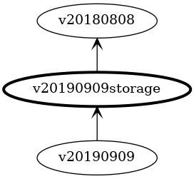

Specification for how storage versioning will operate for code generated CRD definitions.

We're generating a large number of CRD definitions based on the JSON schema definitions published for Azure Resource Manager use.

## Goals

**Principle of Least Surprise:** The goal of the service operator is to allow users to consume Azure resources without having to leave the tooling they are familiar with. We therefore want to do things in the idiomatic Kubernetes fashion, so that they don't experience any nasty surprises.

**Auto-generated conversions:** As far as practical, we want to autogenerate the schema for storage use along with the conversions to and from the actual ARM API versions. Hand coding all the required conversions doesn't scale across all the different Azure sevices, especially with the ongoing rate of change. 

**Allow for hand coded conversions:** While we expect to use code generation to handle the vast majority of needed conversions, we anticipate that some breaking API changes will require *part* of the conversion to be hand coded. We need to make it simple for these conversions to be introduced while still autogenerating the majority of the conversion. We also want to minimize the need for these conversions to be revisited and maintained over time.

**No modification of generated files.** Manual modification of generated files is a known antipattern that greatly increases the complexity and burden of updates. If some files have been manually changed, every difference showing after code generation needs to be manually reviewed before being committed. This is tedious and error prone because the vast majority of auto generated changes will be perfectly fine. Worse, this process would need to be repeated every time we want to update the operator.

**Compliance with Kubernetes versioning.** To quote [Kubebuilder's documentation](https://book.kubebuilder.io/multiversion-tutorial/api-changes.html):

> In Kubernetes, all versions must be safely round-tripable through each other. This means that if we convert from version 1 to version 2, and then back to version 1, we must not lose information. Thus, any change we make to our API must be compatible with whatever we supported in v1, and also need to make sure anything we add in v2 is supported in v1.

**Consistency of experience:** Early adopters should have a similar experience with the latest release of the service operator as new users who are adopting it for the first time. We don't want early adopters to be penalized for their enthusiasm. 

## Non-Goals

**Coverage of every case by code generation:** While it's likely that very high coverage will be achievable with code generation, we don't believe that it will be practical to handle every possible situation automatically. It's therefore necessary for the solution to have some form of extensibility allowing for the injection of hand written code.

## Other Constraints

Unlike the typical situation with a hand written service operator, we don't have complete control over the schema we are publishing for custom resources - we're deriving the CRD schema from the ARM JSON schema published online. This somewhat paints us into a corner where some issues that would be easily avoided with a hand-coded schema have to be faced head on.


## Case Studies

There are three case studies that accompany this specification, each one walking through one possible solution and showing how it will perform as a synthetic ARM style API evolves over time.

The [**Chained Versions**](../case-studies/chained-storage-versions/) case study shows how the preferred solution adapts to changes as the API is modified.

The [**Rolling Versions**](../case-studies/rolling-storage-versions/) case study shows an alternative that works well but falls down when hand coded conversions are introduced between versions.

The [**Fixed Version**](../case-studies/fixed-storage-version/) case study shows how a popular alternative would fare, calling out some specific problems that will occur.

**TL;DR:** Using a *fixed storage version* appears simpler at first, and works well as long as the changes from version to version are simple. However, when the changes become complex (as they are bound to do over time), this approach starts to break down. While there is up front complexity to address with *chained storage versions*, the approach doesn't break down over time and we can generate useful automated tests for verification. The *rolling storage version* approach is viable, but requires additional ongoing maintenance when manual conversions are introduced between versions.

Examples shown in this document are drawn from the case studies.

## Proposed Solution

In summary:

* For each supported version of an Azure Resource Type, we will define a synthetic storage type type that will be used for serialization of that versions of the API. The latest non-preview version will be tagged as the canonical storage type for Kubernetes.

* Automatically generated conversions will allow for lossless conversions between the externally exposed API versions of resources and the related storage versions. Additional conversions will be generated to allow upgrade or downgrade between adjacent storage versions.

* External metadata that we bundle with the code generator will document common changes that occur over time (including property and type name changes), extending the coverage of our automatically generated conversions.

* For cases where automatically generated conversion is not sufficient, standard extension points for each resource type will allow hand-coded conversion steps to be injected into the process at key points.

Each of these four points is expanded upon in detail below.

### Defining Storage Versions

We'll base the schema of the storage versions on the corresponding API version, with the following modifications:

**All properties will be defined as optional** allowing for back compatibility with prior versions of the API that might not have included specific properties.

**Inclusion of a property bag** to provide for storage for properties present in other versions of the API that are not present in this version.

If a resource type is dropped from later releases of the ARM API, we will still generate a storage type based on the latest available release of that type. We need to do this in order to maintain backward compatibility with existing installations of the service operator.

Using a purpose designed types for storage avoids a number of version-to-version compatibility issues that can arise if the API version itself is used directly for storage.

To illustrate, if the API version defined the following `Person` type:

``` go
package v20110101

type Person struct {
    Id        Guid
    FirstName string
    LastName  string
}
```

Then the generated storage (hub) version will be:

``` go
package v20110101storage

type Person struct {
    PropertyBag
    Id          *Guid
    FirstName   *string
    LastName    *string
}
```

Using the latest version of the API as the basis for our storage version gives us maximum compatibility for the usual case, where a user defines their custom resource using the latest available version.

If a type has been dropped from the ARM API, we will still generate a storage schema for it based on the last ARM API version where it existed; this helps to ensure backward compatibility with existing service operator deployments. For example, if `Person` was dropped in favour of `Party` type (that can capture companies and organizations as well), we will still continue to generate a storage version of `Person` to allow deserialization by existing service operator installations as a part of their upgrade process.

Sequestering additional properties away within a property bag in the storage schema is more robust than using separate annotations as they are less subject to arbitrary modification by users. This allows us to largely avoid situations where well meaning (but uninformed) consumers of the service operator innocently make changes that result in the operator becoming failing. We particularly want to avoid this failure mode because recovery will be difficult - restoration of the modified/deleted information may be impractical or impossible.

The latest non-preview storage version will be selected as the definitive storage version (or *hub* version) for use by the controller.

### Generated conversion methods

Each of the structs generated for ARM API will have the normal `ConvertTo()` and `ConvertFrom()` methods generated automatically, implementing the required [Convertible](https://book.kubebuilder.io/multiversion-tutorial/conversion.html) interface:

``` go
// ConvertTo converts this Person to the matching storage version.
func (person *Person) ConvertTo(raw conversion.Hub) error {
    p := raw.(*storage.Person)
    return ConvertToStorage(p)
}

// ConvertFrom converts from the matching storage version
func (person *Person) ConvertFrom(raw conversion.Hub) error {
    p := raw.(*storage.Person)
    return ConvertFromStorage(p)
}
```

As shown, these methods will delegate to two strongly typed helper methods (`ConvertToStorage()` and `ConvertFromStorage()`) that are generated to handle the process of copying information across between instances.

The `ConvertToStorage()` method is responsible for copying all of the properties from the API type onto the storage type. The `ConvertFromStorage()` method is its mirror, responsible for populating all of the properties on the API type from the storage type.

Each property defined in the API type is considered in turn, and will require different handling based on its type and whether a suitable match is found on the storage type:


**For properties with a primitive type** a matching property must have the same name and the identical type. If found, a simple assignment will copy the value over. If not found, the value will be stashed-in/recalled-from the property bag present on the storage type.

* Primitive types are **string**, **int**, **float64**, and **bool**
* Name comparisons are case-insensitive

**For properties with an enumeration type** a matching property must have the same property name and a type matching the underlying type of the enumeration. If found, a simple assignment will copy the value over with a suitable type cast. If not found, the value will be stashed-in/recalled-from the property bag present on the storage type using the underlying type of the enumeration.

* Name comparisons are case-insensitive for both property names and enumeration type names
* Enumeration types are generated independently for each version, so they will never be identical types

**For properties with a custom type** a matching property must have the same name and a custom type with same type name. If found, a new instance will be created and the appropriate `ConvertToStorage()` or `ConvertFromStorage()` method for the custom type will be used. If not found, JSON serialization will be used with the property bag for storage.

* Name comparisons are case-insensitive for both property names and custom type names
* Custom types are generated independently for each version, so they will never be identical types

> ***TODO: Show an example that includes all the cases***

### External Metadata for common changes

We'll capture common changes between versions in metadata (likely a YAML file) that we bundle with the code generator, allowing it to handle a wider range of scenarios.

**If a property is renamed** in a particular API version, conversion from the prior API version to that point of change will instead match based on the new name of the property on the storage type. 

There are more than 40 cases of properties being renamed across versions of the ARM API.

> ***TODO: Show an example***

**If a type has been renamed** in a particular API version, conversion from the API version *prior* to that point of change will instead match based on the new type of the property on the storage type.

There are 160 cases of properties changing type across versions of the ARM API. Many of these can be handled automatically by capturing type renames in metadata.

> ***TODO: Show an example***

> ***Outstanding Issue:*** Are there other kinds of common change we want to support?  
Are there other cases of changes between versions that we may be able to handle automatically. 
Can we find examples? Do we want to support these cases?

### Standard extension points

Code generation will include interfaces to allow easy injection of manual conversion steps.

For each storage type, two interfaces will be generated, one for each direction of conversion.

An `AssignableTo*` interface for conversion *to* the storage type will be available for conversions that write to an instance of the storage type.

``` go
type AssignableToPerson interface {
    AssignToPerson(person Person) error
}
```

Similarly, an `AssignableFrom*` interface for conversion *from* the storage type will be available for conversions that read from an instance of the storage type:

``` go
type AssignableFromPerson interface {
    AssignFromPerson(person Person) error
}
```

If a type (whether API or storage) implements one (or both) of these interfaces, they will be automatically invoked *after* the standard conversion code has completed, creating an opportunity to augment the standard conversion process. 

## Testing

It's vital that we are able to correctly convert between versions. We will therefore generate a set of unit tests to help ensure that the conversions work correctly. Coverage won't be perfect (as there are conversion steps we can't automatically verify) but these tests will help ensure correctness.

### Round Trip Testing

We will generate a unit test to ensure that every spoke version can round trip to the hub version and back again to the same version with no loss of information. This will help to ensure a base level of compliance, that information is not lost through serialization.

This test targets the following failure modes:

* Edge cases not correctly handled by the generated conversion code.
* Manually implemented conversions that don't handle some cases correctly.

Each test will work as follows:

* Create an instance of the required type and API version
  * This will likely be done by using one of the available fuzzing libraries for Go testing
* Convert this to the current storage version
* Convert back from the storage version to a new instance of the original type and API version
* Verify that all properties are equal
  * **string**, **int**, **bool** much match exactly
  * **Float64** match within tolerance
  * Complex types are recursively matched using the same rules

### Relibility Testing

We will generate unit tests to ensure that every spoke version can be converted to every other spoke version via the hub version without crashing. We lack the semantic context to verify that the conversion is correct, but we can at least verify that it doesn't crash.

This test targets the following failure modes:

* Conversions that fail when information is missing (as may happen when converting from earlier versions)

### Golden Tests

For API (spoke) types where the optional interfaces `AssignableTo...()` and `AssignableFrom...()` have been implemented, we'll generate golden tests to verify that they are generating the expected results.

This test targets the following failure modes:

* Manually implemented conversions that don't handle all the expected edge cases.
* Manually implemented conversions that fail when given newer (or older) starting versions than expected.

These tests will be particularly useful when a new version of the ARM API is released for a given service as they will help to catch any new changes that now require support.

We'll generate two golden tests for each type in each API type, one to test verify conversion _**to**_ the latest version, and one to test conversion _**from**_ the latest version.

**Testing conversion to the latest version** will check that an instance of a older version of the API can be up-converted to the latest version:


The test will involve these steps:

* Create an exemplar instance of the older API type 
* Convert it to the storage type using `ConvertToStorage()`
* Convert it to the latest API type using `ConvertFromStorage()`
* Check that it matches the golden file from a previous run

Testing will only occur if one (or both) types implements one of the optional interfaces. That is, one or both of the following must be true:
* The older API type implements `AssignableTo...()`
* The latest API type implements `AssignableFrom...()`

If neither rule is satisfied, the test will silently null out.

**Testing conversion from the latest version** will check that an instance of the latest version of the API can be down-converted to an older version.



* Create an exemplar instance of the latest API type 
* Convert it to the storage type using `ConvertToStorage()`
* Convert it to the older API type using `ConvertFromStorage()`
* Check that it matches the golden file from a previous run

Testing will only occur if one (or both) types implements one of the optional interfaces. That is, one or both of the following must be true:
* The older API type implements `AssignableFrom...()`
* The latest API type implements `AssignableTo...()`

If neither rule is satisfied, the test will silently null out.

## Conversion Flow

To illustrate the operation of conversions, consider the following graph of related versions of `Person`:


API versions are shown across the top, with the associated storage versions directly below. The arrows show the direction of references between the packages, with a package at the start of the arrow importing the package at the end. For example, package `v3` imports `v3storage` and can access the types within. 

The highlighted storage version **v4storage** is the currently nominated hub version - all conversions are to or from this type.

### Direct conversion to storage type

The simplest case is a conversion directly between **v4** and **v4storage**, which simply involves copying properties across:


### Two step conversion to storage type

There's no direct conversion between a **v3.Person** and a **v4storage.Person**, so an intermediate step is required: we convert first to a **v3storage.Person**, and then to the final type:


### Multiple step conversion to storage type

The approach generalizes - at each stage, an intermediate instance is created, one step closer to the current hub type, and the properties are copied across:


### Two step conversion from storage type

When converting in the other direction, the process is similar - we show here just the two step case to illustrate.


## Alternative Solutions

AKA the road not travelled

### Alternative: Fixed storage version

The "v1" storage version of each supported resource type will be created by merging all of the fields of all the distinct versions of the resource type, creating a *superset* type that includes every property declared across every version of the API.

To maintain backward compatibility as Azure APIs evolve over time, we will include properties across all versions of the API, even for versions we are not currently generating as output. This ensures that properties in use by older APIs are still present and available for forward conversion to newer APIs, even as those older APIs age out of use.

This approach has a number of issues that are called out in detail in the [fixed storage version case study](./case-studies/fixed-storage-version/).

**Property Bloat**: As our API evolves over time, our storage version is accumulating all the properties that have ever existed, bloating the storage version with obsolete properties that are seldom (if ever) used. Even properties that only ever existed on a single preview release of an ARM API need to be correctly managed for the lifetime of the service operator.

**Property Amnesia**: Our code generator only knows about properties defined in current versions of the API. Once an API version has been excluded (or if the JSON schema definition is no longer available), the generator completely forgets about older properties. This would cause compatibility issues for established users who would find upgrading the service operator breaks their cluster.

**Type Collision**: Identically named properties with different types can't be stored in the same property; mitigation is possible for a limited time, though eventually *property amnesia* will cause a breaking change.

### Alternative: Use the latest API version

The supported storage version of each resource type will simply be the latest version of the API supported by ARM. Any additional information not supported on that version will be persisted via annotations on the resource.

**This is a known antipattern that we should avoid.**

Annotations are publicly visible on the cluster and can easily modified. This makes it spectacularly easy for a user to make an innocent change that would break the functionality of the operator. 

## Metadata Design

To support property and type renaming, we will include metadata describing the known changes. This will be added to the existing configuration file we already have that includes filtering information on the types we exclude/include in the output.

As identification of renames requires manual inspection, any case of a property not appearing in a later version of the API needs to be checked. We'll therefore also capture metadata for property removal so that we know which properties have been assessed and which have not.


## Outstanding Issues

### Service Operator Upgrades

There are a number of issues outstanding around upgrades of the service operator.

**Timing** - when are upgrades triggered? Does this happen immediately after installation of a new version of the service operator, or does it happen at a later point? If so, what's the trigger?

**Atomicity** - are all the CRDs upgraded in one atomic operation that either succeeds or fails, or are they upgraded one at a time? Are CRDs upgraded serially, or in parallel? 

**Performance** - for users who have a large number of CRDs (hundreds to thousands), what sort of upgrade performance will they see? 

**Recovery** - if an upgrade aborts part way through, or if a new version of the service operator proves to be unreliable, is it possible for users to roll back to a previous version, or must they roll forward to a fixed version?

## See Also

* [Hubs, spokes, and other wheel metaphors](https://book.kubebuilder.io/multiversion-tutorial/conversion-concepts.html)

* [Falsehoods programmers believe about addresses](https://www.mjt.me.uk/posts/falsehoods-programmers-believe-about-addresses/)

https://kubernetes.io/docs/tasks/extend-kubernetes/custom-resources/custom-resource-definition-versioning/
