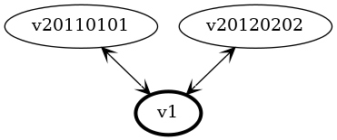
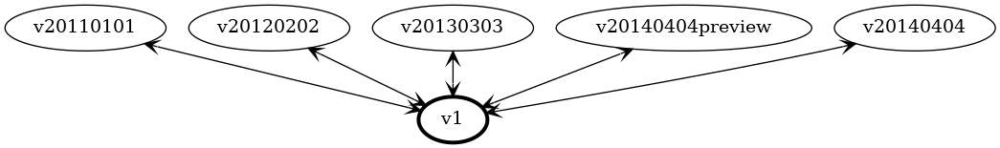
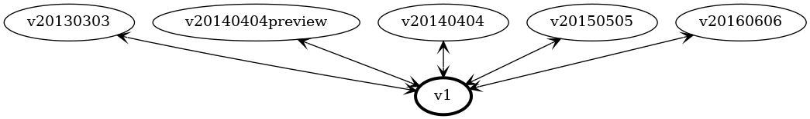
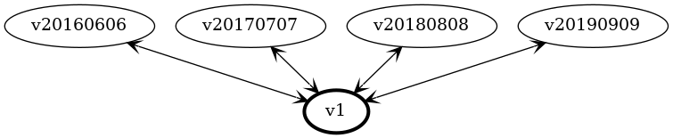

This case study explores the alternative solution of using a *fixed storage version* where the schema of the storage version is modified to handle each additional release.

For the purposes of discussion, we'll be following the version by version evolution of a theoretical ARM service that provides customer resource management (CRM) services. Synthetic examples are used to allow focus on specific scenarios one by one, providing motivation for specific features.

Examples shown are deliberately simplified in order to focus on specific details, and therefore minutiae should be considered motivational, not binding. Reference the formal specification for precise details.

# Version 2011-01-01 - Initial Release

The initial release of the CRM includes a simple definition to capture information about a particular person:

``` go
package v20110101

type Person struct {
    Id        Guid
    FirstName string
    LastName  string
}
```

We're not reusing the API version directly as our storage version. Instead, we define a separate (independent) type with a similar structure:

``` go
package v1

type Person struct {
    FirstName *string
    Id        *Guid
    LastName  *string
}

// Hub marks this type as a conversion hub.
func (*Person) Hub() {}
```

By convention, a fixed storage version is noted as v1

Every property is marked as optional. Optionality doesn't matter at this point, as we are only concerned with a single version of the API. However, as we'll see with later versions, forward and backward compatibility issues would arise if they were not optional.


## Storage Conversion

We need to implement the [Convertible](https://book.kubebuilder.io/multiversion-tutorial/conversion.html) interface to allow conversion to and from the storage version:

``` go
package v20110101

import "v1"

// ConvertTo converts this Person to the Hub storage version.
func (person *Person) ConvertTo(raw conversion.Hub) error {
    p := raw.(*v1.Person)
    return ConvertToStorage(p)
}

// ConvertToStorage converts this Person to a storage version
func (person *Person) ConvertToStorage(dest v1.Person) error {
    // Copy simple properties across
    dest.FirstName = person.FirstName
    dest.Id = person.Id
    dest.LastName = person.LastName

    return nil
}

// ConvertFrom converts from the Hub storage version
func (person *Person) ConvertFrom(raw conversion.Hub) error {
    p := raw.(*v1.Person)
    return ConvertFromStorage(p)
}

// ConvertFrom converts from a storage version to this version.
func (person *Person) ConvertFromStorage(source v1.Person) error {
    // Copy simple properties across
    person.FirstName = source.FirstName
    person.Id = source.Id
    person.LastName = source.LastName

    return nil
}

```

These four methods will be automatically generated in order to handle much of the boilerplate required for conversion. 

Conversion in each direction is separated into two methods (e.g. `ConvertFrom()` and `ConvertFromStorage()`) to allow for reuse of the `ConvertFromStorage()` methods for conversion of nested complex properties, as we'll see later on.

Since they never change, the `ConvertTo()` and `ConvertFrom()` methods are omitted from the following discussion.

## Version Map

With only two classes, our version map doesn't look much like the traditional hub and spoke model, but this will change as we work through this case study:


# Version 2012-02-02 - No Change

In this release of the CRM service, despite changes elsewhere in the service, there are no changes made to the structure of `Person`:

``` go
package v20120202

type Person struct {
    Id        Guid
    FirstName string
    LastName  string
}
```

## Storage Conversion

Conversions between version `v20120202` and the `v1` storage version will be identical to those generated for the earlier `v20110101` version. 

## Version Map

Our hub and spoke diagram is becoming useful for seeing the relationship between versions:



# Version 2013-03-03 - New Property

In response to customer feedback, this release of the CRM adds a new property to `Person` to allow a persons middle name to be stored:

``` go
package v20130303

type Person struct {
    Id         Guid
    FirstName  string
    MiddleName string // *** New ***
    LastName   string
}
```

The storage version is updated with the addition of the new property:

``` go
package v1

type Person struct {
    FirstName  *string
    Id         *Guid
    LastName   *string
    MiddleName *string // *** New ***
}

// Hub marks this type as a conversion hub.
func (*Person) Hub() {}
```

## Storage Conversions

Conversions to and from earlier versions of Person are unchanged, as those versions do not support `MiddleName`. For the new version of `Person`, the new property will be included in the generated methods:

``` go
package v20130303

import "v1"

// ConvertTo converts this Person to the Hub version.
func (person *Person) ConvertToStorage(dest v1.Person) error {
    dest.FirstName = person.FirstName
    dest.Id = person.Id
    dest.LastName = person.LastName
    dest.MiddleName = person.MiddleName // *** New property copied too ***

    return nil
}

// ConvertFrom converts from the Hub version to this version.
func (person *Person) ConvertFromStorage(source v1.Person) error {
    person.FirstName = source.FirstName
    person.Id = source.Id
    person.LastName = source.LastName
    person.MiddleName = source.MiddleName // *** New property copied too ***

    return nil
}
```

The new property is shown at the end of the list not because it is new, but because values are copied across in alphabetical order to guarantee that code generation is deterministic and generates the same result each time.

Conversion methods for earlier API versions of `Person` are essentially unchanged.

## Version Map

A graph of our conversions now starts to show the expected hub and spoke structure:


## How often are new properties added?

At the time of writing, there were **381** version-to-version changes where the only change between versions was solely the addition of new properties. Of those, **249** were adding just a single property, and **71** added two properties. 

# Version 2014-04-04 Preview - Schema Change

To allow the CRM to better support cultures that have differing ideas about how names are written, a preview release of the service modifies the schema considerably:

``` go
package v20140404preview

type Person struct {
    Id         Guid   // *** Only Id is unchanged from the prior version ***
    FullName   string
    FamilyName string
    KnownAs    string
}
```

The storage version gets modified to add these new properties:

``` go
package v1

type Person struct {
    FamilyName *string // *** New ***
    FirstName  *string
    FullName   *string // *** New ***
    Id         *Guid
    KnownAs    *string // *** New ***
    LastName   *string
    MiddleName *string
}

// Hub marks this type as a conversion hub.
func (*Person) Hub() {}
```

## Storage Conversion

The new properties are copied to and from the storage version. Ensuring that all properties are optional makes it possible to leave the unused properties empty.

``` go
package v20140404preview

import storage "v20130303storage"

// ConvertTo converts this Person to the Hub version.
func (person *Person) ConvertToStorage(dest storage.Person) error {
    dest.FamilyName = person.FamilyName
    dest.FullName = person.FullName
    dest.Id = person.Id
    dest.KnownAs = person.KnownAs

    return nil
}

// ConvertFrom converts from the Hub version to this version.
func (person *Person) ConvertFromStorage(source storage.Person) error {
    person.FamilyName = source.FamilyName
    person.FullName = source.FullName
    person.Id = source.Id
    person.KnownAs = source.KnownAs

    return nil
}
```

This provides round-trip support for the preview release, but does not provide backward compatibility with prior official releases. 

The storage version of `Person` written by the preview release will have no values for `FirstName`, `LastName`, and `MiddleName`.

Similarly, the storage version of `Person` written by an earlier release will have no values for `KnownAs`, `FamilyName`, or `FullName`.

These kinds of cross-version conversions cannot be automatically generated as they require more understanding of the semantic changes between versions. 

To allow injection of manual conversion steps, two interfaces will be generated as follows:

``` go
package v1

// AssignableToPerson is implemented on an API version 
// of `Person` to update the storage version
type AssignableToPerson interface {
    AssignTo(person Person) error
}

// AssignableFromPerson is implemented on an API version 
// of `Person` to populate it from the storage version
type AssignableFromPerson interface {
    AssignFrom(person Person) error
}
```

This interface can be optionally implemented by API versions (spoke types) to *augment* (not replace) the generated conversion. 

The generated `ConvertToStorage()` and `ConvertFromStorage()` methods will test for the presence of this interface and will call it if available:

``` go
package v20140404preview

import v1

// ConvertTo converts this Person to the Hub version.
func (person *Person) ConvertToStorage(dest v1.Person) error {
    // … elided …

    // *** Check for the interface and use it if found ***
    if assignable, ok := person.(AssignableToPerson); ok {
        assignable.AssignTo(dest)
    }

    return nil
}

// ConvertFrom converts from the Hub version to this version.
func (person *Person) ConvertFromStorage(source v1.Person) error {
    // … elided …

    // *** Check for the interface and use it if found ***
    if assignable, ok := person.(AssignableFromPerson); ok {
        assignable.AssignFrom(source)
    }

    return nil
}
```

Implementations of these interfaces are called *after* the generated boilerplate conversion has completed. This gives developers freedom to make any changes required as they won't be overwritted by the effects of generated code.

## Version Map

The preview version just appears as another version in our hub and spoke diagram:


# Version 2014-04-04 - Schema Change

Based on feedback generated by the preview release, the CRM schema changes have gone ahead with a few minor changes:

``` go
package v20140404

type Person struct {
    Id         Guid
    LegalName  string // *** Was FullName in preview ***
    FamilyName string
    KnownAs    string
    AlphaKey   string // *** Added after preview ***
}
```

The two new properties need to be added to the storage version to allow this to be stored:

``` go
package v1

type Person struct {
    Id         *Guid
    AlphaKey   *string // *** New ***
    FamilyName *string
    FirstName  *string
    FullName   *string
    KnownAs    *string
    LastName   *string
    LegalName  *string // *** New ***
    MiddleName *string
}

// Hub marks this type as a conversion hub.
func (*Person) Hub() {}
```

## Issue: Property Bloat

As our API evolves over time, our storage version is accumulating all the properties that have ever existed, bloating the storage version with obsolete properties that are seldom (if ever) used. 

For example, only preview users would ever have used `FullName` as it became `LegalName` in the general release; most users will never use `FullName`.

We have a problem, however. We can't remove the `FullName` property as that is a breaking change that will negatively impact users who *have* used the preview version. Both properties will need to be retained permanently.

This violates the *pay for play* principle - even users who adopt the operator after the 2014-04-04 release will have to deal with the complexity even though they've never used the preview version.

## Storage Conversion

The `ConvertToStorage()` and `ConvertFromStorage()` methods for the new version of `Person` are generated as expected, copying across values and invoking the `AssignableToPerson` and `AssignableFromPerson` interfaces if present:

``` go
package v20140404

import v1

// ConvertTo converts this Person to the Hub version.
func (person *Person) ConvertToStorage(dest v1.Person) error {
    dest.AlphaKey = person.AlphaKey
    dest.FamilyName = person.FamilyName
    dest.Id = person.Id
    dest.KnownAs = person.KnownAs
    dest.LegalName = person.LegalName

    // *** Check for the interface and use it if found ***
    if assignable, ok := person.(AssignableToPerson); ok {
        assignable.AssignTo(dest)
    }

    return nil
}

// ConvertFrom converts from the Hub version to this version.
func (person *Person) ConvertFromStorage(source v1.Person) error {
    person.AlphaKey = source.AlphaKey
    person.FamilyName = source.FamilyName
    person.Id = source.Id
    person.KnownAs = source.KnownAs
    person.LegalName = source.LegalName

    // *** Check for the interface and use it if found ***
    if assignable, ok := person.(AssignableFromPerson); ok {
        assignable.AssignFrom(source)
    }

    return nil
}
```

For older versions of `Person`, the conversion methods are essentially unchanged as the properties they require are still present on the storage version.

To interoperate between different versions of `Person`, we need to add some manual conversions.

When a newer version of `Person` is written to storage, we need to also populate `FirstName`, `LastName` and `MiddleName` to allow older versions to be requested. Similarly, when an older version of `Person` is written, we need to populate `AlphaKey`, `FamilyName`, `KnownAs` and `LegalName` so that newer versions can be requested.

To avoid repetition of code across multiple implementations of `AssignTo()` and `AssignFrom()`, we write some helper methods on the storage version:

``` go
package v1

func (person *Person) PopulateFromFirstMiddleLastName(firstName string, middleName string, lastName string) {
    person.KnownAs = firstName
    person.FamilyName = lastName
    person.LegalName = firstName +" "+ middleName + " " + lastName
    person.AlphaKey = lastName
}

func (person *Person) PopulateLegacyProperties() {
    person.FirstName = person.KnownAs
    person.FamilyName = person.FamilyName
    person.MiddleName = // ... elided ...
}
```

These methods are manually authored, so the names are arbitary. However, we will provide some guidance for implementers to encouarage consistency as the operator is updated and improved.

With these methods available, implementing the interface `AssignableToPerson` becomes straightforward. For the `2011-01-01` release of `Person`:

``` go
package v20110101

import v1

func (person *Person) AssignTo(dest v1.Person) error {
    dest.PopulateFromFirstMiddleLastName(
        person.FirstName, "", person.LastName)
    return nil
}
```

For the `2013-03-3` release that introduced `MiddleName` the code is very similar:

``` go
package v20130303

import v1

func (person *Person) AssignTo(dest v1.Person) error {
    dest.PopulateFromFirstMiddleLastName(
        person.FirstName, person.MiddleName, person.LastName)
    return nil
}
```

## Version Map

We can see in our version map that the preview release is still supported:



# Version 2015-05-05 - Property Rename

The term `AlphaKey` was found to be confusing to users, so in this release of the API it is renamed to `SortKey`. This better reflects its purpose of sorting names together (e.g. so that the family name *McDonald* gets sorted as though spelt *MacDonald*).

``` go
package v20150505

type Person struct {
    Id         Guid
    LegalName  string
    FamilyName string
    KnownAs    string
    SortKey    string // *** Used to be AlphaKey ***
}
```

As expected the storage version is also extended:

``` go
package v1

type Person struct {
    Id         *Guid
    AlphaKey   *string // ** Debris ***
    FamilyName *string
    FirstName  *string
    FullName   *string
    KnownAs    *string
    LastName   *string
    LegalName  *string
    MiddleName *string
    SortKey    *string // ** New ***
}

// Hub marks this type as a conversion hub.
func (*Person) Hub() {}
```

Again, we see the issue of **property bloat** where the storage type needs to have both `AlphaKey` and `SortKey` for backward compatibility.

## Storage Conversion

By documenting the renames in the configuration of our code generator, this rename will be automatically handled within the `ConvertTo()` and `ConvertFrom()` methods, as shown here for the `2014-04-04` version of `Person`:

``` go
package v20140404

import v1

// ConvertTo converts this Person to the Hub version.
func (person *Person) ConvertToStorage(dest v1.Person) error {
    dest.AlphaKey = person.AlphaKey // *** Store it the old way ***
    dest.FamilyName = person.FamilyName
    dest.Id = person.Id
    dest.KnownAs = person.KnownAs
    dest.LegalName = person.LegalName
    dest.SortKey = person.AlphaKey // *** Rename is automatically handled ***

    if assignable, ok := person.(AssignableToPerson); ok {
        assignable.AssignTo(dest)
    }

    return nil
}

// ConvertFrom converts from the Hub version to this version.
func (person *Person) ConvertFromStorage(source v1.Person) error {
    person.AlphaKey = source.SortKey // *** Rename is automatically handled ***
    person.FamilyName = source.FamilyName
    person.Id = source.Id
    person.KnownAs = source.KnownAs
    person.LegalName = source.LegalName

    if assignable, ok := person.(AssignableFromPerson); ok {
        assignable.AssignFrom(source)
    }

    return nil
}
```

For forward compatibility, the `ConvertToStorage()` method for version `2014-04-04` populates **both** `AlphaKey` and `SortKey`.

For the `2015-05-05` release of `Person`, the methods are similar:

``` go
package v20150505

import v1

// ConvertTo converts this Person to the Hub version.
func (person *Person) ConvertToStorage(dest v1.Person) error {
    dest.AlphaKey = person.SortKey // *** Back compatibility ***
    dest.FamilyName = person.FamilyName
    dest.Id = person.Id
    dest.KnownAs = person.KnownAs
    dest.LegalName = person.LegalName
    dest.SortKey = person.SortKey // *** New ***

    if assignable, ok := person.(AssignableToPerson); ok {
        assignable.AssignTo(dest)
    }

    return nil
}

// ConvertFrom converts from the Hub version to this version.
func (person *Person) ConvertFromStorage(source v1.Person) error {
    person.FamilyName = source.FamilyName
    person.Id = source.Id
    person.KnownAs = source.KnownAs
    person.LegalName = source.LegalName
    person.SortKey = source.SortKey // *** New ***

    if assignable, ok := person.(AssignableFromPerson); ok {
        assignable.AssignFrom(source)
    }

    return nil
}
```

Here we can see the `2015-05-05` version of `ConvertToStorage()` populates `AlphaKey` for backwards compatiblity.

## Version Map

Here we see our horizon policy coming into effect, with support for version 2011-01-01 being dropped in this release:


## How often do property renames happen?

At the time of writing, there were nearly **60** cases of properties being renamed between versions. (Count is somewhat inexact because renaming was manually inferred from the similarity of names.)

Of these **17** of these involved changes to letter case alone. 

# Version 2016-06-06 - Complex Properties

With some customers expressing a desire to send physical mail to their customers, this release extends the API with a mailing address for each person.

``` go
package v20160606

type Address struct {
    Street string
    City   string
}

type Person struct {
    Id             Guid
    LegalName      string
    FamilyName     string
    KnownAs        string
    SortKey        string
    MailingAddress Address
}
```

We now have two structs used in storage:

``` go
package v1

type Person struct {
    Id             *Guid
    AlphaKey       *string
    FamilyName     *string
    FirstName      *string
    FullName       *string
    KnownAs        *string
    LastName       *string
    LegalName      *string
    MailingAddress *Address // *** New ***
    MiddleName     *string
    SortKey        *string
}

type Address struct {
    PropertyBag
    City        *string
    Street      *string
}

// Hub marks this type as a conversion hub.
func (*Person) Hub() {}
```

## Storage Conversion

The required `ConvertToStorage()` and `ConvertFromStorage()` methods get generated in the expected way:

``` go
package v20160606

import v1

// ConvertTo converts this Person to the Hub version.
func (person *Person) ConvertToStorage(dest v1.Person) error {
    dest.SortKey = person.AlphaKey
    dest.FamilyName = person.FamilyName
    dest.Id = person.Id
    dest.KnownAs = person.KnownAs
    dest.LegalName = person.LegalName

    // *** Copy the mailing address over too ***
    address := &storage.Address{}
    err := person.MailingAddress.ConvertToStorage(address)
    if err != nil {
        return err
    }

    dest.MailingAddress = address

    if assignable, ok := person.(AssignableToPerson); ok {
        err := assignable.AssignTo(dest)
        if err != nill {
            return err
        }
    }

    return nil
}

// ConvertToStorage converts this Address to the hub storage version
func (address *Address) ConvertToStorage(dest v1.Address) error {
    dest.Street = address.Street
    dest.City = address.City

    if assignable, ok := person.(AssignableToAddress); ok {
        err := assignable.AssignTo(dest)
        if err != nill {
            return err
        }
    }

    return nil
}

// ConvertFrom converts from the Hub version to this version.
func (person *Person) ConvertFromStorage(source v1.Person) error {
    person.AlphaKey = source.SortKey // *** Rename still is automatically handled ***
    person.FamilyName = source.FamilyName
    person.Id = source.Id
    person.KnownAs = source.KnownAs
    person.LegalName = source.LegalName

    // *** Copy the mailing address over too ***
    if storage.MailingAddress != nil {
        address := &Address{}
        err := address.ConvertFromStorage(source.Address)
        person.MailingAddress = address
    }

    if assignable, ok := person.(AssignableFromPerson); ok {
        err := assignable.AssignFrom(source)
        if err != nill {
            return err
        }
    }

    return nil
}

// ConvertFromStorage converts from the hub storage version to this version
func (address *Address) ConvertFromStorage(source v1.Address) error {
    address.Street = source.Street
    address.City = source.City

    if assignable, ok := person.(AssignableFromAddress); ok {
        err := assignable.AssignFrom(source)
        if err != nill {
            return err
        }
    }

    return nil
}
```

We're recursively applying the same conversion pattern to `Address` as we have already been using for `Person`. This scales to any level of nesting without the code becoming unweildy.

## Version Map

Again we see the oldest version (`2012-02-02`) drop out:




# Version 2017-07-07 - Optionality changes

In the `2016-06-06` version of the API, the `MailingAddress` property was mandatory. Since not everyone has a mailing address (some people receive no physical mail), this is now being made optional.

The change to the API declarations is simple:

``` go
package v20170707

type Address struct {
    Street string
    City   string
}

type Person struct {
    Id             Guid
    LegalName      string
    FamilyName     string
    KnownAs        string
    SortKey        string
    MailingAddress *Address // *** Was mandatory, now optional ***
}
```

## Storage Conversion

The storage version is identical to that generated used previously (because all properties are marked as optional anyway) and are not shown here.

What does change is the `ConvertToStorage()` method, which now needs to handle the case where the `MailingAddress` has not been included:

``` go
package v20170707

import v1

// ConvertTo converts this Person to the Hub version.
func (person *Person) ConvertToStorage(dest v1.Person) error {
    dest.FamilyName = person.FamilyName
    dest.Id = person.Id
    dest.KnownAs = person.KnownAs
    dest.LegalName = person.LegalName
    dest.SortKey = person.AlphaKey

    // *** Need to check whether we have a mailing address to copy ***
    if person.MailingAddress != nil {
        address := &storage.Address{}
        err := person.MailingAddress.ConvertToStorage(address)
        if err != nil {
            return err
        }

        dest.MailingAddress = address
    }

    if assignable, ok := person.(AssignableToPerson); ok {
        err := assignable.AssignTo(dest)
        if err != nill {
            return err
        }
    }

    return nil
}
```

If we instead had an _optional_ property that became _required_ in a later version of the API, the generated code for `ConvertToStorage()` would become simpler as the check for **nil** would not be needed.

## Version Map

Note that the 2013-03-03 version has now dropped out:


## How often do optionality changes happen?

At the time of writing, there are **100** version-to-version changes where properties became **optional** in the later version of the API, and **99** version-to-version changes where properties became **required**.

## Issue: Property Amnesia

Our code generator only knows about properties defined in current versions of the API. Once an API version has been excluded (or if the JSON schema definition is no longer available), the generator completely forgets about older properties.

This means that we now have a significant issue - with the versions `2011-01-01`, `2012-02-02` and `2013-03-03` no longer included, we can no longer fully generate the expected storage version automatically.

The properties `FirstName`, `MiddleName` and `LastName` no longer exist - they are only defined on the earliest versions of the API. 

As a consequence, the storage version generated for this release will be this:

``` go
package v1

type Person struct {
    AlphaKey       *string
    FamilyName     *string
    FullName       *string
    Id             *Guid
    KnownAs        *string
    LegalName      *string
    MailingAddress *Address
    SortKey        *string
}

type Address struct {
    PropertyBag
    City        *string
    Street      *string
}

// Hub marks this type as a conversion hub.
func (*Person) Hub() {}
```

References to `FirstName`, `MiddleName` and `LastName` will disappear across all the generated `ConvertFromStorage()` and `ConvertToStorage()` methods as well.

**This is a breaking change.** Existing long time users of the service operator, with CRDs serialized containing any of the properties `FirstName`, `MiddleName` and `LastName` will find that their clusters break when this version of the service operator is deployed.

Without explicit intervention in the operator, their only mitigation would be to revert back to the earlier version of the service operator and *never upgrade it ever again.*

The root cause of the problem is that the CRD has never been modified (upgraded) - once first deployed the resource is never modified, only loaded and reconciled.

To retain backward compatibility we would need to manually merge the generated code with prior versions to retain both the property definitions and the conversion support previously generated. 

There are many problems with this approach:

* Violates the goal of avoiding changes to generated files.
* Merging these changes would be tedious and error prone.
* Changes would need to be re-merged for every subsequent release of the service operator.
* Manual conversions would need to be written for newer API versions.
* Over time, the number of classes requiring manual attention would grow.

# Version 2018-08-08 - Extending nested properties

Defining an address simply as `Street` and `City` has been found to be overly simplistic, so this release makes changes to allow a more flexible approach.

``` go
package v20180808

type Address struct {
    // FullAddress shows the entire address as should be used on postage
    FullAddress string
    City        string
    Country     string
    PostCode    string
}
```

As before, the storage version is updated with the additional properties:

``` go
package v1

type Address struct {
    City        *string
    Country     *string // *** New ***
    FullAddress *string // *** New ***
    PostCode    *string // *** New ***
    Street      *string
}
```

These changes are entirely similar to those previously covered in version `2014-04-04`, above.

## Version Map

In this release, we see that support for both `2014-04-04` and the preview version `2014-04-04preview` has been dropped:


Dropping those releases triggers a reccurrance of the ***Property Amnesia*** issue discussed above - the `FullName` property (only included in the `2014-04-04preview` release) has been forgotten.

# Version 2019-09-09 - Changing types

Realizing that some people get deliveries to places that don't appear in any formal database of addresses, in this release the name of the type changes to `Location` and location coordinates are added:

``` go
package v20190909

type Location struct {
    FullAddress string
    City        string
    Country     string
    PostCode    string
    Lattitude   double
    Longitide   double
}
```

The storage version for `Location` gets generated in a straightforward way:

``` go
package v1

type Location struct {
    City        *string
    Country     *string
    FullAddress *string
    PostCode    *string
}
```

We *also* need to retain the `Address` struct - if we drop support for it, we will be breaking existing users as we will be unable to deserialize their resources.

``` go
type Address struct {
    City         *string
    Country      *string
    FullAddress  *string
    PostCode     *string
    Street       *string
}
```

## Issue: Type collision

We run into a problem with the storage version of the `Person` type:

``` go
package v1

type Person struct {
    Id             *Guid
    AlphaKey       *string
    FamilyName     *string
    FullName       *string
    KnownAs        *string
    LegalName      *string
    MailingAddress *Address  // *** Existing property ***
    MailingAddress *Location // *** New property with the same name ***
    SortKey        *string
}
```

We can't have two properties with the same name, either we create a single property that handles both types, or we must change the name of one of them.

We can't change the name of the existing property, because that would break existing users who already have serialised resources. For similar reasons, we can't change the type of the existing property.

So we need to change the name of the new property - and need to do so in a deterministic way to ensure that we generate the same code each time. One way would be to suffic the type name with the version:

``` go
package v1

type Person struct {
    Id                       *Guid
    AlphaKey                 *string
    FamilyName               *string
    FullName                 *string
    KnownAs                  *string
    LegalName                *string
    MailingAddress           *Address
    MailingAddress_v20190909 *Location
    SortKey                  *string
}
```

Needing to do this is a wart, but one with a nasty sting in the tail:

When the original `MailingAddress` property ages out of the system (see **property amnesia**, above), we'll no longer have a collision, and the storage struct will be generated with this structure:

``` go
package v1

type Person struct {
    Id                       *Guid
    AlphaKey                 *string
    FamilyName               *string
    FullName                 *string
    KnownAs                  *string
    LegalName                *string
    MailingAddress           *Location
    SortKey                  *string
}
```

**This is a major breaking change.**

Not only will this break older users who have serialized resources using `Address`, but it will _**also**_ break newer users who have serialized resources using `Location`.   

## Storage Conversion

The conversion methods need to change as well. If we configure metadata detailing the rename (as we did for properties in version `2015-05-05`), we can generate the required conversions automatically:

``` go
package v20170707

// *** Updated storage version ***
import v1

// ConvertTo converts this Person to the Hub version.
func (person *Person) ConvertToStorage(dest v1.Person) error {
    // ... elided properties ...

    if person.MailingAddress != nil {
        address := &storage.Location{}
        err := person.MailingAddress.ConvertToStorage(address)
        if err != nil {
            return err
        }

        dest.MailingAddress = address
    }

    if assignable, ok := person.(AssignableToPerson); ok {
        err := assignable.AssignTo(dest)
        if err != nill {
            return err
        }
    }

    return nil
}

// ConvertToStorage converts this Address to the hub storage version
// ** Different parameter type for dest *** 
func (address *Address) ConvertToStorage(dest v1.Location) error {
    dest.Street = address.Street
    dest.City = address.City

    // *** Interface has been renamed too **
    if assignable, ok := person.(AssignableToLocation); ok {
        err := assignable.AssignTo(dest)
        if err != nill {
            return err
        }
    }

    return nil
}

```

If we don't include metadata to capture type renames, the conversion can be manually injected by implementing the `AssignableToLocation` interface.

## Version Map



## How often do properties change their type?

At the time of writing, there are **160** version-to-version changes where the type of the property changes. This count excludes cases where an optional property become mandatory, or vice versa.
