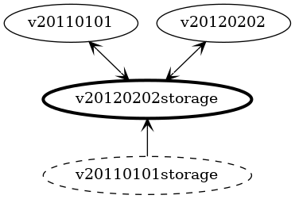
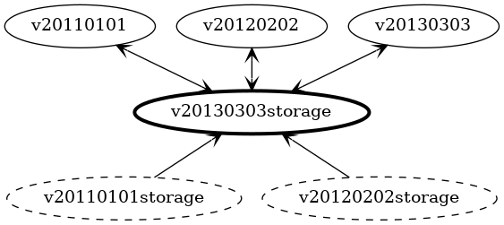
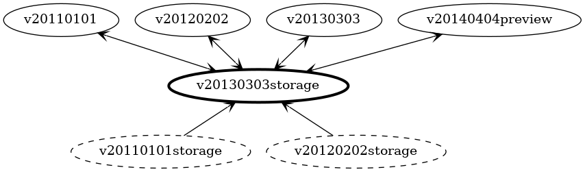
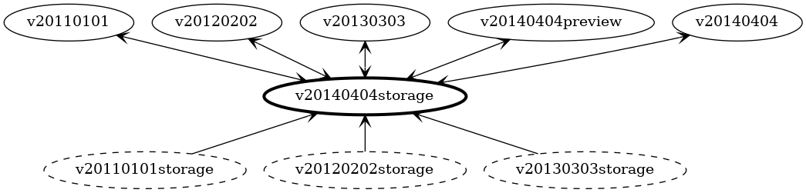
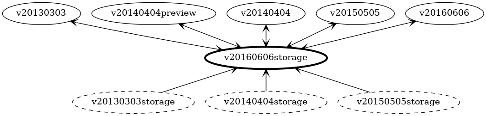
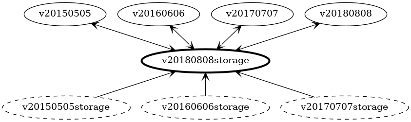

This case study explores the recommended solution of using a *rolling storage version* where we update the storage schema of each resource each release of the service operator. We'll keep the storage version up to date with the latest GA release of each resource.

For the purposes of discussion, we'll be following the version by version evolution of a theoretical ARM service that provides customer resource management (CRM) services. Synthetic examples are used to allow focus on specific scenarios one by one, providing motivation for specific features.

Examples shown are deliberately simplified in order to focus, and therefore minutiae should be considered motivational, not binding. Reference the formal specification for precise details.

# Version 2011-01-01 - Initial Release

The initial release of the CRM includes a simple definition to capture information about a particular person:

``` go
package v20110101

type Person struct {
    Id        Guid
    FirstName string
    LastName  string
}
```

We're not reusing the API version directly as our storage version. Instead, we define a separate (independent) type with a similar structure:

``` go
package v20110101storage

type Person struct {
    PropertyBag
    FirstName   *string
    Id          *Guid
    LastName    *string
}

// Hub marks this type as a conversion hub.
func (*Person) Hub() {}
```

Every property is marked as optional. Optionality doesn't matter at this point, as we currently have only single version of the API. However, as we'll see with later versions, forward and backward compatibility issues would arise if they were not optional.

The `PropertyBag` type provides storage for other properties, plus helper methods. It is always included in storage versions, but in this case will be unused. The method `Hub()` marks this version as the storage schema.

## Storage Conversion

We need to implement the [Convertible](https://book.kubebuilder.io/multiversion-tutorial/conversion.html) interface to allow conversion to and from the storage version:

``` go
package v20110101

import storage "v20110101storage"

// ConvertTo converts this Person to the Hub storage version.
func (person *Person) ConvertTo(raw conversion.Hub) error {
    p := raw.(*storage.Person)
    return ConvertToStorage(p)
}

// ConvertToStorage converts this Person to a storage version
func (person *Person) ConvertToStorage(dest storage.Person) error {
    // Copy simple properties across
    dest.FirstName = person.FirstName
    dest.Id = person.Id
    dest.LastName = person.LastName

    return nil
}

// ConvertFrom converts from the Hub storage version
func (person *Person) ConvertFrom(raw conversion.Hub) error {
    p := raw.(*storage.Person)
    return ConvertFromStorage(p)
}

// ConvertFrom converts from a storage version to this version.
func (person *Person) ConvertFromStorage(source storage.Person) error {
    // Copy simple properties across
    person.FirstName = source.FirstName
    person.Id = source.Id
    person.LastName = source.LastName

    return nil
}

```

Conversion is separated into two methods (e.g. `ConvertFrom()` and `ConvertFromStorage()`) to allow for reuse of the `ConvertFromStorage()` methods for conversion of nested complex properties, as we'll see later on.

These methods will be automatically generated in order to handle the majority of the required conversions. Since they never change, the `ConvertTo()` and `ConvertFrom()` methods are omitted from the following discussion.

## Version Map

With only two classes, our version map doesn't look much like the traditional hub and spoke model, but this will change as we work through this case study:


# Version 2012-02-02 - No Change

In this release of the CRM service, there are no changes made to the structure of `Person`:

``` go
package v20120202

type Person struct {
    Id        Guid
    FirstName string
    LastName  string
}
```

## Storage Conversion

Conversions with the upgraded storage version will need to be trivially modified by changing the import statements for the referenced types.


## Version Map

Our hub and spoke diagram is becoming useful for seeing the relationship between versions:



Observe that the prior storage version is still shown, with a one way conversion to the current storage version. Existing users who upgrade their service operator will have their storage upgraded using this conversion. The conversion between storage versions will be generated with the same approach, and with the same structure, as all our other conversions.

# Version 2013-03-03 - New Property

In response to customer feedback, this release of the CRM adds a new property to `Person` to allow a persons middle name to be stored:

``` go
package v20130303

type Person struct {
    Id         Guid
    FirstName  string
    MiddleName string // *** New ***
    LastName   string
}
```

The new storage version, based on this version, updates accordingly:

``` go
package v20130303storage

type Person struct {
    PropertyBag
    Id          *Guid
    FirstName   *string
    MiddleName  *string // *** New storage ***
    LastName    *string
}

// Hub marks this type as a conversion hub.
func (*Person) Hub() {}
```

## Storage Conversions

Conversions to and from earlier versions of Person are unchanged, as those versions do not support `MiddleName`. For the new version of `Person`, the new property will be included in the generated methods:

``` go
package v20130303

import storage "v20130303storage"

// ConvertTo converts this Person to the Hub version.
func (person *Person) ConvertToStorage(dest storage.Person) error {
    dest.FirstName = person.FirstName
    dest.Id = person.Id
    dest.LastName = person.LastName
    dest.MiddleName = person.MiddleName // *** New property copied too ***

    return nil
}

// ConvertFrom converts from the Hub version to this version.
func (person *Person) ConvertFromStorage(source storage.Person) error {
    person.FirstName = source.FirstName
    person.Id = source.Id
    person.LastName = source.LastName
    person.MiddleName = source.MiddleName // *** New property copied too ***

    return nil
}
```

The new property is shown at the end of the list not because it is new, but because values are copied across in alphabetical order. This is to guarantee that code generation is deterministic and generates the same result each time.

Conversion methods for earlier API versions of `Person` are essentially unchanged. The import statement at the top of the file will be updated to the new storage version; no other changes are necessary.

## Version Map

A graph of our conversions now starts to show the expected hub and spoke structure, with conversions from earlier versions of storage allowing easy upgrades for existing users of the service operator.



## How often are new properties added?

At the time of writing, there were **381** version-to-version changes where the only change between versions was solely the addition of new properties. Of those, **249** were adding just a single property, and **71** added two properties. 

# Version 2014-04-04 Preview - Schema Change

To allow the CRM to better support cultures that have differing ideas about how names are written, a preview release of the service modifies the schema considerably:

``` go
package v20140404preview

type Person struct {
    Id         Guid   // ** Only Id is unchanged ***
    FullName   string
    FamilyName string
    KnownAs    string
}
```

This is a preview version, so the storage version is _left unchanged_ (see below).

## Storage Conversion

The new properties don't exist on the storage version of `Person`, so the generated `ConvertToStorage()` and `ConvertFromStorage()` methods use the `PropertyBag` to carry the properties:

``` go
package v20140404preview

import storage "v20130303storage"

// ConvertTo converts this Person to the Hub version.
func (person *Person) ConvertToStorage(dest storage.Person) error {
    dest.Id = person.Id

    // *** Store in the property bag ***
    dest.WriteString("FamilyName", person.FamilyName)
    dest.WriteString("FullName", person.FullName)
    dest.WriteString("KnownAs", person.KnownAs)

    return nil
}

// ConvertFrom converts from the Hub version to this version.
func (person *Person) ConvertFromStorage(source storage.Person) error {
    person.Id = source.Id

    // *** Read from the property bag ***
    person.FamilyName = source.ReadString("FamilyName")
    person.FullName = source.ReadString("FullName")
    person.KnownAs = source.ReadString("KnownAs")

    return nil
}
```

In the example above, we show first copying all the directly supported properties, then using the property bag. We may not separate these steps in the generated code.


This provides round-trip support for the preview release, but does not provide backward compatibility with prior official releases. 

The storage version of `Person` written by the preview release will have no values for `FirstName`, `LastName`, and `MiddleName`.

These kinds of cross-version conversions cannot be automatically generated as they require more understanding of the semantic changes between versions.

To allow injection of manual conversion steps, interfaces will be generated as follows:

``` go
package v20130303storage

// AssignableToPerson provides methods to augment conversion to storage
type AssignableToPerson interface {
    AssignTo(person Person) error
}

// AssignableFromPerson provides methods to augment conversion from storage
type AssignableFromPerson interface {
    AssignFrom(person Person) error
}
```

This interface can be optionally implemented by API versions (spoke types) to augment the generated conversion.

The generated `ConvertToStorage()` and `ConvertFromStorage()` methods will test for the presence of this interface and will call it if available:

``` go
package v20140404preview

import storage "v20130303storage"

// ConvertTo converts this Person to the Hub version.
func (person *Person) ConvertToStorage(dest storage.Person) error {
    // … property copying and property bag use elided …

    // *** Check for the interface and use it if found ***
    if assignable, ok := person.(AssignableTo); ok {
        assignable.AssignTo(dest)
    }

    return nil
}

// ConvertFrom converts from the Hub version to this version.
func (person *Person) ConvertFromStorage(source storage.Person) error {
    // … property copying and property bag use elided …

    // *** Check for the interface and use it if found ***
    if assignable, ok := person.(AssignableFrom); ok {
        assignable.AssignFrom(source)
    }

    return nil
}
```

## Version Map
 
Preview releases, by definition, include unstable changes that may differ once the feature reaches general availability.

We don't want to make changes to our storage versions based on these speculative changes, so we handle persistence of the preview release with the existing storage version:




# Version 2014-04-04 - Schema Change

Based on feedback generated by the preview release, the CRM schema changes have gone ahead with a few minor changes:

``` go
package v20140404

type Person struct {
    Id         Guid
    LegalName  string // *** Was FullName in preview ***
    FamilyName string
    KnownAs    string
    AlphaKey   string // *** Added after preview ***
}
```

No longer being a preview release, the storage version is also regenerated:

``` go
package v20140404storage

type Person struct {
    PropertyBag
    AlphaKey    *string
    FamilyName  *string
    LegalName   *string
    Id          *Guid
    KnownAs     *string
}

// Hub marks this type as a conversion hub.
func (*Person) Hub() {}
```

## Storage Conversion

The `ConvertToStorage()` and `ConvertFromStorage()` methods for the new version of `Person` are generated as expected, copying across values and invoking the `AssignableToPerson` and `AssignableFromPerson` interfaces if present:

``` go
package v20140404

import storage "v20140404storage"

// ConvertTo converts this Person to the Hub version.
func (person *Person) ConvertToStorage(dest storage.Person) error {
    dest.AlphaKey = person.AlphaKey
    dest.FamilyName = person.FamilyName
    dest.Id = person.Id
    dest.KnownAs = person.KnownAs
    dest.LegalName = person.LegalName

    // *** Check for the interface and use it if found ***
    if assignable, ok := person.(AssignableToPerson); ok {
        assignable.AssignTo(dest)
    }

    return nil
}

// ConvertFrom converts from the Hub version to this version.
func (person *Person) ConvertFromStorage(source storage.Person) error {
    person.AlphaKey = source.AlphaKey
    person.FamilyName = source.FamilyName
    person.Id = source.Id
    person.KnownAs = source.KnownAs
    person.LegalName = source.LegalName

    // *** Check for the interface and use it if found ***
    if assignable, ok := person.(AssignableFromPerson); ok {
        assignable.AssignFrom(source)
    }

    return nil
}
```

The changes to the structure of `Person` mean that our prior conversion methods need to change too. For properties that are no longer present on the storage version, they now need to use the `PropertyBag` to stash the required values.

For example, the `2011-01-01` version of `Person` now has these conversion methods:

``` go
package v20110101

import storage "v20140404storage"

// ConvertTo converts this Person to the Hub version.
func (person *Person) ConvertToStorage(dest storage.Person) error {
    dest.Id = person.Id

    dest.WriteString("FirstName", person.FirstName)
    dest.WriteString("LastName",  person.LastName)

    if assignable, ok := person.(AssignableToPerson); ok {
        assignable.AssignTo(dest)
    }

    return nil
}

// ConvertFrom converts from the Hub version to this version.
func (person *Person) ConvertFromStorage(source storage.Person) error {
    person.Id = source.Id
    person.FirstName = source.ReadString("FirstName")
    person.LastName = source.ReadString("LastName")

    if assignable, ok := person.(AssignableFromPerson); ok {
        assignable.AssignFrom(source)
    }

    return nil
}
```

To interoperate between different versions of `Person`, we need to add manual conversions.

When a newer version of `Person` is written to storage, we need to also populate `FirstName`, `LastName` and `MiddleName` within the `PropertyBag` to allow older versions to be requested. 

When an older version of `Person` is written, we need to populate `AlphaKey`, `FamilyName`, `KnownAs` and `LegalName` so that newer versions can be requested.

To avoid repetition of code across multiple implementations of `AssignTo()` and `AssignFrom()`, we might write some helper methods on the storage version:

``` go
package v20140404storage

func (person *Person) PopulateFromFirstMiddleLastName(firstName string, middleName string, lastName string) {
    person.KnownAs = firstName
    person.FamilyName = lastName
    person.LegalName = firstName +" "+ middleName + " " + lastName
    person.AlphaKey = lastName
}

func (person *Person) PopulateLegacyFields() {
    person.WriteString("FirstName", person.KnownAs)
    person.WriteString("LastName",  person.FamilyName)
    person.WriteString("MiddleName", ... elided ...)
}
```

With these methods available, implementing the interface `AssignableToPerson` becomes straightforward. For the `2011-01-01` release of `Person`:

``` go
package v20110101

import storage "v20140404storage"

func (person *Person) AssignTo(dest storage.Person) error {
    dest.PopulateFromFirstMiddleLastName(
        person.FirstName, "", person.LastName)
}
```

For the `2013-03-03` release that introduced `MiddleName` the code is very similar:

``` go
package v20130303

import storage "v20140404storage"

func (person *Person) AssignTo(dest storage.Person) error {
    dest.PopulateFromFirstMiddleLastName(
        person.FirstName, person.MiddleName, person.LastName)
    return nil
}
```

## Version Map

We can see in our version map that the preview release is still supported, but is now backed by the GA release of the version:



# Version 2015-05-05 - Property Rename

The term `AlphaKey` was found to be confusing to users, so in this release of the API it is renamed to `SortKey`. This better reflects its purpose of sorting names together (e.g. so that the family name *McDonald* gets sorted as though spelt *MacDonald*).

``` go
package v20150505

type Person struct {
    Id         Guid
    LegalName  string
    FamilyName string
    KnownAs    string
    SortKey    string // *** Used to be AlphaKey ***
}
```

As expected the storage version is also regenerated:

``` go
package v20150505storage

type Person struct {
    PropertyBag
    Id          *Guid
    LegalName   *string
    FamilyName  *string
    KnownAs     *string
    SortKey     *string // *** Used to be AlphaKey ***
}

// Hub marks this type as a conversion hub.
func (*Person) Hub() {}
```

## Storage Conversion

By documenting the renames in the configuration of our code generator, this rename will be automatically handled within the `ConvertTo()` and `ConvertFrom()` methods, as shown here for the `2014-04-04` version of `Person`:

``` go
package v20140404

import storage "v20150505storage"

// ConvertTo converts this Person to the Hub version.
func (person *Person) ConvertToStorage(dest storage.Person) error {
    dest.FamilyName = person.FamilyName
    dest.Id = person.Id
    dest.KnownAs = person.KnownAs
    dest.LegalName = person.LegalName
    dest.SortKey = person.AlphaKey // *** Rename is automatically handled ***

    if assignable, ok := person.(AssignableToPerson); ok {
        assignable.AssignTo(dest)
    }

    return nil
}

// ConvertFrom converts from the Hub version to this version.
func (person *Person) ConvertFromStorage(source storage.Person) error {
    person.AlphaKey = source.SortKey // *** Rename is automatically handled ***
    person.FamilyName = source.FamilyName
    person.Id = source.Id
    person.KnownAs = source.KnownAs
    person.LegalName = source.LegalName

    if assignable, ok := person.(AssignableFromPerson); ok {
        assignable.AssignFrom(source)
    }

    return nil
}
```

While `SortKey` appears at the end of the list of assignments in the first method, the mirror assignment of `AlphaKey` appears at the start of the list in the second method.

## Issue: Instability of manual conversions

The earlier manually authored conversions for `AlphaKey` will also need to be modified. While this change looks simple, it's a symptom of an underlying problem: with each release, the map of required conversions is completely new (no reuse of older conversions.

This both requires the introduction of additional conversions to support older versions (as has happened here) and the modification of existing conversions.

To illustrate, consider the manual code (`AssignTo()` and `AssignFrom()`) that was written to augment conversion between `v20110101.Person` and `v20140404storage.Person`.

Now that we've moved to a new release, there is no direct conversion between those two versions (see the version map below) - so the manual conversion just drops off and is ignored. If this is not detected, we may end up corrupting resource definitions as they are converted.

In many cases, updating manual conversion code will only require changing imported package references, but this does introduce risk as it involves modifying the code, even if trivially. 

There will certainly also be cases where the conversion is much harder to convert.

We also have the issue seen above where introduction of a change requires additional conversions to be written for older versions.


## Version Map

Here we see our horizon policy coming into effect, with support for version 2011-01-01 being dropped in this release:


For users staying up to date with releases of the service operator, this will likely have no effect - but users still using the original release (storage version `v2011-01-01storage`) will need to update to an intermediate release before adopting this version.

An alternative approach would be to always support conversion from every storage version, even if the related API version has been dropped. This would allow users to upgrade from any older version of the service operator.

## How often do property renames happen?

At the time of writing, there were nearly **60** cases of properties being renamed between versions; **17** of these involved changes to letter case alone. (Count is somewhat inexact because renaming was manually inferred from the similarity of names.)

# Version 2016-06-06 - Complex Properties

With some customers expressing a desire to send physical mail to their customers, this release extends the API with mailing address for each person.

``` go
package v20160606

type Address struct {
    Street string
    City   string
}

type Person struct {
    Id             Guid
    LegalName      string
    FamilyName     string
    KnownAs        string
    SortKey        string
    MailingAddress Address
}
```

We now have two structs that make up our storage version:

``` go
package v20160606storage

type Person struct {
    PropertyBag
    Id             *Guid
    LegalName      *string
    FamilyName     *string
    KnownAs        *string
    MailingAddress *Address // *** New ***
    SortKey        *string
}

type Address struct {
    PropertyBag
    City        *string
    Street      *string
}

// Hub marks this type of Person as a conversion hub.
func (*Person) Hub() {}
```

## Storage Conversion

The required `ConvertToStorage()` and `ConvertFromStorage()` methods get generated in the expected way:

``` go
package v20160606

import storage "v20160606storage"

// ConvertTo converts this Person to the Hub version.
func (person *Person) ConvertToStorage(dest storage.Person) error {
    dest.FamilyName = person.FamilyName
    dest.Id = person.Id
    dest.KnownAs = person.KnownAs
    dest.LegalName = person.LegalName
    dest.SortKey = person.AlphaKey

    // *** Copy the mailing address over too ***
    address := &storage.Address{}
    err := person.MailingAddress.ConvertToStorage(address)
    if err != nil {
        return err
    }

    dest.MailingAddress = address

    if assignable, ok := person.(AssignableToPerson); ok {
        err := assignable.AssignTo(dest)
        if err != nill {
            return err
        }
    }

    return nil
}

// ConvertToStorage converts this Address to the hub storage version
func (address *Address) ConvertToStorage(dest storage.Address) error {
    dest.City = address.City
    dest.Street = address.Street

    if assignable, ok := person.(AssignableToAddress); ok {
        err := assignable.AssignTo(dest)
        if err != nill {
            return err
        }
    }

    return nil
}

// ConvertFrom converts from the Hub version to this version.
func (person *Person) ConvertFromStorage(source storage.Person) error {
    person.AlphaKey = source.SortKey
    person.FamilyName = source.FamilyName
    person.Id = source.Id
    person.KnownAs = source.KnownAs
    person.LegalName = source.LegalName

    // *** Copy the mailing address over too ***
    if storage.MailingAddress != nil {
        address := &Address{}
        err := address.ConvertFromStorage(storage.Address)
        person.MailingAddress = address
    }

    if assignable, ok := person.(AssignableFromPerson); ok {
        err := assignable.AssignFrom(source)
        if err != nill {
            return err
        }
    }

    return nil
}

// ConvertFromStorage converts from the hub storage version to this version
func (address *Address) ConvertFromStorage(source storage.Address) error {
    address.Street = source.Street
    address.City = source.City

    if assignable, ok := person.(AssignableFromAddress); ok {
        err := assignable.AssignFrom(source)
        if err != nill {
            return err
        }
    }

    return nil
}
```

We're recursively applying the same conversion pattern to `Address` as we have already been using for `Person`. This scales to any level of nesting without the code becoming unweildy.

## Version Map

Again we see the oldest version drop out, allowing users of the three prior versions of the service operator to upgrade cleanly:



# Version 2017-07-07 - Optionality changes

In the `2016-06-06` version of the API, the `MailingAddress` property was mandatory. Since not everyone has a mailing address (some people receive no physical mail), this is now being made optional.

The change to the API declarations is simple:

``` go
package v20170707

type Address struct {
    Street string
    City   string
}

type Person struct {
    Id             Guid
    LegalName      string
    FamilyName     string
    KnownAs        string
    SortKey        string
    MailingAddress *Address // *** Was mandatory, now optional ***
}
```

## Storage Conversion

The storage versions are identical to those used previously and are not shown here.

What does change is the `ConvertToStorage()` method, which now needs to handle the case where the `MailingAddress` has not been included:

``` go
package v20170707

import storage "v20170707storage"

// ConvertTo converts this Person to the Hub version.
func (person *Person) ConvertToStorage(dest storage.Person) error {
    dest.SortKey = person.AlphaKey
    dest.FamilyName = person.FamilyName
    dest.Id = person.Id
    dest.KnownAs = person.KnownAs
    dest.LegalName = person.LegalName

    // *** Need to check whether we have a mailing address to copy ***
    if person.MailingAddress != nil {
        address := &storage.Address{}
        err := person.MailingAddress.ConvertToStorage(address)
        if err != nil {
            return err
        }

        dest.MailingAddress = address
    }

    if assignable, ok := person.(AssignableToPerson); ok {
        err := assignable.AssignTo(dest)
        if err != nill {
            return err
        }
    }

    return nil
}
```

If we instead had an _optional_ field that became _required_ in a later version of the API, the generated code for `ConvertToStorage()` would become simpler as the check for **nil** would not be needed.

## Version Map


## How often does optionality change?

At the time of writing, there are **100** version-to-version changes where fields became **optional** in the later version of the API, and **99** version-to-version changes where fields became **required**.

# Version 2018-08-08 - Extending nested properties

Defining an address simply as `Street` and `City` has been found to be overly simplistic, so this release makes changes to allow a more flexible approach.

``` go
package v20180808

type Address struct {
    // FullAddress shows the entire address as should be used on postage
    FullAddress  string
    City         string
    Country      string
    PostCode     string
}
```

As before, the storage version changes to match, with prior conversions using the property bag to store additional properties:

``` go
package v20180808storage 

type Address struct {
    PropertyBag
    City         *string
    Country      *string
    FullAddress  *string
    PostCode     *string
}
```

These changes are entirely similar to those previously covered in version 2014-04-04, above.

## Version Map

In this release, we see that support for both `2014-04-04` and the preview version `2014-04-04preview` has been dropped:



Users still running earlier releases of the service operator that are using `2014-04-04` or earlier will need to install an intermediate release in order to upgrade to this one.

# Version 2019-09-09 - Changing types

Realizing that some people get deliveries to places that don't appear in any formal database of addresses, in this release the name of the type changes to `Location` and location coordinates are added:

``` go
package v20190909

type Location struct {
    FullAddress string
    City        string
    Country     string
    PostCode    string
    Latitude    double
    Longitude   double
}
```

The storage version gets changed in a straightforward way:

``` go
package v20190909storage 

type Location struct {
    PropertyBag
    City        *string
    Country     *string
    FullAddress *string
    Latitude    *double
    Longitude   *double
    PostCode    *string
}
```

## Storage Conversion

The conversion methods need to change as well. If we configure metadata detailing the rename (as we did for properties in version 2015-05-05), we can generate the required conversions automatically:

``` go
package v20170707

// *** Updated storage version ***
import storage "v20190909storage"

// ConvertTo converts this Person to the Hub version.
func (person *Person) ConvertToStorage(dest storage.Person) error {
    // ... elided properties ...

    if person.MailingAddress != nil {
        address := &storage.Location{} // ** New Type ***
        err := person.MailingAddress.ConvertToStorage(address)
        if err != nil {
            return err
        }

        dest.MailingAddress = address
    }

    if assignable, ok := person.(AssignableToPerson); ok {
        err := assignable.AssignTo(dest)
        if err != nill {
            return err
        }
    }

    return nil
}

// ConvertToStorage converts this Address to the hub storage version
// ** Different parameter type for dest *** 
func (address *Address) ConvertToStorage(dest storage.Location) error {
    dest.Street = address.Street
    dest.City = address.City

    // *** Interface has been renamed too **
    if assignable, ok := person.(AssignableToLocation); ok {
        err := assignable.AssignTo(dest)
        if err != nill {
            return err
        }
    }

    return nil
}

```

If we don't include metadata to capture type renames, the conversion can be manually injected by implementing the `AssignableToLocation` interface.

## Version Map


## How often do properties change their type?

At the time of writing, there are **160** version-to-version changes where the type of the property changes. This count excludes cases where an optional property become mandatory, or vice versa.
