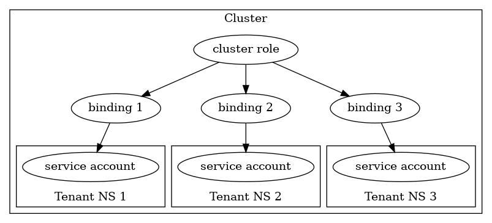
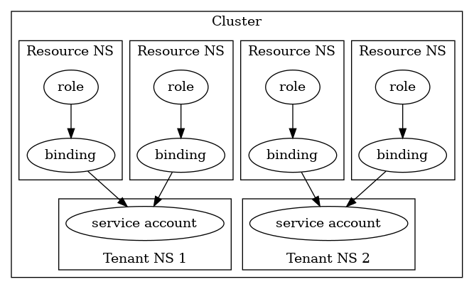

## Multiple operator multitenancy
Multiple operators deployed in different namespaces requires one deployment to handle webhooks (required because webhook configurations are cluster-level resources) and then a separate deployment for each tenant, each with its own credentials and set of namespaces that it watches for Azure resources.

ASO may also be deployed in a _multi-tenant_ configuration, enabling the use of separate credentials for managing resources in different Kubernetes namespaces.


### Multiple operator multitenancy deployment

To deploy the operator in multi-operator multi-tenant mode the release YAML/helm installation has been split into two parts:

1. **Cluster-wide resources**:
   * Custom resource definitions for the Azure resources.

   * Cluster roles for managing those resources.

   * The `azureserviceoperator-system` namespace containing the deployment and service to handle ASO webhooks.
     The webhook service is a deployment of the ASO image, but configured to run in webhook-only mode.
     It won't try to reconcile Azure resources with ARM, and so doesn't need any Azure credentials.

   * Webhook configuration referring to that service.


2. **Per-tenant resources**:
   * A namespace containing the deployment to run the tenant operator, configured for watchers-only mode.

   * The `aso-controller-settings` secret defining the Azure credentials that should be used, and the set of namespaces that this operator will watch for Azure resources.

   * A cluster role binding enabling the per-tenant operator's service account to manage the Azure resources.

### YAML Installation
Examples of the deployment YAML files are available on the release page for ASO v2 releases from [v2.0.0-beta.0](https://github.com/Azure/azure-service-operator/releases/tag/v2.0.0-beta.0).
The cluster-wide file `multitenant-cluster_v2.0.0-beta.0.yaml` can be used as-is (the webhook deployment namespace is fixed as `azureserviceoperator-system`),
but the namespaces and cluster role binding in the per-tenant file `multitenant-tenant_v2.0.0-beta.0.yaml` will need to be customised in each tenant's YAML file from `tenant1` to the desired name for that tenant.

#### Per-tenant configuration
Create the `aso-controller-settings` secret as described in the [authentication docs](./credential-format.md),
but create the secret in the tenant namespace and add an extra target namespaces key to it:
```
   export TENANT_NAMESPACE="<tenant namespace>"
   export AZURE_SUBSCRIPTION_ID="<subscription id>"
   export AZURE_TENANT_ID="<tenant id>"
   export AZURE_CLIENT_ID="<client id>"
   export AZURE_CLIENT_SECRET="<client secret>"
   export AZURE_TARGET_NAMESPACES="<comma-separated namespace names>"
   kubectl create namespace "$TENANT_NAMESPACE"
   cat <<EOF | kubectl apply -f -
   apiVersion: v1
   kind: Secret
   metadata:
     name: aso-controller-settings
     namespace: $TENANT_NAMESPACE
   stringData:
     AZURE_SUBSCRIPTION_ID: "$AZURE_SUBSCRIPTION_ID"
     AZURE_TENANT_ID: "$AZURE_TENANT_ID"
     AZURE_CLIENT_ID: "$AZURE_CLIENT_ID"
     AZURE_CLIENT_SECRET: "$AZURE_CLIENT_SECRET"
     AZURE_TARGET_NAMESPACES: "$AZURE_TARGET_NAMESPACES"
     EOF
```

Once the tenant operator is deployed and configured the contents of the tenant namespace will look something like the following:
```sh
$ kubectl get pods,replicasets,deployments,serviceaccounts,secrets  -n tenant1-system
NAME                                                           READY   STATUS    RESTARTS   AGE
pod/azureserviceoperator-controller-manager-657948696b-dzfmw   1/1     Running   3          3d

NAME                                                                 DESIRED   CURRENT   READY   AGE
replicaset.apps/azureserviceoperator-controller-manager-657948696b   1         1         1       3d

NAME                                                      READY   UP-TO-DATE   AVAILABLE   AGE
deployment.apps/azureserviceoperator-controller-manager   1/1     1            1           3d

NAME                     SECRETS   AGE
serviceaccount/default   1         3d

NAME                             TYPE                                  DATA   AGE
secret/aso-controller-settings   Opaque                                5      3d
secret/default-token-mqmpb       kubernetes.io/service-account-token   3      3d
```

### Helm Installation

To deploy the operator in multi-operator multi-tenant using helm is split into two parts:

1. **Cluster-wide operator installation**:
   ```
   helm repo add aso2 https://raw.githubusercontent.com/Azure/azure-service-operator/main/v2/charts
   ```

   ```
   helm upgrade --install --devel aso2 aso2/azure-service-operator \
      --create-namespace \
      --namespace=azureserviceoperator-system \
      --set multitenant.enable=true \
      --set azureOperatorMode=webhooks \
      --set crdPattern='resources.azure.com/*;containerservice.azure.com/*;keyvault.azure.com/*;managedidentity.azure.com/*;eventhub.azure.com/*'
   ```

2. **Per-tenant operator installation**:
   ```
   helm repo add aso2 https://raw.githubusercontent.com/Azure/azure-service-operator/main/v2/charts
   ```

   ```
   helm upgrade --install --devel aso2 aso2/azure-service-operator \
      --create-namespace \
      --namespace=tenant1-system \
      --set azureSubscriptionID=$AZURE_SUBSCRIPTION_ID \
      --set azureTenantID=$AZURE_TENANT_ID \
      --set azureClientID=$AZURE_CLIENT_ID \
      --set azureClientSecret=$AZURE_CLIENT_SECRET \
      --set multitenant.enable=true \
      --set azureTargetNamespaces='{ns1,ns2,ns3}' \
      --set azureOperatorMode=watchers
   ```
   
### Role handling
The multi-tenant deployment example files have a single `ClusterRole` that grants access to the Azure resource types,
and then a binding to that `ClusterRole` for the service account in each tenant-operator namespace.
Each `ClusterRoleBinding` is named for the specific tenant, so they don't collide and can be managed separately:



This is convenient since there's no need to permit access for Azure resources in each of the target namespaces individually,
but it means that the only thing preventing one tenant operator from reading another's resources is the `AZURE_TARGET_NAMESPACES` setting for each operator.

For some usage scenarios that might be too permissive.

In those cases the `azureserviceoperator-manager-role` should be changed from a `ClusterRole` into `Role`s in each of the target namespaces (where the Azure resources will be created, rather than where the tenant-operator pods run),
and a `RoleBinding` should be created in that namespace linking the `Role` to the service account for the tenant operator that will be managing Azure resources in this target namespace:



### Upgrading
When upgrading to a newer version of ASO the cluster-wide resources (CRDs, cluster roles) and the webhook deployment must be upgraded before upgrading the tenant operators.

Applying the new version of the `multitenant-cluster` YAML file will add new and updated CRDs, then update the webhook configuration and cluster roles.
After that the new version of the `multitenant-tenant` YAML files (customised for the specific tenant names) can be applied.
