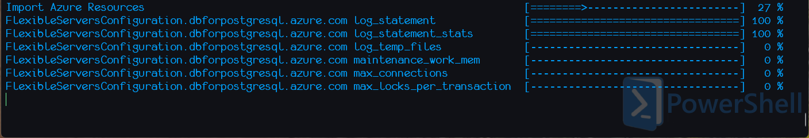

``` bash
$ asoctl
asoctl provides a cmdline interface for working with Azure Service Operator

Usage:
  asoctl [command]

Available Commands:
  completion  Generate the autocompletion script for the specified shell
  crd         Custom Resource Definition (CRD) related actions
  help        Help about any command
  import      imports ARM resources as YAML resource definitions
  version     Display version information
```

## Clean CRDs

TBC

## Import Azure Resource

When you have an existing Azure resource that needs to be managed by ASO, you can use the `import` command to generate a YAML file that can be used to create a new ASO resource. This is useful when:

* You want to migrate an existing Azure resource from ASvO v1 to ASO v2.
* You have an existing Azure resource and want ASO to maintain it in a particular state.
* You have a hand-configured Azure resource and you want to replicate it for development, staging, or production use.

``` bash
$ asoctl import azure-resource --help
imports an ARM resource as a CR

Usage:
  asoctl import azure-resource <ARM/ID/of/resource> [flags]

Flags:
  -h, --help            help for azure-resource
  -o, --output string   Write ARM resource CRD to a file

Global Flags:
      --verbose   Enable verbose logging
```

### Example: Importing a PostgreSQL Server

To import the configuration of an existing PostgreSQL server, we'd run the following command:

``` bash
$ asoctl.exe import azure-resource /subscriptions/[redacted]/resourceGroups/aso-rg/providers/Microsoft.DBforPostgreSQL/flexibleServers/aso-pg --output aso.yaml
```
* The parameter is the full ARM ID to the server; one way tto find this is via the Azure Portal.
* Multiple ARM IDs are permitted.
* Here, the subscription ID has been redacted; in practice, you'd see your own subscription list

While `asoctl import azure-resource` runs, you'll see progress shown dynamically as resources are found and imported:



Once finished, you'll see a list of all the imported resources, and the file they were written to:

``` bash
14:43:34 INF Imported kind=FlexibleServer.dbforpostgresql.azure.com name=aso-pg
14:43:37 INF Imported kind=FlexibleServersFirewallRule.dbforpostgresql.azure.com name=AllowAllAzureServicesAndResourcesWithinAzureIps_2023-3-30_15-26-24
14:44:06 INF Imported kind=FlexibleServersConfiguration.dbforpostgresql.azure.com name=shared_preload_libraries
14:44:15 INF Imported kind=FlexibleServersConfiguration.dbforpostgresql.azure.com name=vacuum_cost_page_miss
14:44:18 INF Imported kind=FlexibleServersDatabase.dbforpostgresql.azure.com name=aso-demo
14:44:25 INF Writing to file path=aso.yaml
Import Azure Resources  [======================================================================================================================================================================] 100 %
```

Not all resources found need to imported; to see more information about those resources, and why they were omitted, use the `--verbose` command line flag.

One situation where this happens is with the configuration of a PostgreSQL server, where most of the values are system defaults that don't need to be explicitly specified.

``` bash
14:47:56 DBG Skipped because="system-defaults don't need to be imported" kind=FlexibleServersConfiguration.dbforpostgresql.azure.com name=synchronous_commit
14:47:56 DBG Skipped because="system-defaults don't need to be imported" kind=FlexibleServersConfiguration.dbforpostgresql.azure.com name=tcp_keepalives_idle
14:47:57 DBG Skipped because="system-defaults don't need to be imported" kind=FlexibleServersConfiguration.dbforpostgresql.azure.com name=tcp_keepalives_count
14:47:57 DBG Skipped because="system-defaults don't need to be imported" kind=FlexibleServersConfiguration.dbforpostgresql.azure.com name=tcp_keepalives_interval
14:47:57 DBG Skipped because="system-defaults don't need to be imported" kind=FlexibleServersConfiguration.dbforpostgresql.azure.com name=temp_buffers
14:47:57 DBG Skipped because="system-defaults don't need to be imported" kind=FlexibleServersConfiguration.dbforpostgresql.azure.com name=temp_tablespaces
```

Another is when role assignments have been inherited by the resource:

``` bash
14:48:03 DBG Skipped because="role assignment is inherited" kind=RoleAssignment.authorization.azure.com name=fe65ff58-[redacted]
14:48:03 DBG Skipped because="role assignment is inherited" kind=RoleAssignment.authorization.azure.com name=61681810-[redacted]
14:48:03 DBG Skipped because="role assignment is inherited" kind=RoleAssignment.authorization.azure.com name=06c013cb-[redacted]
14:48:03 DBG Skipped because="role assignment is inherited" kind=RoleAssignment.authorization.azure.com name=37047941-[redacted]
14:48:03 DBG Skipped because="role assignment is inherited" kind=RoleAssignment.authorization.azure.com name=b0b9667d-[redacted]
14:48:03 DBG Skipped because="role assignment is inherited" kind=RoleAssignment.authorization.azure.com name=88a998ec-[redacted]
```

